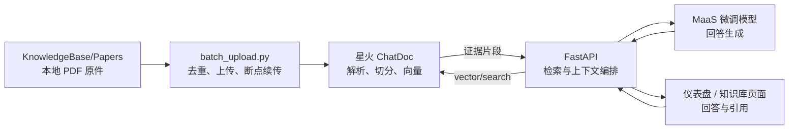

# 讯飞星火知识库后端接入与论文库构建说明

SciPilot 已将 RAG 知识库从 Supabase 自建文档/切块/向量表迁移到讯飞星火 ChatDoc。本文说明凭据边界、论文批量上传、状态核验以及 FastAPI 的实际调用链路。

- 官方接口文档：<https://www.xfyun.cn/doc/spark/ChatDoc-API.html>
- ChatDoc 服务地址：`https://chatdoc.xfyun.cn`
- 本地论文原件：`KnowledgeBase/Papers/`
- Python 批量入口：`KnowledgeBase/api-python-demo/chatdoc-api-python-demo/batch_upload.py`
- FastAPI 客户端：`backend/services/xunfei_knowledge_base_service.py`

本文不记录任何真实 AppID、APISecret、Resource ID 或知识库 ID。实际值仅通过部署环境变量注入。

## 1. 三类 ID 不可混用

| 名称 | 环境变量 | 用途 |
| --- | --- | --- |
| MaaS Model ID | `SCIPILOT_LLM_MODEL_ID` | 指定发布的模型 |
| MaaS Resource ID | `SCIPILOT_LLM_RESOURCE_ID` | 指定微调/LoRA 资源，后端作为 `lora_id` 请求头发送 |
| ChatDoc Repo ID | `XFYUN_KB_REPO_ID` | 指定论文所在的星火知识库 |

Resource ID 用在 MaaS 对话请求，不用于上传或检索论文；Repo ID 用在 ChatDoc 文件与向量接口，不用于选择微调模型。

## 2. 当前设计



主业务链路采用“ChatDoc 纯检索 + MaaS 生成”：

1. FastAPI 调用 `/openapi/v1/vector/search` 获取论文片段。
2. 后端限制数量、整理标题/片段/文件 ID，并构造带引用约束的系统提示词。
3. MaaS 微调模型结合对话历史和证据生成回答。
4. 前端分别展示回答与引用，不接触任何上游凭据。

Python/Java 示例客户端仍保留 ChatDoc `/openapi/v2/chat` SSE 调用，供独立调试使用；SciPilot 仪表盘主链路不依赖浏览器直连 SSE。

## 3. 论文源文件与去重口径

`KnowledgeBase/Papers/` 中的 PDF 是“本地论文原件”：它们是构建远端知识库时的上传源，运行中的前端不会直接读取该文件夹。

批量脚本会：

- 递归发现受支持的 PDF；
- 计算 SHA-256，默认跳过内容完全相同的副本；
- 检查扩展名和单文件大小；
- 上传成功后立刻记录 `fileId`、`sid`、哈希与状态；
- 通过 `.xfyun-upload-state.json` 断点续传；
- 轮询远端状态，直至 `vectored`、`failed` 或超时。

当前仓库预检曾发现 100 个 PDF，其中 95 个内容哈希唯一、5 个为完全重复副本。该数字只描述当前本地目录；远端实际成功数量必须以脚本状态和 `GET /api/v1/knowledge/status` 为准，不应把一次网络中断前的数字写死为“已完成”。

不要删除本地原件。默认也不要使用 `--include-duplicates`，除非业务确认同一内容必须保留多个远端副本。

## 4. 后端配置

### 4.1 FastAPI 的 `backend/.env`

```dotenv
XFYUN_KB_APP_ID=your_app_id
XFYUN_KB_API_SECRET=your_api_secret
XFYUN_KB_REPO_ID=your_repo_id
XFYUN_KB_BASE_URL=https://chatdoc.xfyun.cn
XFYUN_KB_CONNECT_TIMEOUT=10
XFYUN_KB_READ_TIMEOUT=600
XFYUN_KB_TOP_N=6
XFYUN_KB_RETRIEVAL_FILTER_POLICY=REGULAR
XFYUN_KB_TEMPERATURE=0.2
```

### 4.2 批量上传工具

在 `KnowledgeBase/api-python-demo/chatdoc-api-python-demo/.env` 中设置：

```dotenv
XFYUN_KB_APP_ID=your_app_id
XFYUN_KB_API_SECRET=your_api_secret
XFYUN_KB_REPO_ID=your_repo_id
XFYUN_KB_PAPER_DIR=D:\absolute\path\to\SciPilot\KnowledgeBase\Papers
XFYUN_KB_BASE_URL=https://chatdoc.xfyun.cn
```

也可以由进程环境或 Secret Manager 注入，不必创建文件。

### 4.3 安全规范

- `.env`、`.xfyun-upload-state.json` 和日志不得提交。
- 凭据只能留在 FastAPI、构建机或部署平台的服务端 Secret 中。
- 不要把任何凭据放入 `VITE_*`；这些值会进入浏览器构建产物。
- 错误响应不得回传鉴权头、签名或完整上游响应体。
- 部署主机需要准确系统时间；签名时间漂移可能导致鉴权失败。
- 曾出现在聊天、截图、Issue 或提交记录中的长期凭据，应先在讯飞控制台轮换。

每次 ChatDoc 请求使用服务端生成的签名头：

```text
appId: 应用 ID
timeStamp: Unix 秒级时间戳
signature: Base64(HMAC-SHA1(MD5(appId + timeStamp), APISecret))
```

## 5. 批量构建流程

以下命令从仓库根目录开始，建议使用 Python 3.10+。

### 5.1 安装与离线测试

```powershell
Set-Location .\KnowledgeBase\api-python-demo\chatdoc-api-python-demo
python -m pip install -e .
python -m unittest discover -s tests -v
```

### 5.2 只做本地预检

```powershell
python .\batch_upload.py
```

默认不会写入远端。请核对：论文目录、可用文件数、哈希重复数、格式/大小不合规数、已记录数和本次候选数。

### 5.3 小批上传

```powershell
python .\batch_upload.py --execute --limit 3
```

继续全量前至少确认：

1. 每个上传成功项都获得 `fileId` 和 `sid`。
2. 最终状态为 `vectored`，而不是只有 HTTP 上传成功。
3. `/openapi/v1/vector/search` 能命中正确论文片段。
4. SciPilot `/knowledge/search` 与 `/knowledge/answer` 返回正确来源。

普通可复制文字 PDF 可尝试 `--parse-type TEXT`；扫描版 PDF 使用 `--parse-type OCR`；默认 `AUTO`。

### 5.4 断点续传

```powershell
python .\batch_upload.py --execute
```

上传成功后状态立即写入 `.xfyun-upload-state.json`。默认每次最多处理 10 篇；重复执行同一命令即可继续下一批，已有有效 `fileId` 的文件会自动跳过。网络稳定并完成小批验证后，可使用 `--batch-size 0` 单次处理所有剩余文件。

脚本默认每次最多处理 10 篇，并对可恢复的网络错误做有限指数退避。网络特别不稳定时可进一步缩小批次：

```powershell
python .\batch_upload.py --execute --batch-size 3
```

`--limit` 仍作为 `--batch-size` 的兼容参数。上传请求在本地中途中断、无法确认远端是否接收时，脚本会把文件标为不确定并安全暂停；先核对远端文件，确认后才使用 `--retry-uncertain`。不要因为终端超时就直接删除或重复上传。

### 5.5 只检查状态

```powershell
python .\batch_upload.py --status-only
```

文件状态通常依次变化：

```text
uploaded -> texted/ocring -> spliting -> splited -> vectoring -> vectored
                                                               -> failed
```

### 5.6 清理失败文件

先只列出：

```powershell
python .\batch_upload.py --cleanup-failed
```

人工核对 `fileId` 后执行删除：

```powershell
python .\batch_upload.py --cleanup-failed --execute
```

该操作会删除远端失败文件及其本地断点记录，之后才能重新上传。删除是破坏性操作，生产环境应限制管理员权限并记录审计。

## 6. FastAPI 接口

| SciPilot 接口 | 上游行为 | 返回重点 |
| --- | --- | --- |
| `GET /api/v1/knowledge/status` | 查询知识库信息和文件列表 | `configured`、`ready`、`document_count`、`vectored_count` |
| `POST /api/v1/knowledge/search` | ChatDoc 向量检索 | `citations`、`total`、`provider` |
| `POST /api/v1/knowledge/answer` | ChatDoc 检索 + MaaS 生成 | `answer`、`citations`、`model` |
| `GET /api/v1/dashboard/chat/status` | 检查 MaaS 与知识库状态 | `available`、`fine_tuned`、`knowledge_available` |
| `POST /api/v1/dashboard/chat` | 可选检索 + MaaS 多轮生成 | `reply`、`citations`、`knowledge_used` |

这些接口均要求登录。公开响应会去掉 Repo ID 等内部细节，只给前端展示必要的服务状态和文件元数据。

### 典型搜索请求

```http
POST /api/v1/knowledge/search
Authorization: Bearer <user-token>
Content-Type: application/json

{
  "text": "软件缺陷预测中如何避免数据泄漏？",
  "top_n": 6
}
```

前端不得自己计算 ChatDoc 签名，也不得直接向 `chatdoc.xfyun.cn` 发送请求。

## 7. 已封装的 ChatDoc 能力

| 业务 | 上游接口 | 使用位置 |
| --- | --- | --- |
| 文件上传 | `/openapi/v1/file/upload` | Python/Java 构建工具 |
| 文件状态 | `/openapi/v1/file/status` | 构建工具轮询 |
| 删除文件与向量 | `/openapi/v1/file/del` | 失败资源清理 |
| 创建知识库 | `/openapi/v1/repo/create` | 初始化工具/客户端 |
| 知识库信息 | `/openapi/v1/repo/info` | FastAPI 状态接口 |
| 知识库文件列表 | `/openapi/v1/repo/file/list` | FastAPI 状态接口 |
| 纯向量检索 | `/openapi/v1/vector/search` | SciPilot 主业务检索 |
| ChatDoc SSE 问答 | `/openapi/v2/chat` | Python/Java 示例与兼容方法 |
| 删除知识库 | `/openapi/v1/repo/del` | 管理客户端，不向普通业务暴露 |
| 删除库及文件 | `/openapi/v1/repo/del-with-files` | 高风险管理操作，不向普通业务暴露 |

## 8. 运维与故障处理

- 单文件限制和支持格式以讯飞当前官方文档为准；上传前脚本也会执行本地校验。
- 对状态查询的 `429`、`5xx` 和短暂网络失败使用有上限的退避；上传写操作避免无条件重试。
- 日志可记录内部任务 ID、`fileId`、`sid`、HTTP 状态、业务码和耗时，但不得记录 APISecret 或论文全文。
- `401/403`：检查 AppID、APISecret、签名算法和服务器时间。
- `405` 或权限类业务码：检查对应 AppID 是否开通 ChatDoc API 权限。
- 上传成功但长期不向量化：使用 `fileId/sid` 查询状态，并携带 `sid` 向讯飞提交工单。
- FastAPI 返回 `502`：表示上游 ChatDoc/MaaS 当前不可用或响应无效，不应伪装成“知识库为空”。

## 9. 验收标准

- 本地预检的唯一论文均有可追踪的 SHA-256；重复副本默认不上传。
- 目标文件在远端最终状态为 `vectored`，失败项有明确清单并可安全重试。
- `/knowledge/status` 的文件数与讯飞控制台一致。
- 至少抽查 10 个跨年份、跨主题问题，检索片段与论文一致。
- 仪表盘开启论文增强后返回正确引用；关闭增强后仍可使用 MaaS 对话。
- 浏览器、接口响应、日志和 Git 历史中均无 AppID/APISecret 等真实凭据。
- Supabase 中不再创建或写入 `kb_collections`、`kb_documents`、`kb_chunks`、`kb_retrievals`、`kb_citations` 等旧知识库结构。
