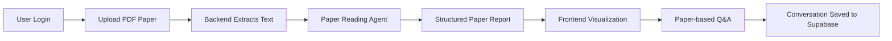
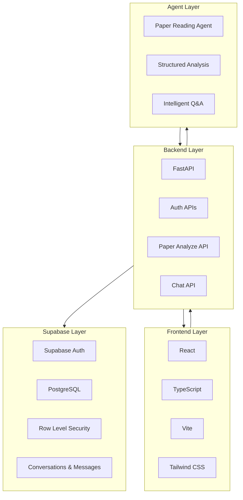
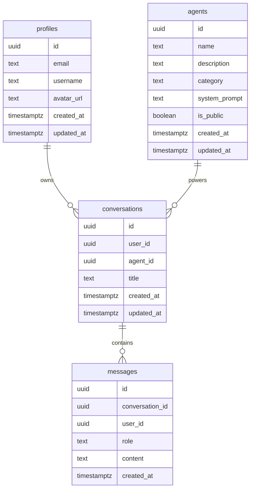
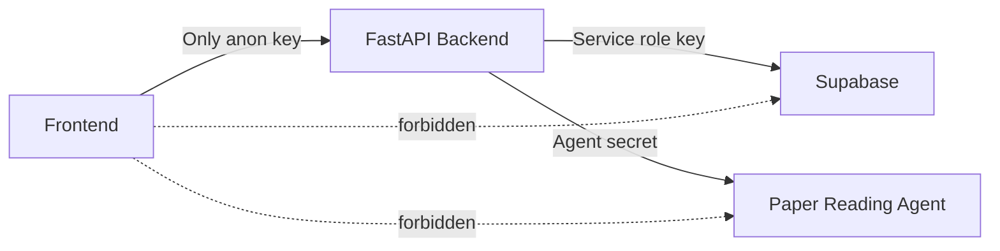
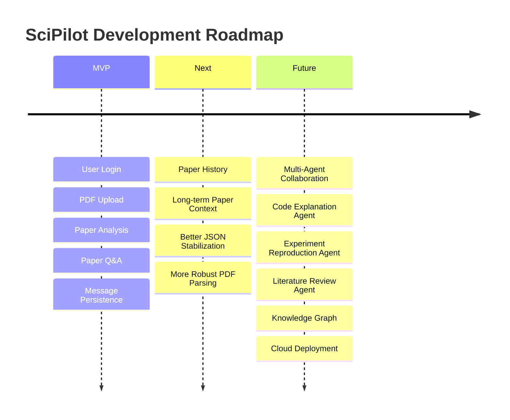

<div align="center">


<br/>


<br/><br/>


</div>

---

## ✨ Overview

**SciPilot** is an AI-powered research agent platform designed for **Software Engineering** scenarios.

It integrates **paper reading**, **structured analysis**, **intelligent Q&A**, **conversation management**, and **database persistence** into a unified research workflow. The current MVP focuses on the first core agent: **Paper Reading Agent**, enabling a closed-loop process from PDF upload to AI-assisted paper understanding.

> SciPilot is not a general chatbot.  
> It is a domain-oriented AI research copilot for software engineering learning and research.

---

## 🚀 Core Workflow



---

## 🧠 Key Features

<table>
<tr>
<td width="50%">

### 📄 Paper Reading Agent

- PDF paper upload
- Text extraction
- Structured paper analysis
- Research background summary
- Core method explanation
- Experiment result extraction
- Key conclusion generation

</td>
<td width="50%">

### 💬 Intelligent Paper Q&A

- Ask questions based on current paper
- Context-aware paper discussion
- Agent-powered responses
- User / assistant message persistence
- Conversation-based interaction

</td>
</tr>

<tr>
<td width="50%">

### 🔐 Secure Authentication

- Supabase Auth login
- Token-based backend authorization
- Protected conversation APIs
- User-level data isolation

</td>
<td width="50%">

### 🧩 Extensible Agent Platform

- Paper Reading Agent
- Code Explanation Agent
- Project Planning Agent
- Future multi-agent collaboration

</td>
</tr>
</table>

---

## 🏗️ Architecture



---

## ⚙️ Tech Stack

| Layer | Technologies |
|---|---|
| Frontend | React, TypeScript, Vite, Tailwind CSS, Zustand, Axios |
| Backend | Python, FastAPI, Uvicorn, Pydantic |
| Database | Supabase PostgreSQL |
| Authentication | Supabase Auth |
| Permission | Row Level Security |
| Agent Service | Backend-proxied Paper Reading Agent |
| Document Processing | PDF Text Extraction |

---

## 🧬 Current MVP Closed Loop

```text
Login
  ↓
Upload PDF
  ↓
Analyze Paper
  ↓
Generate Structured Report
  ↓
Ask Paper-related Questions
  ↓
Agent Replies
  ↓
Save Messages
  ↓
Display Conversation
```

### Current Capabilities

| Module | Status |
|---|---|
| Project Structure | ✅ Completed |
| Supabase Schema | ✅ Completed |
| RLS Policies | ✅ Completed |
| FastAPI Backend | ✅ Completed |
| Auth APIs | ✅ Completed |
| Agent List API | ✅ Completed |
| Conversation APIs | ✅ Completed |
| Message Persistence | ✅ Completed |
| Paper Reading Agent | ✅ Integrated |
| PDF Upload | ✅ MVP Completed |
| Paper Analysis | ✅ MVP Completed |
| Paper Q&A | ✅ MVP Completed |
| Re-upload Paper | ✅ MVP Completed |
| Frontend-Backend Loop | ✅ Running Locally |

---

## 🔌 API Overview

| Method | Endpoint | Description |
|---|---|---|
| `GET` | `/` | Health check |
| `POST` | `/auth/login` | User login |
| `POST` | `/auth/register` | User registration |
| `GET` | `/users/me` | Current user |
| `GET` | `/agents` | Get agent list |
| `POST` | `/conversations` | Create conversation |
| `GET` | `/conversations` | List conversations |
| `GET` | `/conversations/{conversation_id}/messages` | List messages |
| `POST` | `/chat` | Agent chat |
| `POST` | `/papers/analyze` | Analyze uploaded paper |

---

## 🗂️ Database Model



---

## 📁 Project Structure

```text
SciPilot
├── Agent
│   └── PaperReading.md
│
├── backend
│   ├── main.py
│   ├── requirements.txt
│   ├── .env.example
│   └── services
│       ├── supabase_service.py
│       ├── llm_service.py
│       └── xunfei_agent_service.py
│
├── frontend
│   ├── public
│   ├── src
│   │   ├── components
│   │   ├── pages
│   │   ├── services
│   │   ├── store
│   │   └── main.tsx
│   ├── package.json
│   ├── vite.config.ts
│   └── .env.example
│
├── supabase
│   └── migrations
│       ├── 001_init_schema.sql
│       ├── 002_updated_at_trigger.sql
│       └── 003_rls_policies.sql
│
├── docs
├── .gitignore
└── README.md
```

---

## 🖥️ Local Development

### 1. Clone Repository

```bash
git clone https://github.com/telitor/SciPilot.git
cd SciPilot
```

---

### 2. Start Backend

```bash
cd backend
python -m venv .venv
.venv\Scripts\activate
pip install -r requirements.txt
copy .env.example .env
python -m uvicorn main:app --reload
```

Backend:

```text
http://localhost:8000
```

Swagger:

```text
http://localhost:8000/docs
```

---

### 3. Start Frontend

```bash
cd frontend
npm install
copy .env.example .env
npm run dev
```

Frontend:

```text
http://localhost:5173
```

---

## 🔑 Environment Variables

### Backend `.env`

```env
SUPABASE_URL=your_supabase_url
SUPABASE_ANON_KEY=your_supabase_anon_key
SUPABASE_SERVICE_ROLE_KEY=your_supabase_service_role_key

XF_AGENT_APP_ID=your_app_id
XF_AGENT_API_KEY=your_api_key
XF_AGENT_API_SECRET=your_api_secret
XF_AGENT_ASSISTANT_ID=your_assistant_id
```

### Frontend `.env`

```env
VITE_API_BASE_URL=http://localhost:8000
VITE_SUPABASE_URL=your_supabase_url
VITE_SUPABASE_ANON_KEY=your_supabase_anon_key
```

---

## 🛡️ Security Design



- Frontend never stores service role key.
- Frontend never stores Agent API Key or Secret.
- All sensitive keys stay in `backend/.env`.
- Agent calls are proxied by FastAPI.
- Supabase RLS protects user data.

---

## 🧭 Roadmap



---

## 🌌 Vision

SciPilot aims to become a specialized AI research copilot for software engineering students, researchers, and developers.

It focuses on:

- understanding research papers,
- organizing research knowledge,
- supporting paper-based conversations,
- connecting AI agents with real workflows,
- and building a scalable multi-agent research platform.

---

<div align="center">


<h3>🚀 SciPilot · AI Research Copilot for Software Engineering</h3>

<strong>From paper reading to intelligent research workflows.</strong>

</div>
