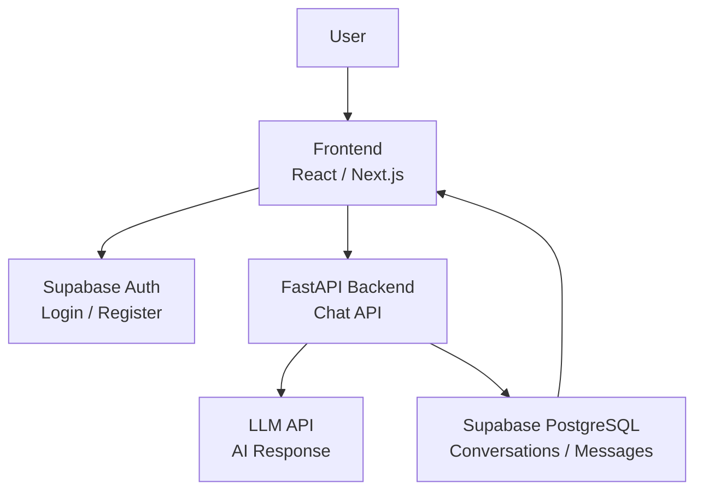
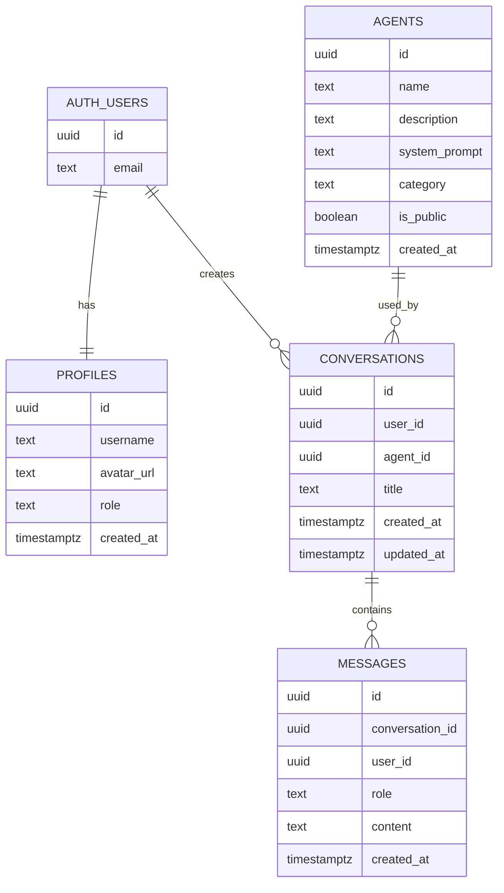

<div align="center">

<br/>

# ✨ SciPilot

### 🧠 面向软件工程学科的智能体学习与项目辅助平台

<br/>

**Paper Reading · Code Understanding · Project Planning · AI Agents**

<br/>


<br/>

> **SciCopilot** is a vertical AI platform for Software Engineering.  
> The first version focuses on a clean MVP: **login, agents, chat, data persistence, and conversation history**.

<br/>


</div>

---

## 🌌 Project Overview

**SciPilot** 是一个面向软件工程学科的智能体平台，目标是为论文阅读、代码理解、项目规划等学习与开发场景提供专业 AI 支持。

它不是一个简单的通用聊天机器人，而是一个逐步扩展的垂直领域平台：

```text
学科场景
  ↓
专业智能体
  ↓
对话交互
  ↓
历史记录
  ↓
数据沉淀
  ↓
后续扩展为知识库与多智能体协作
```

当前版本：

```text
SciPilot v0.1 MVP
```

第一版先不追求复杂功能堆叠，而是先完成一个稳定、清晰、可继续扩展的基础闭环。

---

## 🧭 MVP Target

### 🎯 Version Goal

第一版目标是跑通最核心的产品流程：

```text
用户注册 / 登录
      ↓
查看智能体列表
      ↓
选择一个智能体
      ↓
进入聊天页面
      ↓
发送问题
      ↓
获得 AI 回复
      ↓
保存聊天记录
      ↓
再次登录后查看历史对话
```

### ✅ MVP Success Criteria

| No. | Capability | Description |
| --- | --- | --- |
| 01 | 用户认证 | 支持注册、登录、退出 |
| 02 | 智能体列表 | 展示第一版预设智能体 |
| 03 | 对话创建 | 用户可以选择智能体开启新对话 |
| 04 | AI 回复 | 后端调用大模型生成回答 |
| 05 | 消息保存 | 用户消息和 AI 回复写入数据库 |
| 06 | 历史记录 | 用户可以查看历史对话 |
| 07 | 权限隔离 | 用户只能访问自己的数据 |

---

## 🧩 Core Agents

第一版暂定 3 个基础智能体。

<table>
  <tr>
    <td align="center" width="33%">
      <h3>📚 论文精读助手</h3>
      <p>帮助用户阅读、拆解和理解软件工程及 AI 相关论文。</p>
      <p><b>Paper Reading Agent</b></p>
    </td>
    <td align="center" width="33%">
      <h3>💻 代码解释助手</h3>
      <p>帮助用户理解代码逻辑、定位报错、给出修改建议。</p>
      <p><b>Code Explanation Agent</b></p>
    </td>
    <td align="center" width="33%">
      <h3>🗺️ 项目规划助手</h3>
      <p>帮助用户拆解项目功能、设计模块、规划开发路线。</p>
      <p><b>Project Planning Agent</b></p>
    </td>
  </tr>
</table>

---

## 📚 Agent 01 · 论文精读助手

### Positioning

论文精读助手面向软件工程、人工智能、智能软件开发等方向的论文阅读场景。

它的目标不是简单总结文章，而是帮助用户完成：

- 论文结构拆解
- 研究问题提炼
- 方法流程梳理
- 实验设计理解
- 创新点分析
- 局限性总结
- 可复现思路整理
- 与项目选题结合

### Example Tasks

```text
请帮我精读这篇论文的 Abstract 和 Introduction。
请总结这篇论文解决了什么问题。
请解释论文中的方法流程。
请帮我提炼创新点和不足。
请把这篇论文整理成组会汇报结构。
```

### Initial System Prompt

```text
你是一名论文精读助手，擅长帮助学生阅读和理解软件工程、人工智能、智能软件开发方向的学术论文。你的回答应当结构清晰，重点突出，能够从研究背景、核心问题、方法思路、实验设计、创新点、不足和可复现方向等角度进行分析。面对基础较弱的用户时，要避免空泛总结，优先使用分点解释和通俗说明。
```

---

## 🏗️ System Architecture



| Layer | Responsibility |
| --- | --- |
| Frontend | 页面展示、登录入口、智能体选择、聊天交互 |
| Supabase Auth | 用户注册、登录、身份识别 |
| FastAPI Backend | 聊天接口、大模型调用、业务逻辑 |
| Supabase PostgreSQL | 保存智能体、对话、消息等数据 |
| LLM API | 根据智能体 prompt 生成回复 |

---

## 🛠️ Tech Stack

| Area | Technology |
| --- | --- |
| Frontend | React / Next.js / TypeScript / Tailwind CSS |
| Backend | Python / FastAPI / Uvicorn |
| Database | Supabase PostgreSQL |
| Auth | Supabase Auth |
| Security | Row Level Security |
| AI | LLM API |
| Dev Tools | Git / GitHub / VS Code / Apifox or Postman |

---

## 🗃️ Database Design

第一版只保留最小必要数据表。



| Table | Description |
| --- | --- |
| `profiles` | 用户资料表 |
| `agents` | 智能体配置表 |
| `conversations` | 对话会话表 |
| `messages` | 聊天消息表 |

---

## 🧠 Initial Agents Data

| Agent | Category | Main Use |
| --- | --- | --- |
| 论文精读助手 | `paper-reading` | 论文阅读、结构拆解、创新点分析 |
| 代码解释助手 | `coding` | 代码理解、报错分析、修改建议 |
| 项目规划助手 | `project-planning` | 项目拆解、技术路线、接口设计 |

---

## 🔌 API Design

### Health Check

```http
GET /
```

```json
{
  "status": "ok",
  "service": "SciPilot Backend"
}
```

---

### Get Agents

```http
GET /agents
```

```json
[
  {
    "id": "agent_id",
    "name": "论文精读助手",
    "description": "帮助用户精读软件工程与人工智能方向论文",
    "category": "paper-reading"
  }
]
```

---

### Create Conversation

```http
POST /conversations
```

```json
{
  "agent_id": "agent_id",
  "title": "论文精读对话"
}
```

---

### Chat

```http
POST /chat
```

```json
{
  "conversation_id": "conversation_id",
  "agent_id": "agent_id",
  "message": "请帮我分析这篇论文的研究问题和创新点"
}
```

### Chat Backend Workflow

```text
1. 校验当前用户身份
2. 校验 conversation 是否属于当前用户
3. 查询 agent 的 system_prompt
4. 保存用户消息
5. 调用大模型
6. 保存 AI 回复
7. 返回结果给前端
```

---

## 📁 Project Structure

```text
SciPilot/
│
├── backend/
│   ├── main.py
│   ├── requirements.txt
│   ├── .env.example
│   └── services/
│       ├── llm_service.py
│       └── supabase_service.py
│
├── frontend/
│   ├── app/
│   ├── components/
│   ├── lib/
│   └── package.json
│
├── docs/
│   ├── api.md
│   └── database.md
│
├── supabase/
│   └── migrations/
│
├── README.md
└── .gitignore
```

---

## 🔐 Environment Variables

### Backend `.env`

```env
SUPABASE_URL=your_supabase_project_url
SUPABASE_ANON_KEY=your_supabase_anon_key
SUPABASE_SERVICE_ROLE_KEY=your_supabase_service_role_key

LLM_API_KEY=your_llm_api_key
LLM_BASE_URL=your_llm_base_url
LLM_MODEL=your_model_name
```

### Security Rule

```text
.env 只保存在本地
.env.example 可以提交到 GitHub
service_role key 只能放后端
大模型 API key 只能放后端
```

---

## 🚀 Local Development

### Clone Repository

```bash
git clone https://github.com/telitor/SciPilot.git
cd SciCopilot
```

### Backend

```bash
cd backend
python -m venv .venv
```

Windows:

```bash
.venv\Scripts\activate
```

Install dependencies:

```bash
pip install -r requirements.txt
```

Run backend:

```bash
uvicorn main:app --reload
```

### Frontend

```bash
cd frontend
npm install
npm run dev
```

---

## 🧱 Current MVP Roadmap

### Phase 1 · Project Foundation

- [x] Create GitHub repository
- [x] Add README
- [x] Create basic project structure
- [x] Configure `.gitignore`
- [x] Add `.env.example`
- [x] Prepare local `.env`

### Phase 2 · Supabase Base

- [ ] Create `profiles` table
- [ ] Create `agents` table
- [ ] Create `conversations` table
- [ ] Create `messages` table
- [ ] Insert initial agents
- [ ] Configure RLS policies

### Phase 3 · Backend MVP

- [ ] Create FastAPI backend
- [ ] Add health check API
- [ ] Add agent list API
- [ ] Add conversation APIs
- [ ] Add chat API
- [ ] Connect LLM API
- [ ] Save user and assistant messages

### Phase 4 · Frontend MVP

- [ ] Build login page
- [ ] Build dashboard page
- [ ] Build agent cards
- [ ] Build chat page
- [ ] Build conversation sidebar
- [ ] Connect frontend with backend

---

## 🧪 MVP Acceptance Checklist

第一版完成时，应当满足：

```text
用户可以注册登录
用户可以看到 3 个智能体
用户可以选择论文精读助手开始对话
用户可以发送消息并收到 AI 回复
用户消息和 AI 回复会保存到数据库
用户可以查看历史对话
不同用户不能看到彼此数据
```

---

## 🧬 Future Expansion

| Version | Direction |
| --- | --- |
| v0.2 | 论文 PDF 上传与精读 |
| v0.3 | 课程资料知识库问答 |
| v0.4 | GitHub 仓库代码分析 |
| v0.5 | 多智能体协作工作流 |
| v0.6 | 项目空间与团队协作 |

---

## 🪄 Product Principles

### 1. Small but Complete

第一版功能不多，但要形成完整闭环。

### 2. Data First

先把用户、智能体、对话、消息的数据结构打稳。

### 3. Agent-Oriented

每个智能体要有明确场景，避免泛泛而谈。

### 4. Security by Default

用户私有数据必须默认隔离。

### 5. Build for Iteration

先跑通基础版，再持续扩展论文、知识库、代码仓库和多智能体能力。

---

<div align="center">

<br/>


### 🌟 SciCopilot v0.1

**Read deeply. Code clearly. Build systematically.**

<br/>

</div>
