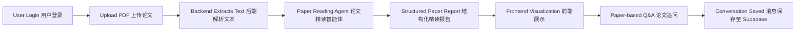
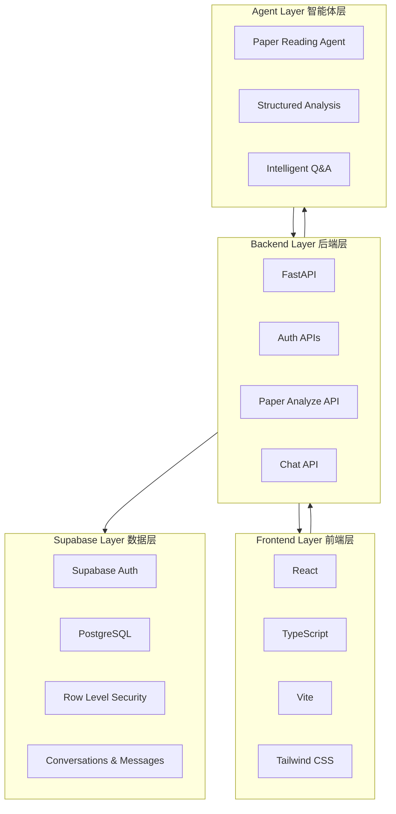
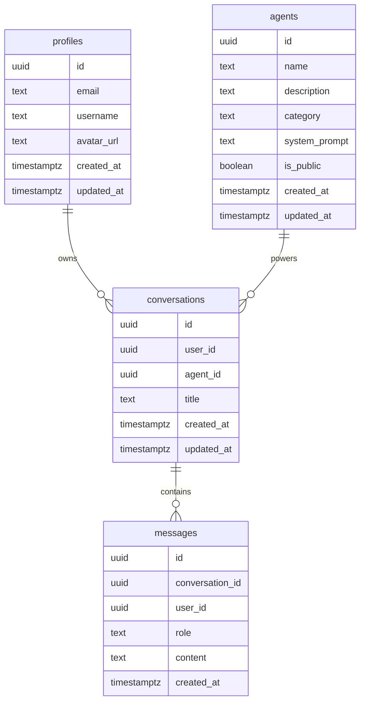
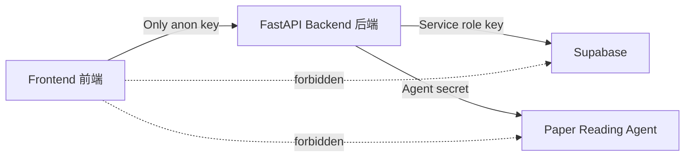
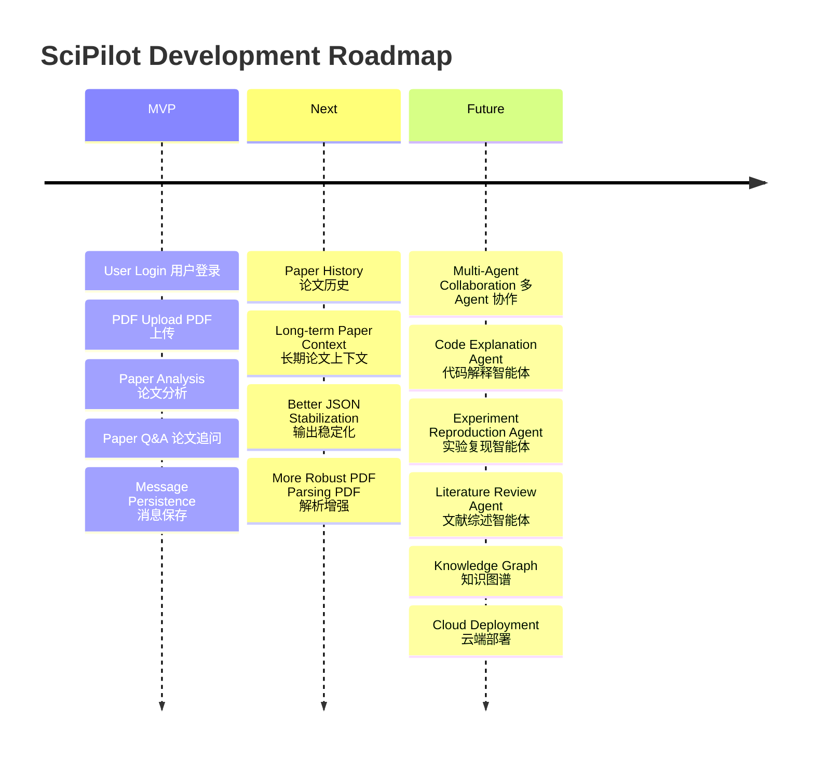

<div align="center">


<br/>


<br/><br/>


</div>

---

## ✨ Overview 项目概览

**SciPilot** is an AI-powered research agent platform designed for **Software Engineering** scenarios.

SciPilot 是一个面向 **软件工程科研与学习场景** 的 AI 智能体平台，围绕论文精读、结构化分析、智能问答与科研工作流组织，构建一个可持续扩展的垂直领域 Agent 系统。

It integrates **paper reading**, **structured analysis**, **intelligent Q&A**, **conversation management**, and **database persistence** into a unified research workflow.

> SciPilot is not a general chatbot.  
> 它不是一个普通聊天工具，而是面向软件工程领域的 **AI Research Copilot**。

---

## 🚀 Core Workflow 核心流程



---

## 🧠 Key Features 核心能力

<table>
<tr>
<td width="50%">

### 📄 Paper Reading Agent 论文精读智能体

- PDF paper upload / PDF 论文上传
- Text extraction / 文本解析
- Structured analysis / 结构化分析
- Research background summary / 研究背景总结
- Core method explanation / 核心方法解释
- Experiment result extraction / 实验结果提取
- Key conclusion generation / 关键结论生成

</td>
<td width="50%">

### 💬 Intelligent Paper Q&A 智能论文追问

- Ask questions based on current paper / 基于当前论文提问
- Context-aware discussion / 上下文感知回答
- Agent-powered responses / 智能体生成回复
- User / assistant message persistence / 消息持久化
- Conversation-based interaction / 会话式交互

</td>
</tr>

<tr>
<td width="50%">

### 🔐 Secure Authentication 安全认证

- Supabase Auth login / 用户登录
- Token-based authorization / Token 鉴权
- Protected backend APIs / 受保护后端接口
- User-level data isolation / 用户级数据隔离

</td>
<td width="50%">

### 🧩 Extensible Agent Platform 可扩展智能体平台

- Paper Reading Agent / 论文精读助手
- Code Explanation Agent / 代码解释助手
- Project Planning Agent / 项目规划助手
- Future multi-agent collaboration / 未来多 Agent 协作

</td>
</tr>
</table>

---

## 🏗️ Architecture 系统架构



---

## ⚙️ Tech Stack 技术栈

| Layer 层级 | Technologies 技术 |
|---|---|
| Frontend 前端 | React, TypeScript, Vite, Tailwind CSS, Zustand, Axios |
| Backend 后端 | Python, FastAPI, Uvicorn, Pydantic |
| Database 数据库 | Supabase PostgreSQL |
| Authentication 认证 | Supabase Auth |
| Permission 权限 | Row Level Security |
| Agent Service 智能体服务 | Backend-proxied Paper Reading Agent |
| Document Processing 文档处理 | PDF Text Extraction |

---

## 🧬 Current MVP Closed Loop 当前 MVP 闭环

```text
Login 用户登录
  ↓
Upload PDF 上传论文
  ↓
Analyze Paper 论文解析
  ↓
Generate Structured Report 生成结构化报告
  ↓
Ask Paper-related Questions 基于论文追问
  ↓
Agent Replies 智能体回答
  ↓
Save Messages 消息保存
  ↓
Display Conversation 前端展示对话
```

### Current Capabilities 当前能力

| Module 模块 | Status 状态 |
|---|---|
| Project Structure 项目结构 | ✅ Completed |
| Supabase Schema 数据库结构 | ✅ Completed |
| RLS Policies 权限策略 | ✅ Completed |
| FastAPI Backend 后端接口 | ✅ Completed |
| Auth APIs 登录鉴权 | ✅ Completed |
| Agent List API 智能体列表 | ✅ Completed |
| Conversation APIs 会话接口 | ✅ Completed |
| Message Persistence 消息保存 | ✅ Completed |
| Paper Reading Agent 论文精读 Agent | ✅ Integrated |
| PDF Upload PDF 上传 | ✅ MVP Completed |
| Paper Analysis 论文分析 | ✅ MVP Completed |
| Paper Q&A 论文追问 | ✅ MVP Completed |
| Re-upload Paper 重新上传 | ✅ MVP Completed |
| Frontend-Backend Loop 前后端闭环 | ✅ Running Locally |

---

## 🔌 API Overview 接口概览

| Method | Endpoint | Description |
|---|---|---|
| `GET` | `/` | Health check / 健康检查 |
| `POST` | `/auth/login` | User login / 用户登录 |
| `POST` | `/auth/register` | User registration / 用户注册 |
| `GET` | `/users/me` | Current user / 当前用户 |
| `GET` | `/agents` | Get agent list / 获取智能体列表 |
| `POST` | `/conversations` | Create conversation / 创建对话 |
| `GET` | `/conversations` | List conversations / 查询对话 |
| `GET` | `/conversations/{conversation_id}/messages` | List messages / 查询消息 |
| `POST` | `/chat` | Agent chat / 智能体对话 |
| `POST` | `/papers/analyze` | Analyze uploaded paper / 论文解析 |

---

## 🗂️ Database Model 数据模型



---

## 📁 Project Structure 项目结构

```text
SciPilot
├── Agent
│   └── PaperReading.md
│
├── backend
│   ├── main.py
│   ├── requirements.txt
│   ├── .env.example
│   └── services
│       ├── supabase_service.py
│       ├── llm_service.py
│       └── xunfei_agent_service.py
│
├── frontend
│   ├── public
│   ├── src
│   │   ├── components
│   │   ├── pages
│   │   ├── services
│   │   ├── store
│   │   └── main.tsx
│   ├── package.json
│   ├── vite.config.ts
│   └── .env.example
│
├── supabase
│   └── migrations
│       ├── 001_init_schema.sql
│       ├── 002_updated_at_trigger.sql
│       └── 003_rls_policies.sql
│
├── docs
├── .gitignore
└── README.md
```

---

## 🖥️ Local Development 本地运行

### 1. Clone Repository 克隆项目

```bash
git clone https://github.com/telitor/SciPilot.git
cd SciPilot
```

---

### 2. Start Backend 启动后端

```bash
cd backend
python -m venv .venv
.venv\Scripts\activate
pip install -r requirements.txt
copy .env.example .env
python -m uvicorn main:app --reload
```

Backend 后端地址：

```text
http://localhost:8000
```

Swagger API Docs 接口文档：

```text
http://localhost:8000/docs
```

---

### 3. Start Frontend 启动前端

```bash
cd frontend
npm install
copy .env.example .env
npm run dev
```

Frontend 前端地址：

```text
http://localhost:5173
```

---

## 🔑 Environment Variables 环境变量

### Backend `.env`

```env
SUPABASE_URL=your_supabase_url
SUPABASE_ANON_KEY=your_supabase_anon_key
SUPABASE_SERVICE_ROLE_KEY=your_supabase_service_role_key

XF_AGENT_APP_ID=your_app_id
XF_AGENT_API_KEY=your_api_key
XF_AGENT_API_SECRET=your_api_secret
XF_AGENT_ASSISTANT_ID=your_assistant_id
```

### Frontend `.env`

```env
VITE_API_BASE_URL=http://localhost:8000
VITE_SUPABASE_URL=your_supabase_url
VITE_SUPABASE_ANON_KEY=your_supabase_anon_key
```

---

## 🛡️ Security Design 安全设计



- Frontend never stores service role key. / 前端不保存 service role key。
- Frontend never stores Agent API Key or Secret. / 前端不保存 Agent 密钥。
- All sensitive keys stay in `backend/.env`. / 敏感密钥仅存放在后端环境变量中。
- Agent calls are proxied by FastAPI. / Agent 调用统一由 FastAPI 后端代理。
- Supabase RLS protects user data. / Supabase RLS 保障用户数据隔离。

---

## 🧭 Roadmap 发展路线



---

## 🌌 Vision 项目愿景

SciPilot aims to become a specialized AI research copilot for software engineering students, researchers, and developers.

SciPilot 致力于成为面向软件工程学习者、科研初学者与开发者的智能科研副驾驶。

It focuses on:

- understanding research papers / 理解科研论文
- organizing research knowledge / 组织科研知识
- supporting paper-based conversations / 支持基于论文的持续对话
- connecting AI agents with real workflows / 将 AI Agent 接入真实科研流程
- building a scalable multi-agent research platform / 构建可扩展的多智能体科研平台

---

<div align="center">


<h3>🚀 SciPilot · AI Research Copilot for Software Engineering</h3>

<strong>From paper reading to intelligent research workflows.</strong>

</div>
