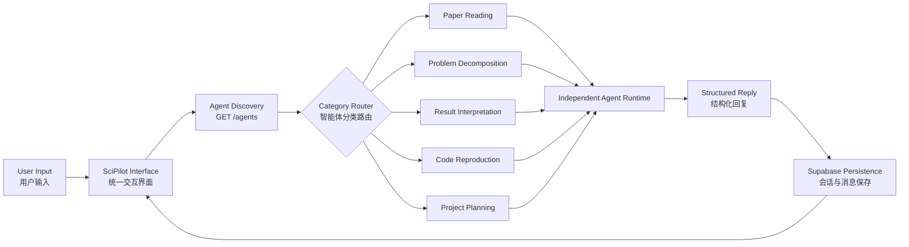
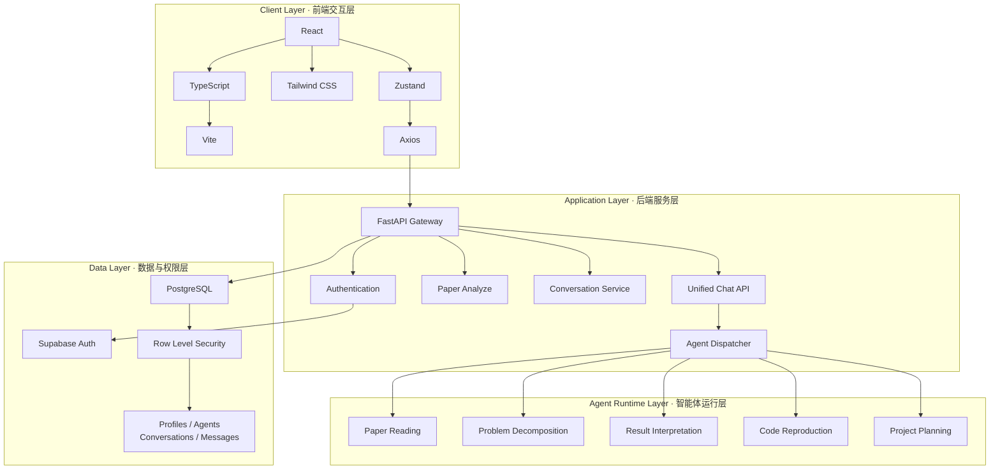
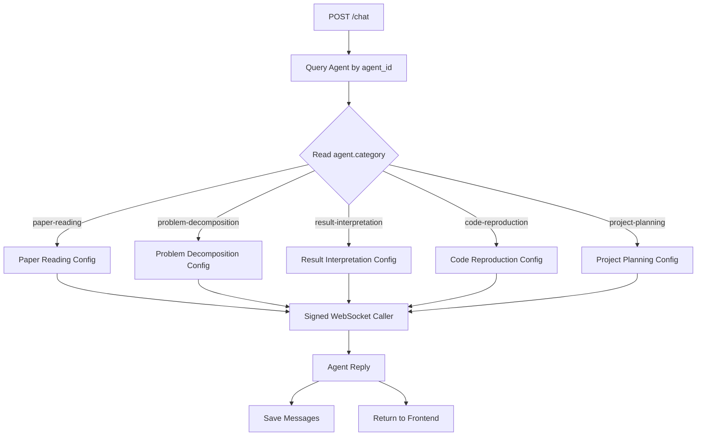
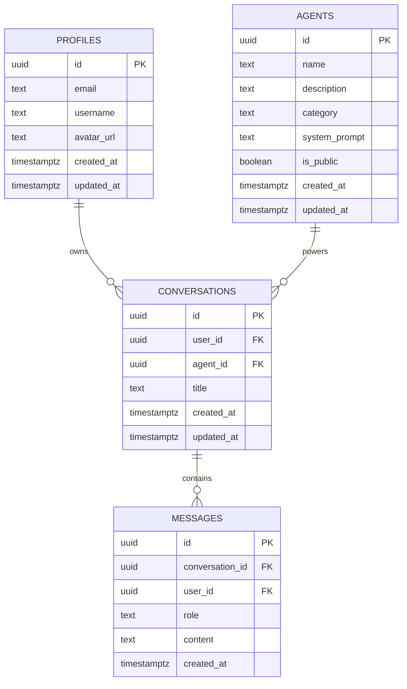
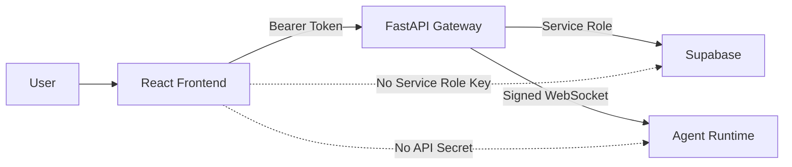
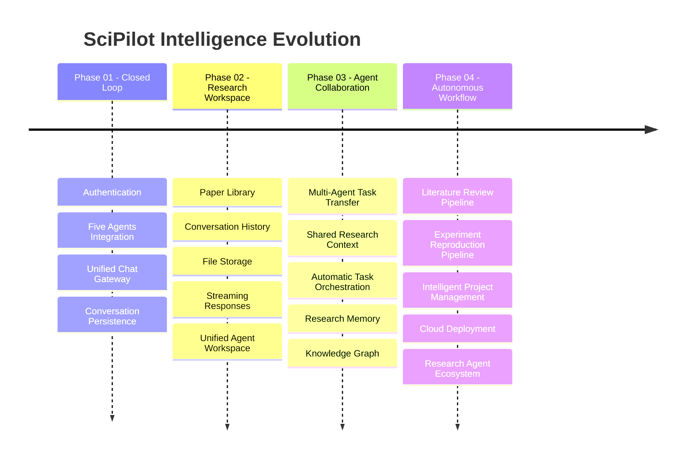
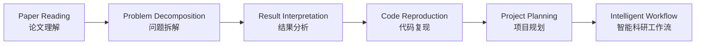

<div align="center">


<br/>


<br/><br/>


<br/><br/>


<br/><br/>

<h3>面向软件工程科研场景的多智能体协同平台</h3>

<p>
  <strong>Multi-Agent Research Copilot for Software Engineering</strong>
</p>

<sub>
从论文理解、问题拆解到代码复现与项目规划，将分散的科研任务连接为完整的智能工作流。
</sub>

</div>

---

## 01 · Mission Control / 平台使命

**SciPilot** 是一个面向软件工程学习、科研分析与项目实践的多智能体平台。

平台以真实科研工作流为核心，将多个已经完成搭建的垂直 Agent 接入统一的前后端系统，通过 **React、FastAPI、Supabase 与独立 WebSocket Agent Runtime**，形成从用户输入到智能处理、结果展示和数据持久化的完整闭环。

```text
┌─────────────────────────────────────────────────────────────┐
│                       SciPilot Core                         │
├─────────────────────────────────────────────────────────────┤
│  Research Input                                             │
│       ↓                                                     │
│  Intelligent Agent Routing                                  │
│       ↓                                                     │
│  Structured Analysis                                        │
│       ↓                                                     │
│  Executable Research & Engineering Workflow                 │
└─────────────────────────────────────────────────────────────┘
```

> **SciPilot is not a general chatbot.**  
> 它不是单一的问答工具，而是一套面向科研与软件工程任务的智能协作系统。

---

## 02 · Agent Constellation / 智能体矩阵

<table>
<tr>
<td width="50%" valign="top">

### 📄 Paper Reading Agent

**论文精读助手**

将 PDF 论文转换为结构化科研认知。

- PDF 文件上传与文本提取
- 研究背景与研究动机识别
- 核心方法与技术路线梳理
- 实验结果与关键结论分析
- 基于当前论文内容持续追问
- 支持重新上传与切换论文

```text
Category: paper-reading
```

</td>

<td width="50%" valign="top">

### 🧩 Problem Decomposition Agent

**问题拆解助手**

将复杂研究问题转换为可执行任务树。

- 识别研究背景与核心目标
- 分析约束、输入与预期输出
- 提炼关键难点与子问题
- 构建阶段化解决路径
- 生成任务、方法和验收标准

```text
Category: problem-decomposition
```

</td>
</tr>

<tr>
<td width="50%" valign="top">

### 📊 Result Interpretation Agent

**结果分析助手**

将实验数据转换为有依据的分析结论。

- 支持 CSV、JSON、Excel 等结果输入
- 分析评价指标与变化趋势
- 解释模型差异与异常现象
- 判断实验结论与可信边界
- 输出优化方向与验证建议

```text
Category: result-interpretation
```

</td>

<td width="50%" valign="top">

### 🧬 Code Reproduction Agent

**代码复现助手**

将论文代码与开源仓库转换为复现路线。

- GitHub 仓库与目录结构分析
- Python 环境与依赖配置
- 配置文件、入口脚本与模块识别
- 错误日志和运行异常诊断
- 输出逐步执行的复现计划

```text
Category: code-reproduction
```

</td>
</tr>

<tr>
<td colspan="2" valign="top">

### 🚀 Project Planning Agent

**项目规划助手**

将科研设想或软件工程目标转化为可落地的项目蓝图。

- 分析项目目标与核心范围
- 拆分需求、开发、测试和部署阶段
- 生成技术路线与阶段任务
- 规划里程碑、人员分工和时间安排
- 识别风险、依赖关系与应对策略
- 建立可量化的验收标准

```text
Category: project-planning
```

</td>
</tr>
</table>

---

## 03 · Intelligence Pipeline / 智能工作流



统一闭环：

```text
用户登录
   ↓
进入功能页面
   ↓
根据 Category 获取 Agent
   ↓
创建 Conversation
   ↓
调用 POST /chat
   ↓
FastAPI 选择对应 Agent 配置
   ↓
建立带签名的 WebSocket 连接
   ↓
获取智能体回复
   ↓
前端展示结果
   ↓
Supabase 保存 User / Assistant 消息
```

---

## 04 · System Architecture / 系统架构



---

## 05 · Dynamic Agent Routing / 动态智能体调度

后端不会将 Agent 密钥或调用地址暴露给前端。

FastAPI 根据 Supabase 中的 `agent.category`，选择对应的独立 Agent 配置。



每个新增 Agent 均可拥有独立的：

```text
APP ID
API Key
API Secret
WebSocket URL
```

前端只接触：

```text
agent_id
category
conversation_id
message
reply
```

---

## 06 · Capability Matrix / 能力矩阵

| Capability | Description | Status |
|---|---|:---:|
| Authentication | 用户注册、登录与 Bearer Token 鉴权 | ✅ |
| Agent Discovery | 从 Supabase 动态读取公开 Agent | ✅ |
| Agent Routing | 根据 category 调度独立 Agent | ✅ |
| Conversation Creation | 创建用户与 Agent 会话 | ✅ |
| Message Persistence | 保存 user / assistant 消息 | ✅ |
| PDF Upload | PDF 文件上传与格式校验 | ✅ |
| Paper Extraction | 论文文本提取与长度控制 | ✅ |
| Structured Paper Analysis | 生成结构化论文精读报告 | ✅ |
| Contextual Paper Q&A | 基于当前论文继续追问 | ✅ |
| Problem Decomposition | 研究问题结构化拆解 | ✅ |
| Result Interpretation | 实验结果与指标分析 | ✅ |
| Code Reproduction | 仓库复现与错误诊断 | ✅ |
| Project Planning | 项目阶段、里程碑和风险规划 | ✅ |
| Independent Credentials | 独立 Agent 配置隔离 | ✅ |
| RLS Authorization | 用户级数据访问隔离 | ✅ |
| Error Normalization | 统一超时与错误提示 | ✅ |

---

## 07 · API Gateway / 接口总览

| Method | Endpoint | Function |
|---|---|---|
| `GET` | `/` | 服务健康检查 |
| `POST` | `/auth/login` | 用户登录 |
| `POST` | `/auth/register` | 用户注册 |
| `GET` | `/users/me` | 获取当前用户 |
| `GET` | `/agents` | 获取公开智能体 |
| `POST` | `/conversations` | 创建会话 |
| `GET` | `/conversations` | 获取会话列表 |
| `GET` | `/conversations/{conversation_id}/messages` | 获取历史消息 |
| `POST` | `/chat` | 统一智能体调用 |
| `POST` | `/papers/analyze` | PDF 解析与论文精读 |

### Chat Request

```json
{
  "conversation_id": "conversation_uuid",
  "agent_id": "agent_uuid",
  "message": "用户输入内容"
}
```

### Chat Response

```json
{
  "reply": "智能体生成的回复"
}
```

### Paper Analyze Request

```text
Content-Type: multipart/form-data

file: paper.pdf
```

### Paper Analyze Response

```json
{
  "title": "论文标题",
  "authors": "作者信息",
  "sections": [
    {
      "title": "研究背景与动机",
      "content": "结构化分析内容",
      "citation": "[1]"
    }
  ]
}
```

---

## 08 · Data Galaxy / 数据模型



核心数据链：

```text
Profile
   └── Conversation
          ├── Agent
          └── Messages
                 ├── user
                 ├── assistant
                 └── system
```

---

## 09 · Technology Core / 技术核心

| Domain | Technology |
|---|---|
| Frontend | React, TypeScript, Vite, Tailwind CSS |
| State Management | Zustand |
| Routing | React Router |
| API Communication | Axios |
| Backend | Python, FastAPI, Uvicorn, Pydantic |
| Authentication | Supabase Auth |
| Database | Supabase PostgreSQL |
| Authorization | Row Level Security |
| Document Processing | PDF Text Extraction |
| Agent Connection | Signed WebSocket |
| Agent Routing | Category-based Dispatcher |
| Version Control | Git, GitHub |

---

## 10 · Project Structure / 项目结构

```text
SciPilot
├── Agent
│   ├── PaperReading.md
│   ├── ProjectPlanning.md
│   └── ...
│
├── backend
│   ├── main.py
│   ├── requirements.txt
│   ├── .env.example
│   └── services
│       ├── supabase_service.py
│       ├── llm_service.py
│       └── xunfei_agent_service.py
│
├── frontend
│   ├── public
│   ├── src
│   │   ├── components
│   │   │   ├── AgentChatPanel.tsx
│   │   │   ├── NotificationContainer.tsx
│   │   │   └── Sidebar.tsx
│   │   ├── pages
│   │   │   ├── Login
│   │   │   ├── PaperRead
│   │   │   ├── ResearchDecompose
│   │   │   ├── ResultAnalyze
│   │   │   ├── CodeReproduce
│   │   │   └── ExperimentRoadmap
│   │   ├── services
│   │   │   └── api.ts
│   │   ├── store
│   │   └── main.tsx
│   ├── package.json
│   ├── vite.config.ts
│   └── .env.example
│
├── supabase
│   └── migrations
│       ├── 001_init_schema.sql
│       ├── 002_updated_at_trigger.sql
│       ├── 003_rls_policies.sql
│       ├── 004_add_multi_agents.sql
│       └── 005_add_project_planning_agent.sql
│
├── docs
├── .gitignore
└── README.md
```

---

<details>
<summary><strong>⚡ Quick Start / 快速启动</strong></summary>

<br/>

### Clone Repository

```powershell
git clone https://github.com/telitor/SciPilot.git
cd SciPilot
```

### Start Backend

```powershell
Set-Location .\backend

python -m venv .venv
.\.venv\Scripts\Activate.ps1

pip install -r requirements.txt
Copy-Item .env.example .env

python -m uvicorn main:app --reload
```

Backend：

```text
http://localhost:8000
```

Swagger：

```text
http://localhost:8000/docs
```

### Start Frontend

打开新的 PowerShell：

```powershell
Set-Location .\frontend

npm install
Copy-Item .env.example .env

npm run dev
```

Frontend：

```text
http://localhost:5173
```

</details>

---

<details>
<summary><strong>🔐 Environment Configuration / 环境配置</strong></summary>

<br/>

所有真实密钥仅允许保存在：

```text
backend/.env
```

示例：

```env
# Supabase
SUPABASE_URL=your_supabase_url
SUPABASE_ANON_KEY=your_supabase_anon_key
SUPABASE_SERVICE_ROLE_KEY=your_service_role_key

# Paper Reading Agent
XF_AGENT_APP_ID=your_app_id
XF_AGENT_API_KEY=your_api_key
XF_AGENT_API_SECRET=your_api_secret
XF_AGENT_ASSISTANT_ID=your_assistant_id

# Problem Decomposition Agent
PROBLEM_DECOMPOSITION_APP_ID=your_app_id
PROBLEM_DECOMPOSITION_API_KEY=your_api_key
PROBLEM_DECOMPOSITION_API_SECRET=your_api_secret
PROBLEM_DECOMPOSITION_WS_URL=wss://your_websocket_url

# Result Interpretation Agent
RESULT_INTERPRETATION_APP_ID=your_app_id
RESULT_INTERPRETATION_API_KEY=your_api_key
RESULT_INTERPRETATION_API_SECRET=your_api_secret
RESULT_INTERPRETATION_WS_URL=wss://your_websocket_url

# Code Reproduction Agent
CODE_REPRODUCTION_APP_ID=your_app_id
CODE_REPRODUCTION_API_KEY=your_api_key
CODE_REPRODUCTION_API_SECRET=your_api_secret
CODE_REPRODUCTION_WS_URL=wss://your_websocket_url

# Project Planning Agent
PROJECT_PLANNING_APP_ID=your_app_id
PROJECT_PLANNING_API_KEY=your_api_key
PROJECT_PLANNING_API_SECRET=your_api_secret
PROJECT_PLANNING_WS_URL=wss://your_websocket_url
```

Frontend：

```env
VITE_API_BASE_URL=http://localhost:8000
VITE_SUPABASE_URL=your_supabase_url
VITE_SUPABASE_ANON_KEY=your_anon_key
```

> `.env` 文件、真实密钥与接口鉴权信息不得提交至 GitHub。

</details>

---

## 11 · Security Protocol / 安全协议



安全原则：

- 前端不保存任何 Agent API Secret
- 前端不保存 Supabase Service Role Key
- Agent 调用统一通过 FastAPI 后端代理
- WebSocket 签名仅在服务端生成
- Supabase RLS 隔离不同用户数据
- `.env` 被 Git 忽略
- 错误信息不返回敏感鉴权参数

---

## 12 · System Verification / 系统验证

```text
╔══════════════════════════════════════════════════════════════╗
║                    SciPilot MVP Matrix                      ║
╠══════════════════════════════════════════════════════════════╣
║  Authentication                              [ READY ]       ║
║  Agent Discovery                             [ READY ]       ║
║  Conversation Management                     [ READY ]       ║
║  Message Persistence                         [ READY ]       ║
║  Paper Reading Agent                         [ READY ]       ║
║  Problem Decomposition Agent                 [ READY ]       ║
║  Result Interpretation Agent                 [ READY ]       ║
║  Code Reproduction Agent                     [ READY ]       ║
║  Project Planning Agent                      [ READY ]       ║
║  Independent Agent Routing                   [ READY ]       ║
║  PDF Analysis Pipeline                       [ READY ]       ║
║  Supabase RLS                                [ ENABLED ]     ║
║  Frontend Production Build                   [ PASSED ]      ║
╚══════════════════════════════════════════════════════════════╝
```

---

## 13 · Evolution Roadmap / 演进路线



---

## 14 · Vision / 项目愿景

SciPilot 希望将科研过程中的多个独立环节连接起来：



平台的目标不只是让 AI 输出回答，而是让智能体参与科研任务的：

```text
理解
拆解
分析
复现
规划
执行
沉淀
```

从一次问题输入，逐步延伸为完整的软件工程与科研协作流程。

---

## 15 · Contributors / 项目贡献者

<div align="center">

<a href="https://github.com/telitor/SciPilot/graphs/contributors">
  
</a>

<br/><br/>

<sub>
Designed, engineered and continuously evolved by the SciPilot team.
</sub>

</div>

---

<div align="center">


<h2>SciPilot</h2>

### Five Agents · One Intelligence Core · Infinite Research Possibilities

**From fragmented research tasks to executable intelligent workflows.**

<br/>

`Research Understanding` · `Engineering Execution` · `Agent Collaboration`

</div>
