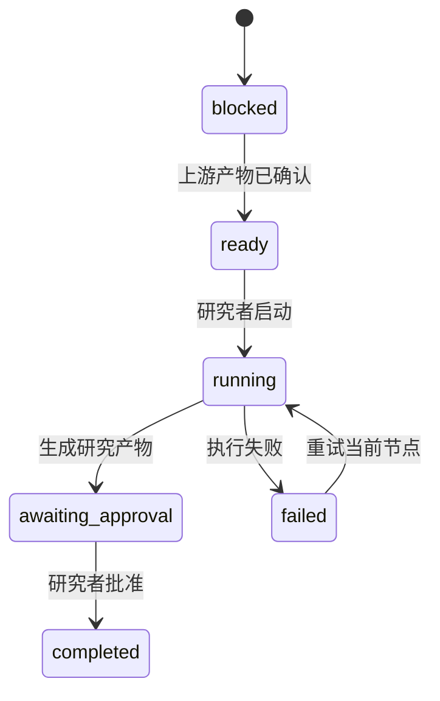
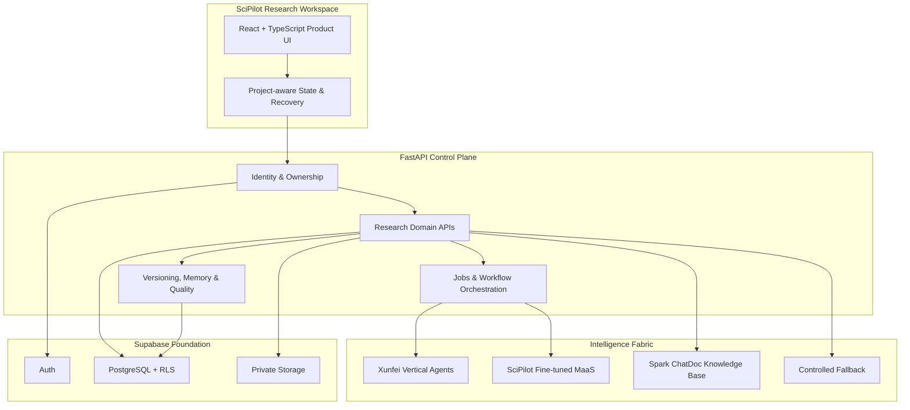

<div align="center">


<p>
  <strong>让复杂研究，从灵感进入秩序。</strong>
</p>

<p>
  SciPilot 将论文理解、问题定义、实验设计、代码复现、结果解释与知识沉淀<br/>
  组织成一条连续、可恢复、可审核的研究生产线。
</p>


<p>
  <a href="https://github.com/telitor/SciPilot"></a>
  
  
</p>

<p>
  
  
  
  
</p>

<br/>

<table>
<tr>
<td align="center" width="25%"><sub>UNDERSTAND</sub><br/><strong>论文与知识</strong></td>
<td align="center" width="25%"><sub>DESIGN</sub><br/><strong>问题与实验</strong></td>
<td align="center" width="25%"><sub>EXECUTE</sub><br/><strong>复现与分析</strong></td>
<td align="center" width="25%"><sub>ACCUMULATE</sub><br/><strong>资产与记忆</strong></td>
</tr>
</table>

</div>

---

<div align="center">

**[产品](#product) · [体验](#experience) · [研究主线](#journey) · [智能系统](#intelligence) · [平台架构](#platform) · [开始使用](#launch)**

</div>

---

<a id="product"></a>

## 不止回答问题，而是推动研究向前

今天的科研工具大多解决一个瞬间：读一篇论文、问一个问题、生成一段代码。

真正困难的部分发生在这些瞬间之间。研究背景如何延续到问题定义，问题如何约束实验，实验如何进入复现，结果如何回到证据，失败经验又如何成为下一轮研究的起点。

**SciPilot 设计的不是另一个聊天窗口，而是一套研究操作系统。**

它以科研项目为主线，让每一次模型调用都拥有上下文，让每一个研究结果都成为资产，让每一个关键决策都可以回看、确认和继续使用。

<br/>

<table>
<tr>
<td width="33%" valign="top">
<sub>01 / CONTEXT</sub>
<h3>研究上下文始终在线</h3>
论文、问题、实验、代码和结果归属于同一个项目。用户不需要在多个工具之间反复搬运背景信息。
</td>
<td width="33%" valign="top">
<sub>02 / CONTROL</sub>
<h3>关键判断仍由人掌握</h3>
上游结果经过确认后才进入下游。Agent 可以加速研究，但不会越过研究者擅自推进关键节点。
</td>
<td width="33%" valign="top">
<sub>03 / CONTINUITY</sub>
<h3>研究过程可以持续生长</h3>
长任务、产物版本、项目记忆和失败恢复共同保证研究不因页面刷新、网络波动或一次错误而中断。
</td>
</tr>
</table>

> [!TIP]
> SciPilot 当前以软件工程科研为核心场景，但平台的项目、工作流、记忆、评审和质量治理能力可以扩展到更广泛的计算机科研任务。

---

<a id="experience"></a>

## 一座为研究者打造的数字工作台

### Research Cockpit

进入 SciPilot，用户首先看到的不是功能菜单，而是研究正在发生什么：当前项目、最近活动、活跃任务、待确认产物、模型运行状态，以及可以继续推进的下一步。

### Project Space

每个项目都是独立的研究空间。论文、会话、问题树、实验路线、代码方案、结果分析和长期记忆在这里形成统一视图。项目支持归档与恢复，旧资产可以保持未归属，也可以在需要时加入新的研究主线。

### Paper Intelligence

上传 PDF 后，系统完成文本提取与结构化精读，呈现研究背景、核心方法、实验结果和关键结论。右侧追问自动携带当前论文上下文，研究者可以围绕同一篇论文继续深入，而不是重新解释材料。

### Problem Studio

将模糊研究意图转化为可执行问题结构：目标、约束、输入输出、关键难点、子任务和验收标准。问题树不是一次性的回答，而是后续实验设计的正式输入。

### Experiment Composer

基于已确认的问题版本生成实验路线，包括阶段任务、基线、数据集、指标、依赖、风险和里程碑。实验不再停留在文字建议，而是成为可以继续审核和迭代的研究资产。

### Reproduction Console

读取仓库结构与项目信息，分析环境、依赖、入口和运行路径，形成清晰的复现方案，并为后续错误诊断保留上下文。当前版本聚焦安全的分析与规划，不直接执行不可信代码。

### Result Observatory

上传真实实验数据，获得指标解释、对比结论、异常现象、可信边界和下一轮验证建议。系统关注的不只是“结果好不好”，还关注“为什么”和“结论能走多远”。

### Knowledge Center

通过服务端连接星火论文知识库，对远程论文仓库进行检索、问答、查询改写与融合重排。回答可以携带来源信息，浏览器不接触知识库密钥或仓库凭据。

---

<a id="journey"></a>

## 一条真正连续的研究主线


```mermaid
flowchart LR
    A["建立研究项目"] --> B["理解论文与证据"]
    B --> C["定义研究问题"]
    C --> D["设计实验路线"]
    D --> E["规划代码复现"]
    E --> F["解释实验结果"]
    F --> G["确认研究产物"]
    G --> H["沉淀项目记忆"]
    H -. "进入下一轮" .-> C
```

这条主线由四个系统级机制支撑：

| Foundation | What it changes |
|---|---|
| **Durable Jobs** | 复杂分析在后台持续运行，页面刷新后仍能恢复进度与结果 |
| **Artifact Versions** | 研究产物拥有草稿、版本、确认、废弃、恢复和来源关系 |
| **Human Approval** | 下游任务等待上游确认，关键科研判断不被自动化越权 |
| **Project Memory** | 事实、决策、约束、偏好和失败经验成为项目长期上下文 |

### 工作流不是黑盒自动化


```mermaid
stateDiagram-v2
    [*] --> blocked
    blocked --> ready: 上游产物已确认
    ready --> running: 研究者启动
    running --> awaiting_approval: 生成研究产物
    awaiting_approval --> completed: 研究者批准
    running --> failed: 执行失败
    failed --> running: 重试当前节点
```

SciPilot 不追求“无人值守地替研究者做决定”。它追求的是让自动化有边界，让每个结果有来源，让失败可以恢复，让研究者始终拥有最后的控制权。

---

<a id="intelligence"></a>

## 为科研任务而生的智能系统

<table>
<tr>
<td width="33%" valign="top"><sub>PAPER READING</sub><h3>论文精读助手</h3>识别论文结构、方法和结论，并围绕当前论文进行连续追问。</td>
<td width="33%" valign="top"><sub>PROBLEM DECOMPOSITION</sub><h3>问题拆解助手</h3>把复杂研究意图转化为目标、约束、难点、子任务与执行路径。</td>
<td width="33%" valign="top"><sub>PROJECT PLANNING</sub><h3>实验规划助手</h3>组织基线、数据集、指标、实验阶段、风险和里程碑。</td>
</tr>
<tr>
<td width="33%" valign="top"><sub>CODE REPRODUCTION</sub><h3>代码复现助手</h3>分析仓库、环境、依赖与入口，并在人工审批后通过 Docker 受控执行采集实验日志与文件证据。</td>
<td width="33%" valign="top"><sub>RESULT INTERPRETATION</sub><h3>结果分析助手</h3>解释指标变化、异常现象、对比结论和结论边界。</td>
<td width="33%" valign="top"><sub>SHARED INTELLIGENCE</sub><h3>统一研究上下文</h3>所有助手共享项目、已确认产物、长期记忆、知识检索与质量治理能力。</td>
</tr>
</table>

### 智能路由留在服务端

前端只根据 Agent 类别选择业务能力。FastAPI 在服务端读取对应应用配置，完成签名、超时、错误转换、上下文组装和结果持久化。

```text
Research Workspace
        -> FastAPI Control Plane
        -> Project Context + Confirmed Artifacts + Memory
        -> Professional Agent / Fine-tuned Model / Knowledge Service
        -> Versioned Result + Runtime Summary + Feedback
```

平台支持：

- 五类讯飞星辰专业 Agent，每个 Agent 可以使用独立应用配置。
- SciPilot 讯飞 MaaS 微调模型，通过 OpenAI 兼容 HTTP 接口调用。
- 星火 ChatDoc 论文知识库，支持查询改写、融合重排与来源组织。
- 可选通用模型和证据摘要降级路径，保证异常情况下仍有明确行为。

### 智能系统必须可观察

每次运行可以记录服务提供方、模型、状态、延迟、检索数量、降级模式和失败原因。用户可以对 Assistant 消息反馈，反馈先进入人工审核，不会自动进入训练流程。

平台还提供固定离线评测集与历史运行记录，用于观察检索质量和版本变化。真实模型评测默认关闭，避免自动消耗外部额度。

---

<a id="platform"></a>

## Enterprise Platform Architecture


```mermaid
flowchart TB
    subgraph Workspace["SciPilot Research Workspace"]
        Product["React + TypeScript Product UI"]
        State["Project-aware State & Recovery"]
    end

    subgraph Control["FastAPI Control Plane"]
        Identity["Identity & Ownership"]
        Research["Research Domain APIs"]
        Orchestration["Jobs & Workflow Orchestration"]
        Governance["Versioning, Memory & Quality"]
    end

    subgraph Intelligence["Intelligence Fabric"]
        Vertical["Xunfei Vertical Agents"]
        FineTuned["SciPilot Fine-tuned MaaS"]
        Knowledge["Spark ChatDoc Knowledge Base"]
        Fallback["Controlled Fallback"]
    end

    subgraph Foundation["Supabase Foundation"]
        Auth["Auth"]
        Database["PostgreSQL + RLS"]
        Storage["Private Storage"]
    end

    Product --> State --> Identity
    Identity --> Research
    Research --> Orchestration
    Research --> Governance
    Orchestration --> Vertical
    Orchestration --> FineTuned
    Research --> Knowledge
    Research --> Fallback
    Identity --> Auth
    Research --> Database
    Governance --> Database
    Research --> Storage
```

### Built for trust

<table>
<tr>
<td width="25%" valign="top"><strong>Server-side Credentials</strong><br/><br/>平台密钥、API Secret、Agent 地址和 LoRA 资源 ID 不进入浏览器。</td>
<td width="25%" valign="top"><strong>Ownership by Default</strong><br/><br/>项目、会话、论文和研究产物均进行用户归属校验。</td>
<td width="25%" valign="top"><strong>Row Level Security</strong><br/><br/>核心数据表采用 RLS、外键约束与最小权限策略。</td>
<td width="25%" valign="top"><strong>Traceable Decisions</strong><br/><br/>运行摘要、版本来源、人工确认和反馈审核共同形成审计线索。</td>
</tr>
</table>

### Technology foundation

| Layer | Technology |
|---|---|
| Product Experience | React 18, TypeScript, Vite, Zustand, Framer Motion, ECharts |
| API & Orchestration | FastAPI, Pydantic, background research worker, Docker execution sandbox |
| Identity & Data | Supabase Auth, PostgreSQL, Storage, RLS |
| Intelligence | Xunfei Star Agents, Xunfei MaaS, Spark ChatDoc |
| Document Processing | pypdf, multipart upload, structured Agent output |
| Quality | unittest, OpenAPI contract checks, offline retrieval evaluation |

---

## Product Surfaces

| Surface | Route | Experience |
|---|---|---|
| Cockpit | `/dashboard` | 研究状态、最近活动与模型对话 |
| Projects | `/projects` | 项目、资产、工作流、记忆与阶段推进 |
| Paper Intelligence | `/paper/read` | PDF 精读、论文上下文追问与报告展示 |
| Paper Library | `/paper/library` | 论文资产、深度阅读与知识同步 |
| Problem Studio | `/research/decompose` | 研究问题结构化拆解 |
| Experiment Composer | `/experiment/roadmap` | 实验路线与里程碑设计 |
| Reproduction Console | `/code/reproduce` | 仓库分析、复现规划与错误诊断 |
| Result Observatory | `/result/analyze` | 实验数据解释与结论分析 |
| Knowledge Center | `/knowledge` | 论文知识检索、问答与来源 |
| Knowledge Graph | `/kg/explore` | 知识节点、关系与主题探索 |

---

<a id="launch"></a>

## Launch SciPilot

### Reproducible local environment

SciPilot targets Python 3.11. On Windows, create a project-specific environment
without relying on an existing Anaconda installation:

```powershell
Set-Location D:\SciCopilot\SciCopilot
powershell -NoProfile -ExecutionPolicy Bypass -File backend\scripts\setup_dev.ps1
powershell -NoProfile -ExecutionPolicy Bypass -File backend\scripts\verify_dev_environment.ps1
```

The setup creates `backend/.venv-scipilot`. The desktop launcher verifies that
the interpreter can actually start before using it and skips stale environments.

Docker-based experiment execution is opt-in. Install Docker Desktop with WSL 2,
apply the latest Supabase migration, then set
`SCIPILOT_DOCKER_EXECUTION_ENABLED=true` in the private `backend/.env`. Dependency
preparation may use the network; the approved experiment command runs with no
network and bounded CPU, memory, process count, workspace size and execution time.

### Backend

```powershell
git clone https://github.com/telitor/SciPilot.git
Set-Location .\SciPilot\backend

python -m venv .venv
.\.venv\Scripts\Activate.ps1
python -m pip install -r requirements.txt
Copy-Item .env.example .env

python -m uvicorn main:app --reload --host 127.0.0.1 --port 8000
```

### Frontend

打开新的 PowerShell：

```powershell
Set-Location .\SciPilot\frontend
npm install
Copy-Item .env.example .env
npm run dev -- --host 127.0.0.1 --port 5173
```

| Service | URL |
|---|---|
| SciPilot | `http://127.0.0.1:5173` |
| FastAPI | `http://127.0.0.1:8000` |
| Swagger | `http://127.0.0.1:8000/docs` |

> [!IMPORTANT]
> 在首次启动前，需要按文件名顺序执行 `supabase/migrations` 目录中现存的 SQL 文件，并在 `backend/.env` 填入 Supabase 配置。真实 `.env` 不得提交到仓库。

<details>
<summary><strong>查看后端配置清单</strong></summary>

### Required

```env
SUPABASE_URL=https://your-project-ref.supabase.co
SUPABASE_PUBLISHABLE_KEY=your_publishable_key
SUPABASE_SECRET_KEY=your_backend_secret_key
CORS_ORIGINS=http://localhost:5173,http://127.0.0.1:5173
```

### SciPilot fine-tuned model

```env
SCIPILOT_LLM_BASE_URL=https://maas-api.cn-huabei-1.xf-yun.com/v2
SCIPILOT_LLM_API_KEY=
SCIPILOT_LLM_MODEL_ID=
SCIPILOT_LLM_RESOURCE_ID=
```

### Paper-reading Agent

```env
XF_AGENT_APP_ID=
XF_AGENT_API_KEY=
XF_AGENT_API_SECRET=
XF_AGENT_ASSISTANT_ID=
XF_AGENT_WS_HOST=spark-openapi.cn-huabei-1.xf-yun.com
XF_AGENT_WS_PATH=/v1/assistants/{assistant_id}
```

### Knowledge base

```env
XFYUN_KB_APP_ID=
XFYUN_KB_API_SECRET=
XFYUN_KB_REPO_ID=
XFYUN_KB_BASE_URL=https://chatdoc.xfyun.cn
```

其他专业 Agent 的独立配置请查看 [`backend/.env.example`](backend/.env.example)。

</details>

<details>
<summary><strong>查看开发验证命令</strong></summary>

```powershell
# Backend
Set-Location .\backend
python -m unittest discover -s tests -v

# Frontend
Set-Location ..\frontend
npm run type-check
npm run lint
npm run build
npm run test:e2e
```

</details>

---

## Repository

```text
SciPilot/
├─ frontend/              Research Workspace
├─ backend/               FastAPI Control Plane
│  ├─ api/                Domain APIs and contracts
│  ├─ services/           Agent, model, knowledge and job services
│  └─ tests/              Backend verification suite
├─ supabase/migrations/   Data model, RLS and workflow evolution
├─ KnowledgeBase/         ChatDoc integration and paper assets
├─ 模型微调/              Dataset and MaaS integration guides
├─ Agent/                 Vertical Agent specifications
└─ docs/                  Architecture and engineering documents
```

### Documentation

- [`docs/SCIPILOT_MATURITY_AND_CLOSURE_GAP_REPORT.md`](docs/SCIPILOT_MATURITY_AND_CLOSURE_GAP_REPORT.md)
- [`docs/BACKEND_TECH_STACK_AND_DEPENDENCIES.md`](docs/BACKEND_TECH_STACK_AND_DEPENDENCIES.md)
- [`docs/DATABASE_GUIDE.md`](docs/DATABASE_GUIDE.md)
- [`docs/FRONTEND_TECH_DEPENDENCIES.md`](docs/FRONTEND_TECH_DEPENDENCIES.md)
- [`KnowledgeBase/星火知识库后端接入说明.md`](KnowledgeBase/星火知识库后端接入说明.md)
- [`模型微调/SciPilot微调大模型HTTP调用说明.md`](模型微调/SciPilot微调大模型HTTP调用说明.md)

<details>
<summary><strong>Current engineering scope</strong></summary>

SciPilot 当前是工程预览版。项目已经具备完整研究主线、专业 Agent、后台任务、版本审核、项目记忆、运行观测和离线质量评估。

下一阶段重点不是继续堆叠孤立页面，而是完善管理员质量运营、外部知识库稳定性、真实模型版本回归、复杂 PDF 解析、受控执行镜像覆盖、生产配额与告警，以及团队协作权限。

</details>

---

## Security

- 浏览器只连接 FastAPI，不保存平台 API Key、API Secret、Agent 地址或 Supabase Secret Key。
- 不要提交 `backend/.env`、真实 token、模型 ID、LoRA Resource ID 或用户数据。
- 不要在公开 Issue 中粘贴完整服务端日志和外部平台凭据。
- 生产部署前应重新检查 CORS、RLS、管理员角色、配额、备份和告警策略。

---

<div align="center">

### SciPilot

**Research deserves a system, not a collection of disconnected tools.**

<sub>Understand deeply. Decide clearly. Execute reliably. Remember everything.</sub>

<br/><br/>


</div>
