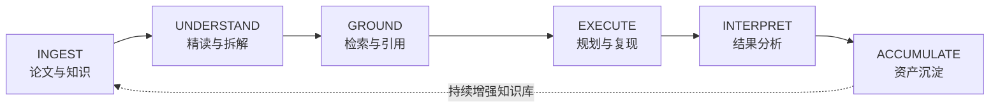
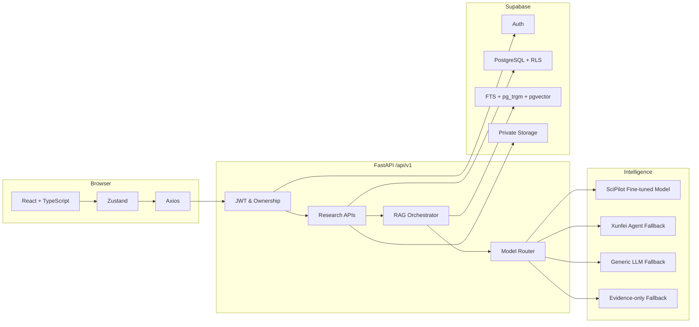
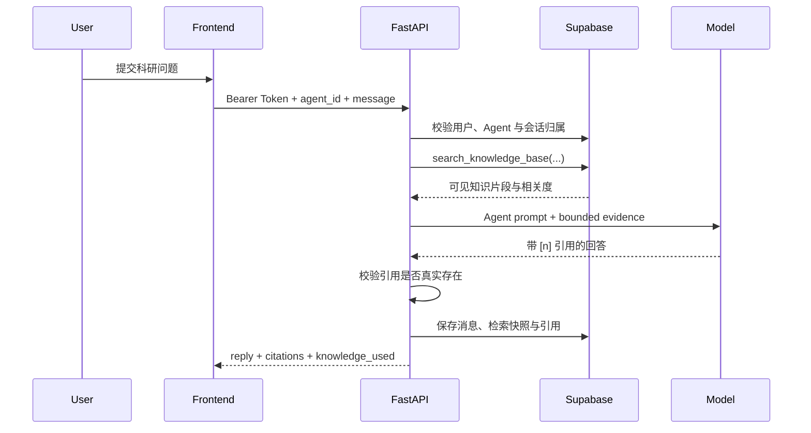
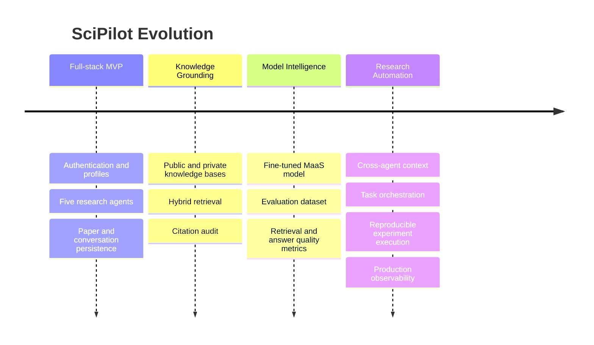

<div align="center">


<p>
  <strong>面向软件工程科研场景的新一代多智能体研究工作台</strong>
</p>

<p>
  让论文、知识、实验与代码在同一个智能工作流中持续流动
</p>

<p>
  <a href="https://github.com/telitor/SciPilot">
    
  </a>
  
  
</p>

<p>
  
</p>

<br/>

<table>
<tr>
<td align="center" width="25%"><sub>AGENT NETWORK</sub><br/><strong>5 VERTICAL AGENTS</strong></td>
<td align="center" width="25%"><sub>KNOWLEDGE LAYER</sub><br/><strong>HYBRID RAG</strong></td>
<td align="center" width="25%"><sub>MODEL RUNTIME</sub><br/><strong>FINE-TUNED MaaS</strong></td>
<td align="center" width="25%"><sub>TRUST BOUNDARY</sub><br/><strong>RLS + SERVER KEYS</strong></td>
</tr>
</table>

<sub>Evidence grounded. Citation traceable. Credentials server-side.</sub>

</div>

---

<div align="center">

### Product Navigation

<table>
<tr>
<td align="center"><a href="#product-vision"><strong>产品愿景</strong></a></td>
<td align="center"><a href="#capability-system"><strong>能力系统</strong></a></td>
<td align="center"><a href="#agent-matrix"><strong>Agent Matrix</strong></a></td>
<td align="center"><a href="#system-architecture"><strong>系统架构</strong></a></td>
</tr>
<tr>
<td align="center"><a href="#rag-pipeline"><strong>RAG Pipeline</strong></a></td>
<td align="center"><a href="#fine-tuned-runtime"><strong>微调模型</strong></a></td>
<td align="center"><a href="#quick-start"><strong>快速启动</strong></a></td>
<td align="center"><a href="#roadmap"><strong>演进路线</strong></a></td>
</tr>
</table>

</div>

---

<a id="product-vision"></a>

## SciPilot 是什么

SciPilot 不是一个通用聊天框，而是一套围绕科研理解、实验设计和工程复现构建的智能工作流。

系统将五类垂直 Agent、个人与公共知识库、论文管理、会话持久化和微调模型统一在一个全栈应用中。用户只与 React 前端交互；FastAPI 负责身份校验、知识检索、模型路由和结果落库；Supabase 提供 Auth、PostgreSQL、Storage、RLS 与向量检索能力。

```text
研究资料进入系统
      ↓
解析、去重、切块与索引
      ↓
用户选择科研 Agent 并提出问题
      ↓
检索公共知识 + 用户私有知识
      ↓
微调模型生成有依据的回答
      ↓
引用校验、会话保存与检索审计
```

> [!NOTE]
> 当前仓库定位为可运行的全栈 MVP。模型、Supabase 和可选 Embedding 服务需要由部署者在后端环境变量中配置。

### Product Principles

<table>
<tr>
<td width="33%" valign="top">
<h3>01 · Evidence First</h3>
<strong>回答必须有据可查</strong>
<br/><br/>
先检索用户可见知识，再组织模型回答；所有来源使用 <code>[n]</code> 标记并接受合法性校验。
</td>
<td width="33%" valign="top">
<h3>02 · Workflow Native</h3>
<strong>能力围绕科研任务组织</strong>
<br/><br/>
从论文精读到实验规划，从问题拆解到代码复现，不让用户在多个孤立工具间反复搬运上下文。
</td>
<td width="33%" valign="top">
<h3>03 · Security by Design</h3>
<strong>密钥与数据边界后置</strong>
<br/><br/>
浏览器只连接 FastAPI；模型凭据留在服务端；公共知识与个人知识通过 RLS 隔离。
</td>
</tr>
</table>

### Research Journey


```mermaid
flowchart LR
    A["INGEST<br/>论文与知识"] --> B["UNDERSTAND<br/>精读与拆解"]
    B --> C["GROUND<br/>检索与引用"]
    C --> D["EXECUTE<br/>规划与复现"]
    D --> E["INTERPRET<br/>结果分析"]
    E --> F["ACCUMULATE<br/>资产沉淀"]
    F -. "持续增强知识库" .-> A
```

<a id="capability-system"></a>

## 核心能力

<table>
<tr>
<td width="50%" valign="top">
<h3>Research Workspace</h3>
<code>PAPERS</code> <code>AGENTS</code> <code>CONVERSATIONS</code>
<br/><br/>
PDF 上传与文本提取、论文元数据、结构化精读、论文库、五类科研 Agent、历史会话与持续追问。
</td>
<td width="50%" valign="top">
<h3>Knowledge Intelligence</h3>
<code>INGEST</code> <code>SEARCH</code> <code>GROUND</code>
<br/><br/>
知识集合、PDF/TXT/Markdown/文本入库、SHA-256 去重、分段切块、全文检索、中文模糊检索与可选向量检索。
</td>
</tr>
<tr>
<td width="50%" valign="top">
<h3>Trust & Traceability</h3>
<code>CITATIONS</code> <code>AUDIT</code> <code>RLS</code>
<br/><br/>
来源片段、<code>[n]</code> 引用校验、检索快照、引用审计、公共与私有数据隔离、私有文件存储。
</td>
<td width="50%" valign="top">
<h3>Research Assets</h3>
<code>ROADMAP</code> <code>CODE</code> <code>RESULTS</code>
<br/><br/>
问题拆解、实验路线图、代码仓库分析、运行错误诊断、实验结果解读、知识节点与关系浏览。
</td>
</tr>
</table>

<a id="agent-matrix"></a>

## Agent Matrix

<table>
<tr>
<td width="33%" valign="top">
<sub>AGENT 01</sub>
<h3>论文精读</h3>
<code>paper-reading</code>
<br/><br/>
提取论文脉络、核心方法、实验设计与关键结论，并围绕当前论文持续追问。
</td>
<td width="33%" valign="top">
<sub>AGENT 02</sub>
<h3>问题拆解</h3>
<code>problem-decomposition</code>
<br/><br/>
把复杂研究问题拆成目标、约束、输入输出、核心难点、子任务与验收标准。
</td>
<td width="33%" valign="top">
<sub>AGENT 03</sub>
<h3>实验规划</h3>
<code>project-planning</code>
<br/><br/>
生成阶段任务、技术路线、里程碑、依赖关系、风险控制与执行计划。
</td>
</tr>
<tr>
<td width="33%" valign="top">
<sub>AGENT 04</sub>
<h3>代码复现</h3>
<code>code-reproduction</code>
<br/><br/>
分析仓库结构、环境依赖、入口脚本与运行路径，协助定位复现过程中的错误。
</td>
<td width="33%" valign="top">
<sub>AGENT 05</sub>
<h3>结果分析</h3>
<code>result-interpretation</code>
<br/><br/>
解读指标变化、模型差异和异常现象，识别结论边界并提出下一轮验证建议。
</td>
<td width="33%" valign="top">
<sub>SHARED INTELLIGENCE</sub>
<h3>统一知识底座</h3>
<code>RAG + CITATIONS</code>
<br/><br/>
五个工作舱共享同一套知识检索、引用校验、会话持久化和安全权限体系。
</td>
</tr>
</table>

所有 Agent 复用统一后端闭环：

```text
GET /agents
  → POST /conversations
  → POST /conversations/{id}/messages
  → RAG retrieval
  → model response
  → Supabase persistence
```

前端只认识 `agent_id` 和 `category`，不会接触模型的 API Key、API Secret、WebSocket 地址或 LoRA 资源 ID。

### Product Surfaces

| Workspace | Route | 交付结果 |
|---|---|---|
| Research Cockpit | `/dashboard` | 研究资产、活动与工作状态总览 |
| Paper Intelligence | `/paper/read` · `/paper/library` | 论文上传、精读、追问与论文资产管理 |
| Problem Studio | `/research/decompose` | 研究问题结构化拆解 |
| Experiment Studio | `/experiment/roadmap` | 可执行实验路线图 |
| Reproduction Studio | `/code/reproduce` | 仓库分析、环境规划与错误诊断 |
| Result Studio | `/result/analyze` | 实验数据解读与结论建议 |
| Knowledge Center | `/knowledge` | 私有集合、文档入库、检索与基于来源问答 |
| Knowledge Graph | `/kg/explore` | 知识节点、关系网络与主题探索 |

---

<a id="system-architecture"></a>

## System Architecture

<p align="right"><code>SCIPILOT / SYSTEM BLUEPRINT / 01</code></p>


```mermaid
flowchart LR
    subgraph Browser["Browser"]
        UI["React + TypeScript"]
        Store["Zustand"]
        HTTP["Axios"]
    end

    subgraph Backend["FastAPI /api/v1"]
        Auth["JWT & Ownership"]
        API["Research APIs"]
        Retrieval["RAG Orchestrator"]
        Router["Model Router"]
    end

    subgraph Intelligence["Intelligence"]
        FineTuned["SciPilot Fine-tuned Model"]
        Xunfei["Xunfei Agent Fallback"]
        Generic["Generic LLM Fallback"]
        Extractive["Evidence-only Fallback"]
    end

    subgraph Supabase["Supabase"]
        SupaAuth["Auth"]
        DB["PostgreSQL + RLS"]
        Vector["FTS + pg_trgm + pgvector"]
        Storage["Private Storage"]
    end

    UI --> Store --> HTTP
    HTTP --> Auth --> API
    API --> Retrieval
    Retrieval --> Vector
    Retrieval --> Router
    Router --> FineTuned
    Router --> Xunfei
    Router --> Generic
    Router --> Extractive
    Auth --> SupaAuth
    API --> DB
    API --> Storage
```

### 数据边界

- 浏览器仅调用 FastAPI，不直接连接模型服务。
- Supabase Secret Key、模型 Key 和 LoRA 资源 ID 只存在于 `backend/.env`。
- 私有知识文件存储在非公开 Storage Bucket 中。
- 公共知识可被登录用户检索，个人知识只对所有者可见。
- 知识表和 Storage 均使用 RLS；后端检索 RPC 只授权给服务端角色。

---

<a id="rag-pipeline"></a>

## RAG 工作流

<p align="right"><code>SCIPILOT / KNOWLEDGE ENGINE / 02</code></p>


```mermaid
sequenceDiagram
    participant U as User
    participant F as Frontend
    participant A as FastAPI
    participant S as Supabase
    participant M as Model

    U->>F: 提交科研问题
    F->>A: Bearer Token + agent_id + message
    A->>S: 校验用户、Agent 与会话归属
    A->>S: search_knowledge_base(...)
    S-->>A: 可见知识片段与相关度
    A->>M: Agent prompt + bounded evidence
    M-->>A: 带 [n] 引用的回答
    A->>A: 校验引用是否真实存在
    A->>S: 保存消息、检索快照与引用
    A-->>F: reply + citations + knowledge_used
```

检索策略：

1. 默认使用 PostgreSQL 全文检索与 `pg_trgm` 中文模糊检索。
2. 配置 Embedding 服务后，自动加入 1536 维 `pgvector` 语义检索。
3. 系统合并关键词相关度和向量相似度，返回当前用户可见的片段。
4. 模型必须使用合法的 `[1]`、`[2]` 引用；无效引用会触发可审计的证据摘录 fallback。
5. 没有命中证据时，系统明确说明知识库信息不足，而不是编造来源。

---

<a id="fine-tuned-runtime"></a>

## 微调模型链路

<p align="right"><code>SCIPILOT / MODEL RUNTIME / 03</code></p>

SciPilot 已接入讯飞 MaaS 的 OpenAI 兼容 HTTP 接口。模型配置完整时，RAG 和现有回复链路会优先使用 SciPilot 微调模型。

```text
SCIPILOT_LLM_* configured
        ↓
POST /v2/chat/completions
        ↓
model = SCIPILOT_LLM_MODEL_ID
lora_id header = SCIPILOT_LLM_RESOURCE_ID
        ↓
grounded answer + citation validation
```

模型选择顺序：

1. SciPilot 微调模型；
2. 论文精读 Agent 的讯飞 WebSocket 调用；
3. 可选通用 LLM；
4. 仅基于证据片段的安全摘录。

> [!IMPORTANT]
> `SCIPILOT_LLM_RESOURCE_ID` 是 LoRA 的 Resource ID，后端会把它作为 `lora_id` 请求头发送。不要把它写到前端，也不要提交真实值。

### Runtime Profiles

| Profile | Model | Retrieval | 系统行为 |
|---|---|---|---|
| Evidence Core | 未配置 | 全文 + 中文模糊 | 返回带引用的证据摘录，知识库仍可完整使用 |
| Fine-tuned | SciPilot MaaS | 全文 + 中文模糊 | 微调模型基于命中证据生成回答 |
| Hybrid Intelligence | SciPilot MaaS | 全文 + 模糊 + pgvector | 同时启用语义召回、微调生成和引用审计 |
| Compatibility | Xunfei / Generic LLM | 可用检索 | 微调模型不可用时按服务端配置安全降级 |

---

<a id="quick-start"></a>

## Quick Start

<p align="right"><code>SCIPILOT / LAUNCH SEQUENCE / 04</code></p>

### 1. 获取代码

```powershell
git clone https://github.com/telitor/SciPilot.git
Set-Location .\SciPilot
```

### 2. 准备 Supabase

创建 Supabase 项目后，在 SQL Editor 中按编号顺序执行：

```text
supabase/migrations/001_init_schema.sql
supabase/migrations/002_updated_at_trigger.sql
supabase/migrations/003_rls_policies.sql
supabase/migrations/004_add_multi_agents.sql
supabase/migrations/005_add_project_planning_agent.sql
supabase/migrations/006_workspace_data_layer.sql
supabase/migrations/007_seed_public_research_catalog.sql
supabase/migrations/008_knowledge_base.sql
```

`008_knowledge_base.sql` 会创建知识集合、文档、切块、检索记录、引用记录、混合检索 RPC 和私有 `knowledge-base` Storage Bucket。

> [!TIP]
> 如果 Supabase 项目关闭了新表的 Data API 自动暴露，请同时检查迁移中的 `GRANT` 是否已经生效。RLS 决定“能看到哪些行”，Data API 权限决定“表是否可访问”。

### 3. 启动后端

```powershell
Set-Location .\backend
python -m venv .venv
.\.venv\Scripts\Activate.ps1
python -m pip install -r requirements.txt
Copy-Item .env.example .env
```

编辑 `backend/.env`，至少填写 Supabase 配置：

```env
SUPABASE_URL=https://your-project-ref.supabase.co
SUPABASE_PUBLISHABLE_KEY=your_publishable_key
SUPABASE_SECRET_KEY=your_backend_secret_key
```

启动 API：

```powershell
python -m uvicorn main:app --reload
```

| Service | URL |
|---|---|
| Backend | `http://localhost:8000` |
| Swagger | `http://localhost:8000/docs` |
| API Prefix | `http://localhost:8000/api/v1` |

### 4. 启动前端

打开新的 PowerShell：

```powershell
Set-Location .\frontend
npm install
Copy-Item .env.example .env
npm run dev
```

访问 `http://localhost:5173`。

前端只需要：

```env
VITE_API_BASE_URL=http://localhost:8000/api/v1
```

## Backend Configuration

### 必需配置

```env
# Supabase
SUPABASE_URL=https://your-project-ref.supabase.co
SUPABASE_PUBLISHABLE_KEY=your_publishable_key
SUPABASE_SECRET_KEY=your_backend_secret_key

# Local origins
CORS_ORIGINS=http://localhost:5173,http://127.0.0.1:5173
```

### SciPilot 微调模型

```env
SCIPILOT_LLM_BASE_URL=https://maas-api.cn-huabei-1.xf-yun.com/v2
SCIPILOT_LLM_API_KEY=your_web_api_key
SCIPILOT_LLM_MODEL_ID=your_model_id
SCIPILOT_LLM_RESOURCE_ID=your_lora_resource_id
SCIPILOT_LLM_TEMPERATURE=0.3
SCIPILOT_LLM_MAX_TOKENS=2048
```

### 可选语义检索

```env
EMBEDDING_API_KEY=your_embedding_api_key
EMBEDDING_BASE_URL=
EMBEDDING_MODEL=text-embedding-3-small
```

当前数据库向量列为 1536 维，因此 Embedding 模型也必须输出 1536 维向量。不配置时，知识库仍可使用全文与中文模糊检索。

### 可选模型 fallback

```env
LLM_API_KEY=
LLM_BASE_URL=
LLM_MODEL=
```

完整字段和注释请查看 [backend/.env.example](backend/.env.example)。

> [!CAUTION]
> 不要提交 `backend/.env`。不要把 Supabase Secret/Service Role Key、模型 API Key、API Secret 或 Resource ID 放进任何 `VITE_*` 变量。

---

## API Overview

<p align="right"><code>SCIPILOT / API CONTROL PLANE / 05</code></p>

所有业务接口使用 `/api/v1` 前缀。

| Domain | Endpoints |
|---|---|
| Health | `GET /health` |
| Auth | `POST /auth/register`, `POST /auth/login`, `POST /auth/logout` |
| Profile | `GET/PATCH /users/me`, `GET /users/me/stats` |
| Papers | `POST /papers/upload`, `GET /papers`, `GET /papers/{id}` |
| Agents | `GET /agents`, `POST /agents/{id}/ask` |
| Conversations | `POST/GET /conversations`, `POST /conversations/{id}/messages` |
| Legacy Chat | `POST /chat` |
| Knowledge Base | `/knowledge/status`, `/collections`, `/documents`, `/search`, `/answer` |
| Research | `POST /research/decompose`, `GET /research/{id}` |
| Experiments | `POST /experiments/generate-roadmap`, `GET /experiments/{id}` |
| Code | `POST /code/analyze-repo`, `POST /code/diagnose` |
| Results | `POST /results/analyze`, `GET /results/{id}` |
| Knowledge Graph | `GET /kg/explore`, `GET /kg/search` |
| Dashboard | `GET /dashboard/summary` |

Swagger 会展示最新请求模型和响应结构：

```text
http://localhost:8000/docs
```

---

## Project Structure

<p align="right"><code>SCIPILOT / REPOSITORY MAP / 06</code></p>

```text
SciPilot/
├─ backend/
│  ├─ api/
│  │  ├─ dependencies.py          # JWT 与依赖注入
│  │  ├─ routes.py                # /api/v1 业务接口
│  │  └─ schemas.py               # Pydantic 请求/响应模型
│  ├─ services/
│  │  ├─ agent_knowledge_service.py
│  │  ├─ finetuned_model_service.py
│  │  ├─ knowledge_base_service.py
│  │  ├─ llm_service.py
│  │  ├─ supabase_service.py
│  │  └─ xunfei_agent_service.py
│  ├─ scripts/                    # 数据播种与端到端验证
│  ├─ tests/                      # 后端单元测试
│  ├─ main.py
│  └─ requirements.txt
├─ frontend/
│  ├─ src/
│  │  ├─ components/
│  │  ├─ pages/
│  │  ├─ services/
│  │  ├─ store/
│  │  └─ App.tsx
│  └─ package.json
├─ supabase/
│  └─ migrations/                 # 001 - 008
├─ docs/
│  ├─ DATABASE_GUIDE.md
│  └─ KNOWLEDGE_BASE_GUIDE.md
├─ 模型微调/
└─ README.md
```

## Verification

前端：

```powershell
Set-Location .\frontend
npm run type-check
npm run build
```

后端单元测试：

```powershell
Set-Location .\backend
python -m unittest discover -s tests -p "test_*.py"
```

连接真实 Supabase 后，可执行：

```powershell
python scripts/verify_supabase.py
python scripts/e2e_knowledge_base.py
python scripts/e2e_agent_knowledge.py
```

建议手工验收：

1. 注册并登录两个测试账号。
2. 创建个人知识集合，分别添加文本和可提取文本的 PDF。
3. 搜索文档关键词，确认出现命中片段与相关度。
4. 在五个 Agent 页面分别提问，确认回答带 `[n]` 引用和来源卡片。
5. 检查第二个账号无法读取第一个账号的私有集合。
6. 确认公共知识仍可被两个账号读取。
7. 在 Supabase 中确认 `kb_retrievals`、`kb_citations` 和会话消息已落库。

---

## 当前边界

- 扫描版 PDF 暂不执行 OCR，需先转换成可复制文本的 PDF。
- Embedding 是可选能力；未配置时不是语义向量检索。
- 微调模型接入已完成，但运行效果取决于部署者提供的 MaaS API Key、Model ID 和 Resource ID。
- 多 Agent 当前是统一入口下的垂直能力调用，不是自动自治编排系统。
- 仓库未内置生产域名、CI/CD、监控告警与云端部署配置。

---

<a id="roadmap"></a>

## Roadmap

<p align="right"><code>SCIPILOT / EVOLUTION MAP / 07</code></p>


```mermaid
timeline
    title SciPilot Evolution
    Full-stack MVP
      : Authentication and profiles
      : Five research agents
      : Paper and conversation persistence
    Knowledge Grounding
      : Public and private knowledge bases
      : Hybrid retrieval
      : Citation audit
    Model Intelligence
      : Fine-tuned MaaS model
      : Evaluation dataset
      : Retrieval and answer quality metrics
    Research Automation
      : Cross-agent context
      : Task orchestration
      : Reproducible experiment execution
      : Production observability
```

## Documentation

- [数据库部署与使用指南](docs/DATABASE_GUIDE.md)
- [知识库使用与验收指南](docs/KNOWLEDGE_BASE_GUIDE.md)
- [微调模型 HTTP 调用说明](模型微调/SciPilot微调大模型HTTP调用说明.md)
- [微调模型 WebSocket 调用说明](模型微调/SciPilot微调大模型WebSocket调用说明.md)

---

<div align="center">

### SciPilot

**Turn research material into grounded, traceable and executable work.**

<sub>Research Understanding · Engineering Reproduction · Knowledge Grounding</sub>

<br/><br/>


</div>
