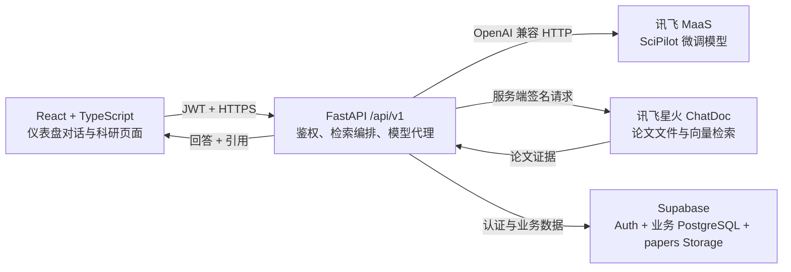

# SciPilot

SciPilot 是面向软件工程科研场景的全栈研究工作台。登录后进入仪表盘，即可使用接入讯飞 MaaS 微调模型的对话框；需要论文依据时，可开启“论文增强”，由讯飞星火 ChatDoc 外接知识库检索证据，再由微调模型生成带来源的回答。

> 当前实现的核心边界：浏览器只访问 SciPilot 的 FastAPI；MaaS、ChatDoc 与 Supabase 的凭据全部保留在后端环境变量中。

## 已实现能力

- 仪表盘模型对话：支持多轮上下文、Markdown、快捷提问、清空/重试、折叠、移动端布局和本地会话保留。
- 微调模型接入：后端使用讯飞 MaaS OpenAI 兼容 HTTP 接口；配置资源 ID 时以 `lora_id` 请求头调用对应微调资源。
- 论文知识增强：使用星火 ChatDoc 的远端知识库和向量检索，不再把知识库文档、切块或向量保存到 Supabase。
- 可追溯回答：知识检索结果作为受限上下文交给 MaaS，前端展示命中文档与引用片段。
- 科研工作区：论文精读、问题拆解、实验路线、代码复现、结果分析、知识图谱、会话和活动记录。
- 数据隔离：Supabase 继续负责登录、用户资料和业务数据；RLS 保护用户的论文、对话与研究产物。

## 系统架构


```mermaid
flowchart LR
    Browser["React + TypeScript\n仪表盘对话与科研页面"]
    API["FastAPI /api/v1\n鉴权、检索编排、模型代理"]
    MaaS["讯飞 MaaS\nSciPilot 微调模型"]
    ChatDoc["讯飞星火 ChatDoc\n论文文件与向量检索"]
    Supabase["Supabase\nAuth + 业务 PostgreSQL + papers Storage"]

    Browser -->|"JWT + HTTPS"| API
    API -->|"OpenAI 兼容 HTTP"| MaaS
    API -->|"服务端签名请求"| ChatDoc
    API -->|"认证与业务数据"| Supabase
    ChatDoc -->|"论文证据"| API
    API -->|"回答 + 引用"| Browser
```

### 数据职责

| 系统 | 保存/处理内容 | 不应保存的内容 |
| --- | --- | --- |
| 浏览器 | 登录令牌、界面状态、最近 20 条仪表盘对话 | APIKey、APISecret、Supabase 服务端密钥 |
| FastAPI | 鉴权、请求校验、知识检索编排、模型调用 | 不把真实密钥返回给前端 |
| 星火 ChatDoc | `KnowledgeBase/Papers` 上传后的文档、解析结果和向量 | SciPilot 用户认证与业务表 |
| 讯飞 MaaS | 微调模型推理 | SciPilot 业务数据库 |
| Supabase | Auth、用户资料、论文业务记录、会话、研究产物、活动和知识图谱 | 不再承担 RAG 文档切块、向量和知识库文件存储 |

## 关键调用链路

### 仪表盘对话

```text
POST /api/v1/dashboard/chat
  -> 可选调用 ChatDoc /openapi/v1/vector/search
  -> 组装多轮历史、系统提示词与有限证据
  -> POST MaaS /v2/chat/completions
  -> 返回 reply、citations、model、knowledge_used
```

`SCIPILOT_LLM_RESOURCE_ID` 是微调模型资源 ID，仅用于 MaaS 请求；它不是星火知识库 ID。星火知识库由 `XFYUN_KB_REPO_ID` 标识，两者不能混用。

### 知识库页面

| 接口 | 用途 |
| --- | --- |
| `GET /api/v1/knowledge/status` | 查看远端库、文件数和已向量化数量 |
| `POST /api/v1/knowledge/search` | 只检索论文证据 |
| `POST /api/v1/knowledge/answer` | ChatDoc 检索后由 MaaS 组织回答 |
| `GET /api/v1/dashboard/chat/status` | 查看模型与论文增强是否可用 |
| `POST /api/v1/dashboard/chat` | 仪表盘多轮对话 |

上述知识库与仪表盘对话接口均由后端验证登录身份。

## 本地启动

### 环境要求

- Node.js 18 或更高版本（推荐当前 LTS）
- npm 9 或更高版本
- Python 3.10 或更高版本（推荐 3.11）
- 一个 Supabase 项目，用于 Auth 和业务数据
- 已开通的讯飞 MaaS 与星火 ChatDoc 服务
- Go：不需要

### 1. 获取项目

```powershell
git clone https://github.com/telitor/SciPilot.git
Set-Location .\SciPilot
```

### 2. 初始化 Supabase

在 Supabase SQL Editor 中，按文件名编号执行 `supabase/migrations/` 下的全部迁移。迁移序列保留历史变更：旧版 Supabase RAG 结构会由后续清理迁移移除，最终仅保留认证、论文和其他业务数据结构。

详细说明见 [数据库指南](docs/DATABASE_GUIDE.md)。

### 3. 配置并启动后端

```powershell
Set-Location .\backend
python -m venv .venv
.\.venv\Scripts\Activate.ps1
python -m pip install -r requirements.txt
Copy-Item .env.example .env
```

编辑 `backend/.env`。以下值必须填写真实部署值，但不得提交到 Git：

```dotenv
# Supabase：认证与业务数据
SUPABASE_URL=https://your-project-ref.supabase.co
SUPABASE_PUBLISHABLE_KEY=your_publishable_key
SUPABASE_SECRET_KEY=your_backend_secret_key

# 讯飞 MaaS 微调模型
SCIPILOT_LLM_BASE_URL=https://maas-api.cn-huabei-1.xf-yun.com/v2
SCIPILOT_LLM_API_KEY=your_server_api_key
SCIPILOT_LLM_MODEL_ID=your_model_id
SCIPILOT_LLM_RESOURCE_ID=your_resource_id

# 星火 ChatDoc 外接知识库
XFYUN_KB_APP_ID=your_app_id
XFYUN_KB_API_SECRET=your_api_secret
XFYUN_KB_REPO_ID=your_repo_id
XFYUN_KB_BASE_URL=https://chatdoc.xfyun.cn

CORS_ORIGINS=http://localhost:5173,http://127.0.0.1:5173
```

如果本机只做界面和模型验收、暂时没有 Supabase 凭据，可在仅供本机使用的
`backend/.env` 中显式启用隔离演示账号：

```dotenv
SCIPILOT_ENV=local
LOCAL_DEMO_MODE=true
LOCAL_DEMO_EMAIL=demo@scipilot.local
LOCAL_DEMO_PASSWORD=请设置一个仅本机使用的强密码
LOCAL_DEMO_USERNAME=本地验收用户
```

该模式默认关闭，并且代码只在 `SCIPILOT_ENV=local` 时允许启用；共享、测试或
生产部署应保留 `SCIPILOT_ENV=production`。

启动：

```powershell
python -m uvicorn main:app --reload --host 127.0.0.1 --port 8000
```

- API：`http://127.0.0.1:8000`
- Swagger：`http://127.0.0.1:8000/docs`
- API 前缀：`http://127.0.0.1:8000/api/v1`

### 4. 配置并启动前端

打开新的 PowerShell：

```powershell
Set-Location .\frontend
npm install
Copy-Item .env.example .env
npm run dev
```

前端只需要后端地址：

```dotenv
VITE_API_BASE_URL=http://127.0.0.1:8000/api/v1
```

访问 `http://127.0.0.1:5173`，注册或登录后进入 `/dashboard`。不要创建任何包含密钥的 `VITE_*` 变量。

### 5. Windows 构建后双击启动

先完成后端依赖安装、`backend/.env` 配置和前端构建：

```powershell
Set-Location .\frontend
npm run build
```

随后可双击仓库根目录的 `启动_SciPilot本地网页_双击运行.cmd`。该脚本启动后端和已构建前端，验收地址仍为 `http://127.0.0.1:5173`。

## 构建论文知识库

本地论文原件位于 `KnowledgeBase/Papers/`。它们是上传源文件，不是运行时由浏览器读取的知识库。批量脚本会做 SHA-256 去重、断点记录和向量化状态检查：

```powershell
Set-Location .\KnowledgeBase\api-python-demo\chatdoc-api-python-demo
python -m pip install -e .
python .\batch_upload.py                    # 仅预检
python .\batch_upload.py --execute --limit 3 # 小批验证
python .\batch_upload.py --execute           # 默认处理 10 篇；重复运行可断点续传
python .\batch_upload.py --status-only       # 检查已上传文件状态
```

网络稳定并确认账号配额后，也可用 `--batch-size 0` 在单次运行中处理所有待上传文件。

完整流程见 [星火知识库后端接入说明](KnowledgeBase/星火知识库后端接入说明.md)。上传受网络、账号配额和讯飞解析状态影响；以 `/knowledge/status` 返回的远端数量与 `vectored_count` 为准。

## 前端页面

| 页面 | 路由 |
| --- | --- |
| 首页 / 登录 / 注册 | `/` · `/login` · `/register` |
| 仪表盘与模型对话 | `/dashboard` |
| 论文精读 / 论文库 | `/paper/read` · `/paper/library` |
| 外接论文知识库 | `/knowledge` |
| 问题拆解 | `/research/decompose` |
| 实验路线 | `/experiment/roadmap` |
| 代码复现 | `/code/reproduce` |
| 结果分析 | `/result/analyze` |
| 知识图谱 | `/kg/explore` |
| 个人资料 | `/profile` |

## 项目结构

```text
SciPilot/
├─ backend/
│  ├─ api/                         # FastAPI 路由、鉴权与请求模型
│  ├─ services/
│  │  ├─ finetuned_model_service.py
│  │  ├─ xunfei_knowledge_base_service.py
│  │  ├─ xunfei_agent_service.py
│  │  └─ supabase_service.py
│  ├─ tests/
│  └─ main.py
├─ frontend/
│  └─ src/
│     ├─ features/model-chat/       # 仪表盘模型对话（独立新模块）
│     ├─ pages/KnowledgeBase/       # 星火知识库页面
│     ├─ services/api.ts
│     └─ store/
├─ KnowledgeBase/
│  ├─ Papers/                       # 本地论文上传源
│  ├─ api-python-demo/              # 批量构建工具
│  └─ api-java-demo/                # Java 接入示例
├─ supabase/migrations/             # Auth 与业务数据库迁移历史
├─ docs/
└─ 模型微调/
```

## 验证

```powershell
# 后端
Set-Location .\backend
python -m unittest discover -s tests -p "test_*.py" -v

# 前端
Set-Location ..\frontend
npm run type-check
npm run build
```

手工验收建议：

1. 注册并登录，确认首个业务页面为仪表盘。
2. 检查 SciPilot AI 状态为在线并发送连续两轮问题。
3. 开启“论文增强”，确认回答显示论文引用；关闭后确认仍可直接对话。
4. 打开 `/knowledge`，确认远端文件数、向量化数量、搜索和知识问答可用。
5. 使用第二个账号确认无法读取第一个账号的论文、对话和研究产物。
6. 检查浏览器网络响应、前端构建产物和 Git 变更中均无任何真实密钥。

## 安全要求

- `backend/.env`、`frontend/.env`、上传断点文件、日志、`node_modules/` 和构建产物不得提交。
- MaaS APIKey、ChatDoc APISecret、Supabase Secret/Service Role Key 只能存在于后端 Secret 管理或本地 `.env`。
- Resource ID、Model ID、Repo ID 也建议通过环境变量注入，不写入前端代码。
- 任何曾出现在聊天、截图、Issue 或提交历史中的长期凭据，都应在对应控制台轮换后再用于生产。
- 生产环境应使用 HTTPS、严格 CORS、受控日志和独立测试/生产凭据。

## 文档

- [前端技术依赖清单](docs/FRONTEND_TECH_DEPENDENCIES.md)
- [数据库部署与使用指南](docs/DATABASE_GUIDE.md)
- [星火知识库后端接入与论文构建](KnowledgeBase/星火知识库后端接入说明.md)
- [GitHub 更新清单](docs/GITHUB_UPDATE_CHECKLIST.md)
- [微调模型 HTTP 调用说明](模型微调/SciPilot微调大模型HTTP调用说明.md)
- [微调模型 WebSocket 调用说明](模型微调/SciPilot微调大模型WebSocket调用说明.md)
