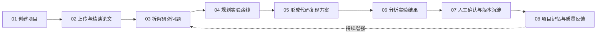
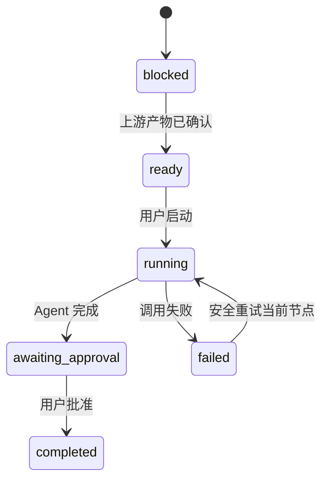
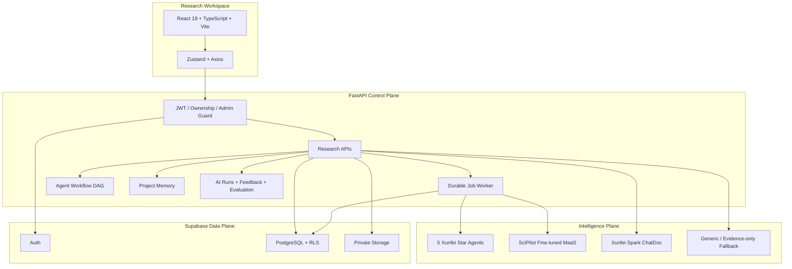
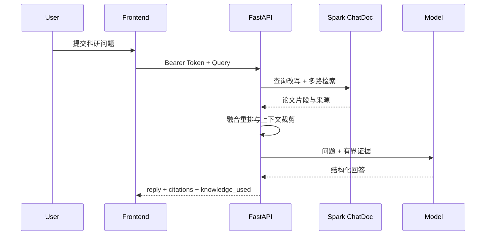
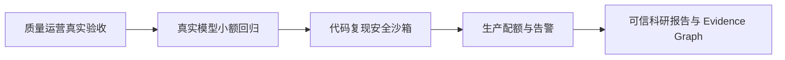

<div align="center">


### 面向软件工程科研的 AI 原生高级工作台

**把论文、问题、实验、代码、结果与知识沉淀在同一条可恢复、可审核、可追溯的研究主线上。**

<p>
  <a href="https://github.com/telitor/SciPilot"></a>
  
  
  
</p>

<p>
  <a href="https://github.com/telitor/SciPilot/commits/main"></a>
  <a href="https://github.com/telitor/SciPilot"></a>
  
  
  
</p>


<br/><br/>

<table>
<tr>
<td align="center" width="25%"><sub>RESEARCH CORE</sub><br/><strong>5 VERTICAL AGENTS</strong></td>
<td align="center" width="25%"><sub>WORKFLOW ENGINE</sub><br/><strong>DURABLE + APPROVED</strong></td>
<td align="center" width="25%"><sub>KNOWLEDGE LAYER</sub><br/><strong>RAG + CITATIONS</strong></td>
<td align="center" width="25%"><sub>TRUST PLANE</sub><br/><strong>RLS + OBSERVABILITY</strong></td>
</tr>
</table>

<sub>Research assets are versioned. Agent runs are observable. Credentials stay server-side.</sub>

</div>

---

<div align="center">

**[产品愿景](#product-vision) · [科研闭环](#research-loop) · [Agent 网络](#agent-network) · [系统架构](#architecture) · [快速启动](#quick-start) · [成熟度](#maturity)**

</div>

---

<a id="product-vision"></a>

## 01 / 产品愿景

SciPilot 不是一个套壳聊天框，而是一套围绕科研过程组织的智能工作空间。平台将论文理解、研究问题拆解、实验路线规划、代码复现、结果分析、知识检索和项目记忆统一到一个可持续演进的项目上下文中。

用户只与 React 工作台交互。FastAPI 负责认证、权限、Agent 路由、长任务调度、知识检索和结果持久化；Supabase 提供 Auth、PostgreSQL、Storage 与 RLS；讯飞星辰 Agent、SciPilot 微调模型和星火知识库全部由服务端调用。

> [!NOTE]
> 当前版本定位为可运行的工程预览版。核心研究链路已经连通，综合闭环度约 **77%**。该数值是基于现有代码、迁移、自动化测试和真实验收形成的工程评估，不代表生产 SLA。

### 为什么需要 SciPilot

<table>
<tr>
<td width="33%" valign="top">
<h3>Evidence First</h3>
<strong>结论应当有据可查</strong><br/><br/>
知识回答基于可见论文片段组织，保留检索结果、引用编号和运行摘要，减少没有来源的科研表达。
</td>
<td width="33%" valign="top">
<h3>Workflow Native</h3>
<strong>上下文沿科研过程流动</strong><br/><br/>
论文、问题树、实验路线、复现方案和结果分析不再散落在多个孤立工具中，而是归属于同一个科研项目。
</td>
<td width="33%" valign="top">
<h3>Human in Control</h3>
<strong>关键节点由人确认</strong><br/><br/>
Agent 工作流采用依赖阻塞、人工启动、版本确认和失败重试，避免未经确认的结果自动污染下游研究。
</td>
</tr>
</table>

### 当前能力快照

| 能力域 | 当前状态 | 已实现内容 |
|---|---:|---|
| 统一科研项目 | 88% | 项目、论文、会话、产物、记忆和工作流统一归属 |
| 真实科研产物生成 | 82% | 问题树、实验路线、代码复现方案、结果分析均接入真实后端 |
| 长任务与故障恢复 | 84% | 后台任务、进度、租约、幂等复用、有限重试、刷新恢复 |
| 产物版本与人工审核 | 86% | 草稿、确认、废弃、恢复、父版本与并发冲突保护 |
| 项目记忆 | 80% | 事实、决策、约束、偏好、摘要和失败经验进入 Agent 上下文 |
| Agent 工作流 | 76% | 五阶段 DAG、依赖阻塞、人工执行、批准与失败重试 |
| 运行观测与反馈 | 79% | AI 运行摘要、延迟、降级原因、点赞点踩与管理员审核 |
| AI 质量评估 | 72% | 固定离线评测、Recall@3、MRR、通过率和历史运行 |
| 知识库与 RAG | 65% | 星火知识库查询、改写、融合重排和引用；稳定性依赖外部平台 |

---

<a id="research-loop"></a>

## 02 / 端到端科研闭环


```mermaid
flowchart LR
    P["01 创建项目"] --> R["02 上传与精读论文"]
    R --> Q["03 拆解研究问题"]
    Q --> E["04 规划实验路线"]
    E --> C["05 形成代码复现方案"]
    C --> A["06 分析实验结果"]
    A --> H["07 人工确认与版本沉淀"]
    H --> M["08 项目记忆与质量反馈"]
    M -. "持续增强" .-> Q
```

### 闭环不是一次模型调用

1. **项目上下文**：研究资产通过 `project_id` 归属；旧数据保留为未归属资产，可手动加入项目。
2. **真实产物**：核心页面调用真实 FastAPI 接口和对应专业 Agent，不再以 Mock 内容作为最终结果。
3. **长任务恢复**：论文分析和研究产物生成可进入持久化任务，页面刷新后仍能恢复状态。
4. **版本与审核**：每个科研产物从草稿开始，可保存新版本、确认、废弃和恢复。
5. **工作流约束**：上游未确认时，下游任务保持 `blocked`；失败后只重试当前节点。
6. **质量回流**：用户反馈先进入人工审核，不会自动用于训练或优化。

### 核心产品界面

| 工作台 | 路由 | 主要交付 |
|---|---|---|
| Research Cockpit | `/dashboard` | 项目概览、活动、模型对话与研究状态 |
| Project Workspace | `/projects` | 项目生命周期、阶段、资产、工作流和项目记忆 |
| Paper Intelligence | `/paper/read` | PDF 上传、结构化精读、论文上下文追问与重新上传 |
| Paper Library | `/paper/library` | 论文资产管理、深度阅读与知识同步状态 |
| Problem Studio | `/research/decompose` | 研究目标、约束、难点、子任务与验收标准 |
| Experiment Studio | `/experiment/roadmap` | 阶段任务、基线、数据集、指标、依赖与里程碑 |
| Reproduction Studio | `/code/reproduce` | 仓库结构、依赖、运行路径、复现步骤与报错诊断 |
| Result Studio | `/result/analyze` | 数据上传、指标解释、异常现象、结论边界与建议 |
| Knowledge Center | `/knowledge` | 星火论文知识库状态、检索、问答和来源引用 |
| Knowledge Graph | `/kg/explore` | 知识节点、关系网络与主题探索 |

---

<a id="agent-network"></a>

## 03 / Agent Network

<table>
<tr>
<td width="33%" valign="top"><sub>AGENT 01</sub><h3>论文精读</h3><code>paper-reading</code><br/><br/>提取标题、作者、研究背景、核心方法、实验结果和关键结论，并围绕当前论文持续追问。</td>
<td width="33%" valign="top"><sub>AGENT 02</sub><h3>问题拆解</h3><code>problem-decomposition</code><br/><br/>将复杂问题拆解为背景、目标、约束、输入输出、核心难点、子任务与执行路径。</td>
<td width="33%" valign="top"><sub>AGENT 03</sub><h3>实验规划</h3><code>project-planning</code><br/><br/>生成阶段任务、技术路线、基线、数据集、评价指标、风险和里程碑。</td>
</tr>
<tr>
<td width="33%" valign="top"><sub>AGENT 04</sub><h3>代码复现</h3><code>code-reproduction</code><br/><br/>分析仓库、依赖、入口和运行路径，给出可执行复现步骤并辅助定位错误。</td>
<td width="33%" valign="top"><sub>AGENT 05</sub><h3>结果分析</h3><code>result-interpretation</code><br/><br/>解释指标变化、对比结论和异常现象，识别结论边界并提出下一轮验证建议。</td>
<td width="33%" valign="top"><sub>SHARED CORE</sub><h3>统一智能底座</h3><code>CONTEXT + RAG + MEMORY</code><br/><br/>共享项目上下文、已确认产物、项目记忆、运行观测、反馈审核与安全权限。</td>
</tr>
</table>

### 后端路由原则

前端只认识 `agent_id`、`category` 和 FastAPI 业务接口。平台密钥、完整 WebSocket 地址、应用 ID、API Secret、模型 ID 和 LoRA Resource ID 永远不进入浏览器。

```text
GET /api/v1/agents
        -> POST /api/v1/conversations
        -> POST /api/v1/conversations/{id}/messages
        -> FastAPI 根据 agent.category 选择服务端配置
        -> 专业 Agent / 微调模型 / 安全降级
        -> Supabase 保存消息、运行摘要和反馈
```

专业 Agent 使用相同的服务端调用协议，但可拥有各自独立的讯飞应用配置。论文精读保留原有 `XF_AGENT_*` 变量，其余 Agent 按 category 读取对应配置。

---

## 04 / 可信科研工程能力

### Durable Research Jobs

- 支持论文上传、问题拆解、实验规划、代码分析和结果分析异步执行。
- 状态覆盖 `pending`、`running`、`succeeded`、`failed`、`cancelled`。
- 等价活跃任务复用，减少重复点击导致的重复调用和重复费用。
- Supabase 租约避免多个后端进程重复领取同一任务。
- 瞬时错误支持有限重试，永久错误直接失败并返回安全错误信息。

### Artifact Versioning

- 科研产物从 `v1` 草稿开始，保留版本组、父版本和来源信息。
- 支持确认、废弃、恢复与历史版本查看。
- 通过版本号和 `409 Conflict` 防止旧页面覆盖新结果。
- 下游任务只消费已经确认的上游版本。

### Project Memory

- 支持事实、决策、约束、偏好、摘要和失败经验。
- 记忆可以手动创建，也可以从已确认产物中生成。
- Agent 调用只读取当前项目中仍然有效的记忆。
- 项目记忆表采用 RLS 与最小权限策略。

### Human-approved Workflow


```mermaid
stateDiagram-v2
    [*] --> blocked
    blocked --> ready: 上游产物已确认
    ready --> running: 用户启动
    running --> awaiting_approval: Agent 完成
    awaiting_approval --> completed: 用户批准
    running --> failed: 调用失败
    failed --> running: 安全重试当前节点
```

### AI Observability & Quality

- `ai_runs` 记录 provider、model、状态、延迟、检索数量、降级模式和失败原因。
- 运行记录不重复保存用户问题正文或 Agent 回复正文，降低隐私扩散。
- Assistant 消息支持点赞、点踩和补充说明，反馈默认进入 `pending`。
- 管理员可审核为 `reviewed` 或 `rejected`，后端从数据库角色判断权限。
- 固定离线评测集计算 Recall@3、MRR 与通过率，默认不调用真实模型、不消耗额度。

---

<a id="architecture"></a>

## 05 / System Architecture


```mermaid
flowchart TB
    subgraph Client["Research Workspace"]
        UI["React 18 + TypeScript + Vite"]
        State["Zustand + Axios"]
    end

    subgraph API["FastAPI Control Plane"]
        Auth["JWT / Ownership / Admin Guard"]
        Routes["Research APIs"]
        Jobs["Durable Job Worker"]
        Flow["Agent Workflow DAG"]
        Memory["Project Memory"]
        Observe["AI Runs + Feedback + Evaluation"]
    end

    subgraph Intelligence["Intelligence Plane"]
        Agents["5 Xunfei Star Agents"]
        FT["SciPilot Fine-tuned MaaS"]
        KB["Xunfei Spark ChatDoc"]
        Safe["Generic / Evidence-only Fallback"]
    end

    subgraph Data["Supabase Data Plane"]
        SA["Auth"]
        DB["PostgreSQL + RLS"]
        Store["Private Storage"]
    end

    UI --> State --> Auth
    Auth --> Routes
    Routes --> Jobs
    Routes --> Flow
    Routes --> Memory
    Routes --> Observe
    Jobs --> Agents
    Jobs --> FT
    Routes --> KB
    Routes --> Safe
    Auth --> SA
    Routes --> DB
    Jobs --> DB
    Routes --> Store
```

### 数据与密钥边界

| 边界 | 策略 |
|---|---|
| Browser | 只保存登录 token，只调用 FastAPI，不保存任何平台密钥 |
| FastAPI | 读取后端 `.env`，完成模型选择、签名、鉴权、超时和错误转换 |
| Supabase | Auth + PostgreSQL + Storage；核心表启用 RLS 与 owner 约束 |
| External AI | 仅接收有界上下文；API Key、Secret 和接口地址不返回前端 |
| Feedback | 默认等待人工审核，不自动进入训练或优化流程 |

---

## 06 / RAG 与微调模型

### 星火论文知识库

当前知识库采用讯飞星火 ChatDoc 作为外部检索服务。论文原文件与远程文件状态通过后端管理，浏览器不会接触 `APP_ID`、`API_SECRET` 或 `REPO_ID`。


```mermaid
sequenceDiagram
    participant U as User
    participant F as Frontend
    participant A as FastAPI
    participant K as Spark ChatDoc
    participant M as Model

    U->>F: 提交科研问题
    F->>A: Bearer Token + Query
    A->>K: 查询改写 + 多路检索
    K-->>A: 论文片段与来源
    A->>A: 融合重排与上下文裁剪
    A->>M: 问题 + 有界证据
    M-->>A: 结构化回答
    A-->>F: reply + citations + knowledge_used
```

知识检索支持本地查询改写、最多两个查询变体、RRF/词法重排和引用组织，不需要额外的前端密钥。

> [!WARNING]
> 外部知识库的可用性、仓库状态和额度依赖讯飞平台。当前项目保留清晰的状态检查与错误提示，但生产级 SLA、自动容灾和额度告警仍需继续建设。

### SciPilot 微调模型

后端已经接入讯飞 MaaS 的 OpenAI 兼容 HTTP 链路。配置完整时，Dashboard 模型对话和相关生成链路可以使用 SciPilot 微调模型；`SCIPILOT_LLM_RESOURCE_ID` 作为上游 `lora_id` 请求头发送。

```text
SCIPILOT_LLM_* configured
        -> POST {SCIPILOT_LLM_BASE_URL}/chat/completions
        -> model = SCIPILOT_LLM_MODEL_ID
        -> lora_id = SCIPILOT_LLM_RESOURCE_ID
        -> result persistence + runtime diagnostics
```

---

<a id="quick-start"></a>

## 07 / Quick Start

### 1. 获取代码

```powershell
git clone https://github.com/telitor/SciPilot.git
Set-Location .\SciPilot
```

### 2. 准备 Supabase

创建 Supabase 项目后，在 SQL Editor 中按文件名顺序执行 `supabase/migrations` 目录中现存的全部 SQL 文件。

```text
001_init_schema.sql
...
007_seed_public_research_catalog.sql
009_remove_legacy_knowledge_base.sql
...
025_ai_quality_evaluation.sql
```

仓库不再包含旧的 `008_knowledge_base.sql`。知识库已切换为星火 ChatDoc，迁移应以目录中实际存在的文件为准。

### 3. 启动后端

```powershell
Set-Location .\backend
python -m venv .venv
.\.venv\Scripts\Activate.ps1
python -m pip install -r requirements.txt
Copy-Item .env.example .env
```

在 `backend/.env` 中填入真实配置后启动：

```powershell
python -m uvicorn main:app --reload --host 127.0.0.1 --port 8000
```

| 服务 | 地址 |
|---|---|
| Backend | `http://127.0.0.1:8000` |
| Swagger | `http://127.0.0.1:8000/docs` |
| API Prefix | `http://127.0.0.1:8000/api/v1` |

如果端口 8000 被系统占用，可以改用 8001，并同步修改前端 `VITE_API_BASE_URL`。

### 4. 启动前端

打开新的 PowerShell：

```powershell
Set-Location .\frontend
npm install
Copy-Item .env.example .env
npm run dev -- --host 127.0.0.1 --port 5173
```

访问：`http://127.0.0.1:5173`

前端环境变量只需要 FastAPI 地址：

```env
VITE_API_BASE_URL=http://localhost:8000/api/v1
```

---

## 08 / Backend Configuration

### 必需配置

```env
SUPABASE_URL=https://your-project-ref.supabase.co
SUPABASE_PUBLISHABLE_KEY=your_publishable_key
SUPABASE_SECRET_KEY=your_backend_secret_key

CORS_ORIGINS=http://localhost:5173,http://127.0.0.1:5173
```

### 微调模型

```env
SCIPILOT_LLM_BASE_URL=https://maas-api.cn-huabei-1.xf-yun.com/v2
SCIPILOT_LLM_API_KEY=your_web_api_key
SCIPILOT_LLM_MODEL_ID=your_model_id
SCIPILOT_LLM_RESOURCE_ID=your_lora_resource_id
SCIPILOT_LLM_TIMEOUT_SECONDS=120
```

### 论文精读 Agent

```env
XF_AGENT_APP_ID=your_xunfei_app_id
XF_AGENT_API_KEY=your_xunfei_api_key
XF_AGENT_API_SECRET=your_xunfei_api_secret
XF_AGENT_ASSISTANT_ID=your_paper_reading_assistant_id
XF_AGENT_WS_HOST=spark-openapi.cn-huabei-1.xf-yun.com
XF_AGENT_WS_PATH=/v1/assistants/{assistant_id}
```

### 其他专业 Agent

```env
PROBLEM_DECOMPOSITION_APP_ID=
PROBLEM_DECOMPOSITION_API_KEY=
PROBLEM_DECOMPOSITION_API_SECRET=
PROBLEM_DECOMPOSITION_WS_URL=

PROJECT_PLANNING_APP_ID=
PROJECT_PLANNING_API_KEY=
PROJECT_PLANNING_API_SECRET=
PROJECT_PLANNING_WS_URL=

RESULT_INTERPRETATION_APP_ID=
RESULT_INTERPRETATION_API_KEY=
RESULT_INTERPRETATION_API_SECRET=
RESULT_INTERPRETATION_WS_URL=

CODE_REPRODUCTION_APP_ID=
CODE_REPRODUCTION_API_KEY=
CODE_REPRODUCTION_API_SECRET=
CODE_REPRODUCTION_WS_URL=
```

### 星火知识库

```env
XFYUN_KB_APP_ID=
XFYUN_KB_API_SECRET=
XFYUN_KB_REPO_ID=
XFYUN_KB_BASE_URL=https://chatdoc.xfyun.cn
XFYUN_KB_READ_TIMEOUT=600
XFYUN_KB_TOP_N=6
```

完整字段、默认值和注释请查看 [`backend/.env.example`](backend/.env.example)。

> [!CAUTION]
> 不要提交 `backend/.env`。不要把 Supabase Secret Key、平台 API Key、API Secret、WebSocket URL、模型 ID 或 LoRA Resource ID 写入任何 `VITE_*` 变量。

---

## 09 / API Control Plane

所有业务接口统一使用 `/api/v1` 前缀。

| Domain | Representative Endpoints |
|---|---|
| Health | `GET /health` |
| Auth | `POST /auth/register`, `POST /auth/login`, `POST /auth/logout` |
| Profile | `GET/PATCH /users/me`, `GET /users/me/stats` |
| Projects | `GET/POST /projects`, `PATCH /projects/{id}`, archive / restore |
| Project Memory | `GET/POST /projects/{id}/memories`, `PATCH /projects/{id}/memories/{memory_id}` |
| Agent Workflow | `GET/POST /projects/{id}/workflow`, task start / approve / retry |
| Research Jobs | `GET /jobs`, `GET /jobs/{id}`, `POST /jobs/{id}/retry` |
| Papers | sync / async upload, list, deep-read, knowledge sync, download |
| Agents | `GET /agents`, `POST /agents/{id}/ask` |
| Conversations | create, list, detail, messages, feedback and delete |
| Research Assets | decompose, experiment roadmap, code analysis, result analysis |
| Artifact Review | versions, update, confirm, deprecate and restore |
| Knowledge | status, search, answer and Xunfei answer |
| Quality Admin | feedback review, evaluation suites and evaluation runs |
| Dashboard | summary, model chat and runtime status |

以 Swagger 为最终接口契约：`http://localhost:8000/docs`

---

## 10 / Quality Gate

| 验证项 | 当前结果 | 覆盖范围 |
|---|---:|---|
| 后端测试 | **113 / 113** | Auth、项目、会话、产物、任务、工作流、记忆、反馈、评测、RAG |
| TypeScript | 通过 | `npm run type-check` |
| ESLint | 通过 | 零警告门禁 |
| Frontend Build | 通过 | Vite 生产构建 |
| API Contract | 通过 | 前端生产调用可在 FastAPI OpenAPI 中找到 |
| Mock Guard | 通过 | 核心生产页面不再导入 Mock API |
| Offline RAG Eval | 3 / 3 | Recall@3 = 100%，MRR 达到既定门槛 |
| Security | 通过 | RLS、后端密钥、管理员服务端鉴权、密钥扫描 |

本地验证命令：

```powershell
# Backend
Set-Location .\backend
python -m unittest discover -s tests -v

# Frontend
Set-Location ..\frontend
npm run type-check
npm run lint
npm run build
```

---

<a id="maturity"></a>

## 11 / Maturity & Roadmap

### 已经闭环

- 用户认证、真实 token 和服务端用户识别。
- 论文上传、PDF 文本提取、结构化精读、论文上下文追问和消息持久化。
- 五类专业 Agent 的后端路由与独立平台配置。
- 统一科研项目、未归属资产、项目归档与恢复。
- 四类研究产物的真实生成、保存、版本审核和下游消费。
- 长任务、刷新恢复、幂等复用、错误分类和安全重试。
- 五阶段人工批准 Agent 工作流。
- 项目记忆、AI 运行观测、用户反馈和固定离线评测。

### 尚未完全闭环

| Priority | Gap | 下一步 |
|---|---|---|
| P0 | 管理员质量运营入口尚未完成真实账号验收 | 指定管理员账号、提升数据库角色并验收反馈与评测页面 |
| P0 | 外部知识库稳定性受远程仓库状态和额度影响 | 建立仓库健康检查、额度告警与可恢复同步策略 |
| P1 | 真实模型版本回归尚未开放 | 建立小规模黄金问题集，每次真实评测单独审批额度 |
| P1 | 代码复现目前是分析方案，不执行不可信代码 | 引入只读拉取、容器沙箱、资源限制、日志和人工批准 |
| P1 | 扫描 PDF、双栏、公式和复杂表格解析有限 | 增加 OCR、版面分析和结构化文档解析 |
| P1 | 多 Agent 仍是固定 DAG，不是自主 Planner | 增加结构化契约、动态规划、Verifier 与并行调度 |
| P2 | 生产治理仍需加强 | 增加限流、用户配额、模型配额、告警、备份恢复与成本治理 |
| P2 | 前端图表包仍有体积提示 | 按页面动态加载 ECharts 并拆分构建 chunk |
| P2 | 团队协作能力有限 | 增加项目成员、角色、评论、分享权限和操作审计 |

### 推荐演进顺序


```mermaid
flowchart LR
    A["质量运营真实验收"] --> B["真实模型小额回归"]
    B --> C["代码复现安全沙箱"]
    C --> D["生产配额与告警"]
    D --> E["可信科研报告与 Evidence Graph"]
```

---

## 12 / Repository Map

```text
SciPilot/
├─ frontend/                  React + TypeScript + Vite 工作台
│  └─ src/
│     ├─ pages/               论文、项目、问题、实验、代码、结果与知识页面
│     ├─ components/          工作流、记忆、产物审核、反馈与质量面板
│     ├─ services/            Axios API 与安全错误处理
│     └─ store/               Auth、Project、Paper、Chat 与 UI 状态
├─ backend/                   FastAPI 控制平面
│  ├─ api/                    路由、依赖注入与 Pydantic 契约
│  ├─ services/               Agent、微调模型、知识库、任务与评测服务
│  ├─ tests/                  113 项后端自动化测试
│  └─ scripts/                配置与 Supabase 诊断
├─ supabase/migrations/       001-025 数据层演进
├─ KnowledgeBase/             星火知识库说明、上传工具与论文资产
├─ 模型微调/                  数据集构建与 MaaS 接入说明
├─ Agent/                     专业 Agent 接入文档
└─ docs/                      架构、依赖、数据库、成熟度与进度报告
```

### 延伸文档

- [`docs/SCIPILOT_MATURITY_AND_CLOSURE_GAP_REPORT.md`](docs/SCIPILOT_MATURITY_AND_CLOSURE_GAP_REPORT.md) - 功能成熟度与闭环缺口
- [`docs/BACKEND_TECH_STACK_AND_DEPENDENCIES.md`](docs/BACKEND_TECH_STACK_AND_DEPENDENCIES.md) - 后端技术栈与依赖
- [`docs/DATABASE_GUIDE.md`](docs/DATABASE_GUIDE.md) - 数据库结构与迁移指南
- [`docs/FRONTEND_TECH_DEPENDENCIES.md`](docs/FRONTEND_TECH_DEPENDENCIES.md) - 前端技术依赖
- [`KnowledgeBase/星火知识库后端接入说明.md`](KnowledgeBase/星火知识库后端接入说明.md) - 星火知识库接入
- [`模型微调/SciPilot微调大模型HTTP调用说明.md`](模型微调/SciPilot微调大模型HTTP调用说明.md) - 微调模型 HTTP 调用

---

## Security

- 真实 `.env`、API Key、API Secret、Supabase Secret Key 和 LoRA Resource ID 不得提交到 Git。
- 前端不得出现平台密钥、完整 Agent 接口地址或 `service_role` 权限。
- 外部贡献前请运行后端测试、前端 type-check、lint、build 和密钥扫描。
- 发现安全问题时，请不要在公开 Issue 中粘贴密钥、token、用户数据或服务端日志全文。

---

<div align="center">

### SciPilot

**From research material to traceable decisions, executable workflows and reusable knowledge.**

<sub>Paper Intelligence · Agent Workflow · Research Memory · Quality Governance</sub>

<br/><br/>


</div>
