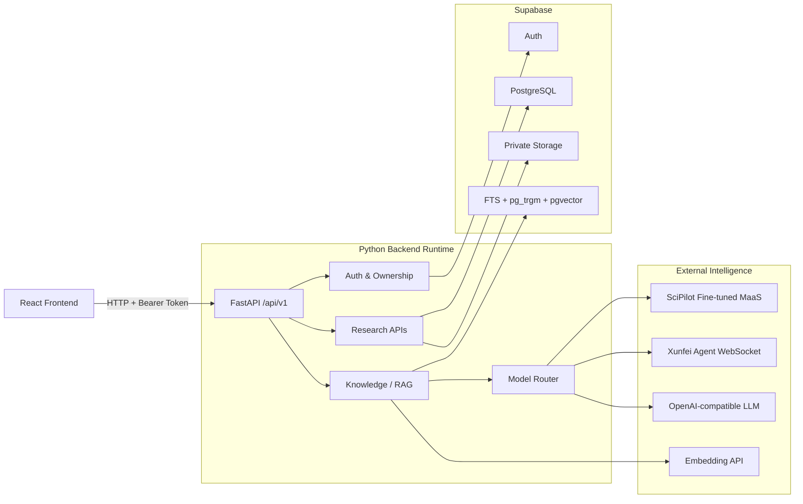
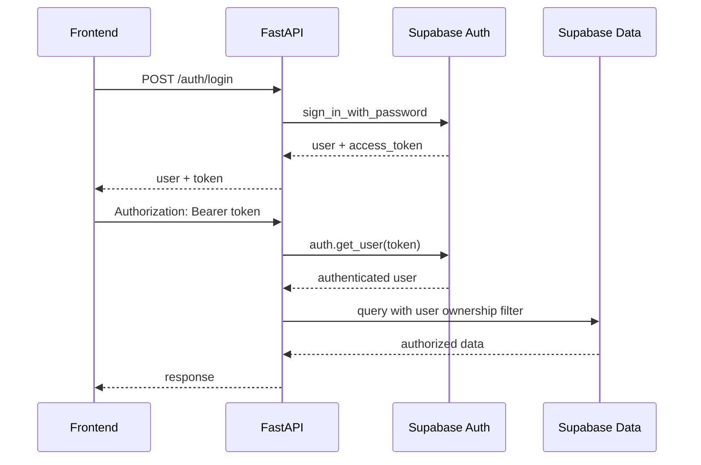
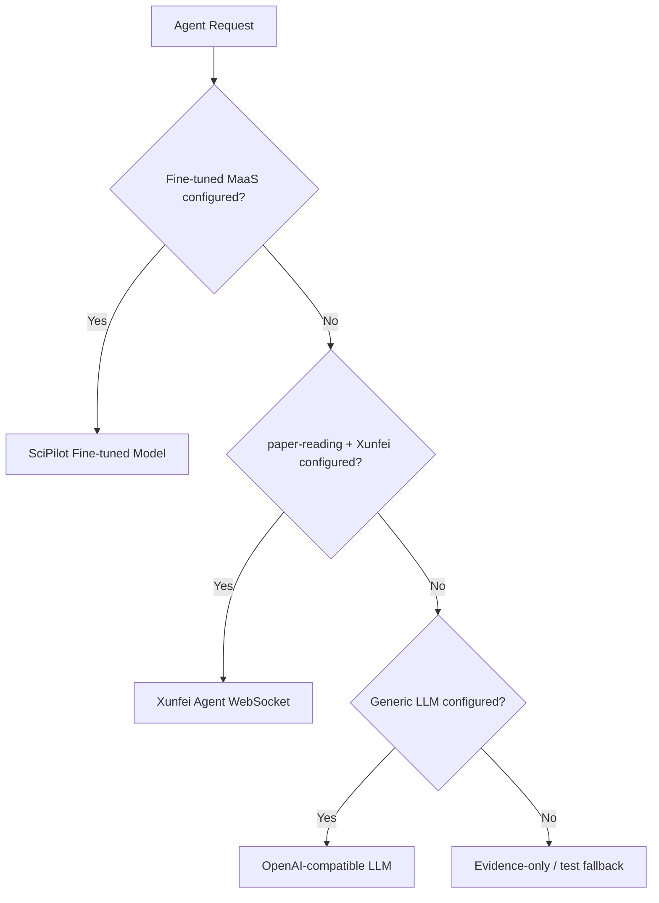
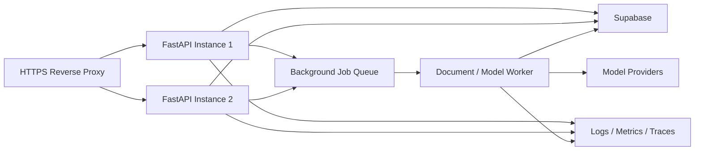

# SciPilot 后端技术栈与依赖说明

> 文档范围：`backend/`、`supabase/migrations/` 及后端外部服务
> 核对日期：2026-08-03
> 用途：开发环境搭建、技术交接、部署准备、依赖升级与故障定位

---

## 1. 后端技术全景

SciPilot 后端采用“FastAPI 应用网关 + Supabase 数据平台 + 多模型服务”的结构。



### 核心技术选型

| 层级 | 技术 | 当前作用 |
|---|---|---|
| 编程语言 | Python | 后端业务、数据处理、模型调用和运维脚本 |
| Web 框架 | FastAPI | HTTP API、鉴权依赖、文件上传、Swagger |
| ASGI Server | Uvicorn | 本地和服务端运行 FastAPI |
| 数据平台 | Supabase | Auth、PostgreSQL、Storage、Data API |
| 数据权限 | PostgreSQL RLS | 用户级数据隔离和公共/私有知识边界 |
| 数据访问 | `supabase-py` | 调用 Auth、PostgREST、RPC 和 Storage |
| 数据校验 | Pydantic v2 | 请求体、字段约束和接口契约 |
| 模型 SDK | OpenAI Python SDK | MaaS、通用 LLM 和 Embedding 兼容调用 |
| Agent 通信 | `websocket-client` | 讯飞论文精读 Agent WebSocket 调用 |
| PDF 解析 | `pypdf` | 论文和知识库 PDF 文本提取 |
| Excel 解析 | `openpyxl` | XLSX 实验结果读取 |
| 配置管理 | `python-dotenv` | 从 `backend/.env` 加载服务端配置 |
| 测试 | Python `unittest` | 服务层和 API 行为单元测试 |

---

## 2. Python 运行环境

### 2.1 当前环境

当前本地 `backend/.venv/pyvenv.cfg` 记录：

```text
Python 3.13.9
include-system-site-packages = false
```

这说明虚拟环境与系统包隔离，依赖安装在 `backend/.venv` 中。

### 2.2 仓库当前约束

仓库目前没有以下 Python 版本声明文件：

- `.python-version`；
- `runtime.txt`；
- `pyproject.toml` 中的 `requires-python`；
- Dockerfile 中的固定 Python 镜像。

因此，Python 3.13.9 是当前机器的实际环境，不是仓库已经正式约定的团队标准。

### 2.3 建议团队基线

建议正式声明：

```text
Python >= 3.11, < 3.14
推荐开发版本：Python 3.12
```

原因：

- Python 3.11/3.12 在 FastAPI、Supabase、Pydantic 和数据处理库中兼容范围更成熟；
- 固定团队版本可以减少不同机器上的解析、依赖和二进制包差异；
- Python 3.13 可以继续验证，但不应只依赖某一台机器的虚拟环境记录。

### 2.4 创建环境

Windows PowerShell：

```powershell
Set-Location D:\SciCopilot\SciCopilot\backend
python -m venv .venv
.\.venv\Scripts\Activate.ps1
python -m pip install --upgrade pip
python -m pip install -r requirements.txt
```

检查环境：

```powershell
python --version
python -m pip --version
python -m pip check
```

> 不要提交 `.venv`。虚拟环境是机器相关产物，代码仓库只应保存依赖声明。

---

## 3. Python 第三方依赖

当前依赖文件：[backend/requirements.txt](../backend/requirements.txt)

| 依赖 | 当前版本范围 | 用途 | 必需性 |
|---|---|---|:---:|
| `fastapi` | `>=0.115,<1` | API 路由、中间件、依赖注入、异常和上传 | 必需 |
| `uvicorn[standard]` | `>=0.30,<1` | ASGI 服务器和开发热更新 | 必需 |
| `python-dotenv` | `>=1,<2` | 加载 `backend/.env` | 必需 |
| `python-multipart` | `>=0.0.9,<1` | `multipart/form-data` 文件和表单上传 | 必需 |
| `supabase` | `>=2.15,<3` | Auth、Data API、RPC 和 Storage | 必需 |
| `openai` | `>=1.50,<3` | MaaS、通用 LLM 和 Embedding 调用 | 条件必需 |
| `pydantic` | `>=2.8,<3` | 请求模型和字段校验 | 必需 |
| `pypdf` | `>=5,<7` | PDF 文本和元数据提取 | 必需 |
| `openpyxl` | `>=3.1,<4` | XLSX 结果文件读取 | 必需 |
| `websocket-client` | `>=1.8,<2` | 讯飞 Agent WebSocket 客户端 | 条件必需 |

### 3.1 标准库依赖

项目还大量使用 Python 标准库，无需单独安装：

- `csv`、`json`、`statistics`：结果数据处理；
- `hashlib`、`hmac`、`base64`：文件校验和 WebSocket 签名；
- `uuid`、`datetime`：业务 ID 和时间；
- `pathlib`、`io`：文件路径和内存流；
- `re`：文本清理、校验和引用识别；
- `functools.lru_cache`：Supabase 客户端缓存；
- `unittest`、`unittest.mock`：单元测试。

### 3.2 当前依赖管理缺口

1. `requirements.txt` 使用较宽的版本范围，没有锁定具体解析结果。
2. 仓库没有 `requirements.lock` 或其他后端 Lockfile。
3. E2E 脚本直接导入 `httpx`，但 `requirements.txt` 没有显式声明 `httpx`。
4. `httpx` 当前可能由其他 SDK 间接安装，不能视为稳定契约。
5. 没有自动依赖漏洞扫描和升级回归。

建议：

- 将 `httpx` 增加为显式开发/测试依赖；
- 区分运行依赖和开发测试依赖；
- 生成可重复安装的锁文件；
- 定期执行依赖安全检查；
- 升级前运行后端单元测试和真实 Supabase E2E。

---

## 4. FastAPI 应用结构

### 4.1 入口

应用入口：[backend/main.py](../backend/main.py)

```text
backend/main.py
├─ 创建 FastAPI app
├─ 配置 CORS
├─ 注册 Supabase 配置异常处理
├─ 挂载 /api/v1 路由
└─ 提供 GET / 根状态接口
```

启动命令必须在 `backend` 目录执行：

```powershell
Set-Location D:\SciCopilot\SciCopilot\backend
python -m uvicorn main:app --reload
```

默认地址：

| 服务 | 地址 |
|---|---|
| 后端根地址 | `http://localhost:8000` |
| API 前缀 | `http://localhost:8000/api/v1` |
| Swagger | `http://localhost:8000/docs` |
| OpenAPI JSON | `http://localhost:8000/openapi.json` |

### 4.2 代码职责

| 文件 | 职责 |
|---|---|
| `backend/main.py` | App、CORS、全局异常和路由挂载 |
| `backend/api/routes.py` | 所有业务接口和业务编排 |
| `backend/api/schemas.py` | Pydantic 请求/响应数据模型 |
| `backend/api/dependencies.py` | Bearer Token、用户解析、所有权检查、活动记录 |
| `backend/services/supabase_service.py` | Supabase 客户端工厂 |
| `backend/services/knowledge_base_service.py` | 文档解析、切块、Token 估算、Embedding |
| `backend/services/agent_knowledge_service.py` | RAG 上下文、引用和模型 fallback |
| `backend/services/finetuned_model_service.py` | SciPilot 微调 MaaS HTTP 调用 |
| `backend/services/llm_service.py` | 模型路由和通用 LLM |
| `backend/services/xunfei_agent_service.py` | 讯飞论文 Agent WebSocket 签名和收发 |

### 4.3 FastAPI 关键能力

- `Depends(get_current_user)`：保护需要登录的接口；
- `UploadFile` + `File` + `Form`：处理 PDF、知识文档和结果文件；
- `Query`：分页、搜索和限制；
- `HTTPException`：统一 HTTP 业务错误；
- `CORSMiddleware`：允许配置的本地前端访问；
- Pydantic v2 `BaseModel`、`Field` 和 `field_validator`：验证输入；
- 自动 OpenAPI/Swagger：查看真实请求和响应模型。

### 4.4 当前运行模型

当前路由大部分使用普通同步函数，文件上传使用 `async def` 读取内容。模型调用、Supabase 数据访问和文档处理仍主要在请求生命周期内完成。

当前没有：

- Celery/RQ/Arq 等任务队列；
- Redis；
- 独立 Worker；
- 真正的服务端流式输出；
- OpenTelemetry/Prometheus；
- 全局 API 限流。

长耗时模型调用和大文档入库后续应迁移到后台任务。

---

## 5. Supabase 技术依赖

### 5.1 使用的 Supabase 能力

| Supabase 能力 | SciPilot 用途 |
|---|---|
| Auth | 注册、登录、Token 验证和用户身份 |
| PostgreSQL | 用户、Agent、论文、会话、科研产物、知识库 |
| Data API / PostgREST | `supabase-py` 表查询和写入 |
| RPC | `search_knowledge_base` 混合检索函数 |
| Storage | 私有论文文件和知识库原文件 |
| RLS | 用户数据隔离、公共知识读取和写权限控制 |
| pgvector | 可选 1536 维语义检索 |
| `pg_trgm` | 中文和文本模糊匹配 |
| PostgreSQL FTS | 全文检索 |

### 5.2 两类 Supabase 客户端

后端在 [supabase_service.py](../backend/services/supabase_service.py) 中建立两类客户端。

#### 可信服务端客户端

```text
SUPABASE_URL
SUPABASE_SECRET_KEY
```

兼容旧变量：

```text
SUPABASE_SERVICE_ROLE_KEY
```

用途：

- 数据表读写；
- Storage；
- RPC；
- Token 用户查询；
- 服务端管理流程。

Secret/Service Role Key 可能绕过 RLS，因此后端必须先验证用户并检查记录归属。当前项目通过 `require_owned_row()` 和用户 ID 过滤执行应用层保护。

#### 认证客户端

```text
SUPABASE_URL
SUPABASE_PUBLISHABLE_KEY
```

兼容旧变量：

```text
SUPABASE_ANON_KEY
```

用途：

- 用户注册；
- 用户密码登录；
- 获取普通用户 Session/Access Token。

两类客户端都关闭 SDK Session 持久化和自动刷新，避免后端进程在不同用户请求间共享登录状态。

### 5.3 鉴权链路



### 5.4 数据库扩展

迁移启用：

| 扩展 | 用途 |
|---|---|
| `pgcrypto` | UUID 和加密相关数据库能力 |
| `vector` | `pgvector` 向量字段和相似度计算 |
| `pg_trgm` | 三元组模糊匹配 |

### 5.5 数据表分组

| 领域 | 主要表 |
|---|---|
| 用户与 Agent | `profiles`, `agents` |
| 会话 | `conversations`, `messages` |
| 论文 | `papers`, `paper_reports` |
| 科研资产 | `research_artifacts`, `activities` |
| 公共资源 | `catalog_resources` |
| 知识图谱 | `knowledge_nodes`, `knowledge_edges` |
| 知识库 | `kb_collections`, `kb_documents`, `kb_chunks` |
| 入库与审计 | `kb_ingestion_jobs`, `kb_retrievals`, `kb_citations` |

### 5.6 Storage

当前迁移创建私有 Bucket：

| Bucket | 用途 |
|---|---|
| `papers` | 用户上传论文 |
| `knowledge-base` | 知识库原始文档 |

文件路径包含用户 ID，以便 Storage RLS 验证所有者。原文件不应设为公开 Bucket；下载通过短时签名 URL。

### 5.7 迁移顺序

新 Supabase 项目必须按顺序执行：

```text
001_init_schema.sql
002_updated_at_trigger.sql
003_rls_policies.sql
004_add_multi_agents.sql
005_add_project_planning_agent.sql
006_workspace_data_layer.sql
007_seed_public_research_catalog.sql
008_knowledge_base.sql
```

迁移位置：[supabase/migrations](../supabase/migrations)

### 5.8 2026 Data API 注意事项

Supabase 已调整新表的 Data API 默认暴露行为。RLS 与数据库 `GRANT` 是两层不同控制：

- `GRANT` 决定某个角色能否通过 Data API 访问表；
- RLS 决定该角色可以看到或修改哪些行。

新项目执行迁移后，如果出现 `permission denied for table`，应检查迁移中的显式 `GRANT` 和项目 Data API 设置，而不是关闭 RLS。

官方参考：

- [Supabase Python Client 初始化](https://supabase.com/docs/reference/python/initializing)
- [Supabase RLS](https://supabase.com/docs/guides/database/postgres/row-level-security)
- [Supabase API Keys](https://supabase.com/docs/guides/getting-started/api-keys)
- [Data API 默认暴露变更](https://supabase.com/changelog/45329-breaking-change-tables-not-exposed-to-data-and-graphql-api-automatically)

---

## 6. 模型和智能服务依赖

### 6.1 SciPilot 微调模型

协议：HTTPS，OpenAI Chat Completions 兼容。

依赖：`openai` Python SDK。

配置：

```env
SCIPILOT_LLM_BASE_URL=https://maas-api.cn-huabei-1.xf-yun.com/v2
SCIPILOT_LLM_API_KEY=
SCIPILOT_LLM_MODEL_ID=
SCIPILOT_LLM_RESOURCE_ID=
SCIPILOT_LLM_TEMPERATURE=0.3
SCIPILOT_LLM_MAX_TOKENS=2048
```

`SCIPILOT_LLM_RESOURCE_ID` 通过请求头 `lora_id` 发送。默认超时为 120 秒。

### 6.2 讯飞论文精读 Agent

协议：带 HMAC-SHA256 签名的 WebSocket。

依赖：`websocket-client`。

配置由真实 `backend/.env` 提供，典型字段包括：

```env
XF_AGENT_APP_ID=
XF_AGENT_API_KEY=
XF_AGENT_API_SECRET=
XF_AGENT_ASSISTANT_ID=
XF_AGENT_WS_HOST=
XF_AGENT_WS_PATH=
XF_AGENT_DOMAIN=generalv3
XF_AGENT_TEMPERATURE=0.5
XF_AGENT_TOP_K=4
XF_AGENT_MAX_TOKENS=2028
```

当前实现由后端接收上游流式片段，拼接完整后一次性返回前端。

### 6.3 通用 LLM fallback

协议：OpenAI Chat Completions 兼容。

```env
LLM_API_KEY=
LLM_BASE_URL=
LLM_MODEL=
```

如果微调模型未配置，非论文 Agent 可以使用该服务。当前代码在完全未配置通用 LLM 时仍可能返回临时测试回复，因此生产环境必须显式配置并验证模型路由。

### 6.4 Embedding 服务

协议：OpenAI Embeddings 兼容。

```env
EMBEDDING_API_KEY=
EMBEDDING_BASE_URL=
EMBEDDING_MODEL=text-embedding-3-small
```

数据库向量列固定为 1536 维。Embedding 模型输出不是 1536 维时，服务会拒绝写入。未配置 Embedding 时，知识库继续使用 PostgreSQL 全文检索和 `pg_trgm` 模糊检索。

### 6.5 模型选择顺序



---

## 7. 文件与数据处理依赖

### 7.1 PDF

`pypdf` 用于：

- 校验和读取 PDF；
- 提取页数；
- 提取元数据；
- 提取每页文本；
- 论文预览和知识库入库。

当前不包含 OCR、版面分析、公式识别和表格结构化。扫描版 PDF 可能无法提取文本。

### 7.2 文本和 Markdown

支持：

- `.txt`；
- `.md`；
- `.markdown`；
- UTF-8、UTF-8 BOM、GB18030 解码尝试。

### 7.3 实验结果

| 格式 | 解析方式 |
|---|---|
| CSV | Python `csv.DictReader` |
| JSON | Python `json`，要求对象数组 |
| XLSX/XLSM | `openpyxl` 只读模式 |

当前最大结果文件 20 MB，最多读取 10,000 行。

### 7.4 知识切块

当前默认：

```text
目标大小：1200 字符
重叠大小：180 字符
```

切块基于段落和字符长度，不依赖额外 NLP 框架。

---

## 8. 后端环境变量

完整模板：[backend/.env.example](../backend/.env.example)

### 8.1 必需

| 变量 | 作用 | 可进入前端 |
|---|---|:---:|
| `SUPABASE_URL` | Supabase 项目地址 | 否，当前架构前端不直连 Supabase |
| `SUPABASE_PUBLISHABLE_KEY` | 后端执行普通 Auth 请求 | 否 |
| `SUPABASE_SECRET_KEY` | 后端可信数据访问 | **绝对不允许** |

### 8.2 服务设置

| 变量 | 默认值 | 作用 |
|---|---|---|
| `CORS_ORIGINS` | 本地 5173 | 允许的前端 Origin |
| `MAX_UPLOAD_MB` | 25 | 论文上传大小 |
| `MAX_KB_UPLOAD_MB` | 25 | 知识文档大小 |
| `MAX_KB_EXTRACTED_CHARS` | 2000000 | 单文档最大提取字符数 |
| `AUTH_AUTO_CONFIRM_EMAIL` | true | 试运行注册策略 |
| `SCIPILOT_SEED_USER_ID` | 空 | 公共知识播种所属用户 |

### 8.3 密钥规则

- 真实值只写入 `backend/.env` 或部署平台 Secret Manager；
- 不修改 `.env.example` 为真实值；
- 不将任何 Secret 写入 `VITE_*`；
- 不在日志中输出 Authorization、API Key、API Secret 或 LoRA Resource ID；
- 生产环境需要定期轮换密钥；
- `backend/.env` 必须被 Git 忽略。

---

## 9. 数据和请求链路

### 9.1 普通业务请求

```text
Frontend
→ FastAPI Bearer Token verification
→ Supabase Auth get_user
→ ownership check
→ Supabase Data API / Storage
→ response
```

### 9.2 RAG 请求

```text
User question
→ FastAPI authentication
→ optional query embedding
→ search_knowledge_base RPC
→ visible chunks
→ bounded evidence prompt
→ fine-tuned / fallback model
→ citation validation
→ kb_retrievals + kb_citations
→ answer + sources
```

### 9.3 文件入库

```text
Upload
→ size/type validation
→ text extraction
→ SHA-256 duplicate check
→ Storage upload
→ chunking
→ optional embedding
→ PostgreSQL rows
→ ready status
```

---

## 10. 开发、测试与运维脚本

### 10.1 单元测试

```powershell
Set-Location D:\SciCopilot\SciCopilot\backend
python -m unittest discover -s tests -p "test_*.py"
```

覆盖：

- 注册和登录行为；
- 知识提取与切块；
- RAG 引用和 fallback；
- 微调模型请求结构。

### 10.2 Supabase 检查

```powershell
python scripts/verify_supabase.py
```

### 10.3 真实端到端检查

后端运行后执行：

```powershell
python scripts/e2e_knowledge_base.py
python scripts/e2e_agent_knowledge.py
```

E2E 会连接真实 Supabase，执行前必须确认测试项目、密钥和数据清理范围。

### 10.4 公共知识播种

```powershell
python scripts/seed_software_engineering_kb.py
```

多 Profile 环境应先设置 `SCIPILOT_SEED_USER_ID`。

---

## 11. 当前后端没有使用的技术

为避免技术边界混淆，当前后端没有直接使用：

- Django/Flask；
- SQLAlchemy ORM；
- 直接 PostgreSQL 连接池；
- LangChain/LlamaIndex；
- Celery/RQ；
- Redis；
- Kafka/RabbitMQ；
- Docker/Kubernetes 配置；
- OCR 引擎；
- 真实浏览器到 Agent 的 WebSocket；
- 服务端 SSE；
- Prometheus/OpenTelemetry。

这些能力如后续引入，应先确认是否解决明确问题，不应只为扩大技术栈。

---

## 12. 已知技术风险与改进建议

| 优先级 | 风险 | 建议 |
|:---:|---|---|
| P0 | Python 版本未正式声明 | 增加 `.python-version` 或 `pyproject.toml` |
| P0 | 后端依赖没有锁定 | 引入可重复安装的 Lockfile |
| P0 | `httpx` 未显式声明 | 加入测试依赖 |
| P0 | `.env.example` 未列出代码使用的 `XF_AGENT_*` 字段 | 补齐无真实密钥的配置占位和注释 |
| P0 | Secret 客户端可绕过 RLS | 所有写操作继续强制用户和所有权检查 |
| P0 | 长任务同步执行 | 引入任务表、Worker 和状态查询 |
| P1 | 模型/Embedding 外部服务缺少统一重试 | 增加超时、重试、熔断和错误分类 |
| P1 | 依赖版本跨度较宽 | 定期锁定、升级和回归测试 |
| P1 | 没有 CI | 自动执行测试、构建和 Secret Scan |
| P1 | PDF 仅文本提取 | 后续增加 OCR 和 Layout Parser |
| P2 | 缺少调用指标 | 增加模型延迟、Token、费用和 fallback 统计 |

---

## 13. 推荐的标准后端环境

```text
Operating System: Windows 11 / Linux
Python: 3.12.x recommended
Virtual Environment: venv
API Framework: FastAPI 0.115+
ASGI Server: Uvicorn 0.30+
Data Platform: Supabase
Database: PostgreSQL + RLS
Extensions: pgcrypto + pg_trgm + pgvector
Object Storage: Supabase Storage
Model Protocols: HTTPS + WebSocket
Default API Port: 8000
```

建议生产部署结构：



当前仓库尚未实现 Queue、Worker、反向代理和 Observability；该图是建议目标，不代表当前已有能力。

---

## 14. 快速排障清单

### 后端无法启动

1. 确认当前目录是 `backend`。
2. 确认虚拟环境已激活。
3. 执行 `python -m pip check`。
4. 检查 `backend/.env` 是否存在。
5. 检查 8000 端口是否被占用。

### 返回 503 Supabase 配置错误

检查：

```text
SUPABASE_URL
SUPABASE_PUBLISHABLE_KEY
SUPABASE_SECRET_KEY
```

### 返回数据库表不存在

按 001–008 顺序执行迁移，并确认目标 Supabase 项目正确。

### 返回 permission denied

同时检查：

- Data API 的表级 `GRANT`；
- RLS 是否启用；
- RLS Policy；
- 当前用户 Token；
- 后端是否使用正确项目的 Secret Key。

### 知识库只能全文检索

这是未配置 `EMBEDDING_API_KEY` 时的正常行为。配置后还需要确认模型输出为 1536 维。

### 微调模型没有被调用

必须同时存在：

```text
SCIPILOT_LLM_API_KEY
SCIPILOT_LLM_MODEL_ID
SCIPILOT_LLM_RESOURCE_ID
```

修改 `.env` 后重启后端。

---

## 15. 总结

SciPilot 后端当前的核心依赖可以概括为：

```text
Python
  + FastAPI / Uvicorn
  + Pydantic
  + Supabase Auth / PostgreSQL / Storage / RLS
  + PostgreSQL FTS / pg_trgm / pgvector
  + OpenAI-compatible MaaS / LLM / Embedding
  + Xunfei Agent WebSocket
  + pypdf / openpyxl
```

当前技术栈已经足以支撑全栈 MVP 和知识增强 Agent。下一阶段后端建设重点不应是继续引入大量框架，而应优先解决：

1. Python 与依赖可重复安装；
2. 长任务后台化；
3. 模型与 RAG 可观测；
4. 前后端真实业务闭环；
5. CI、限流、密钥治理和生产恢复能力。
