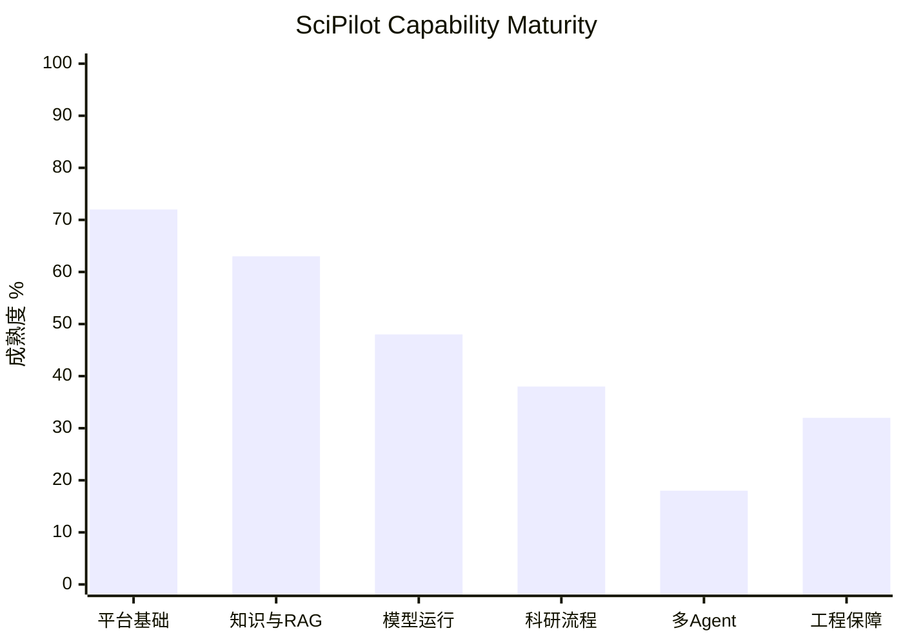
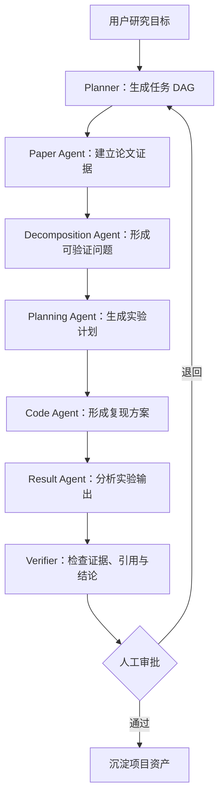
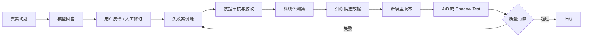
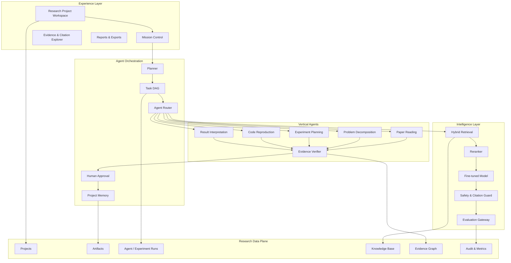
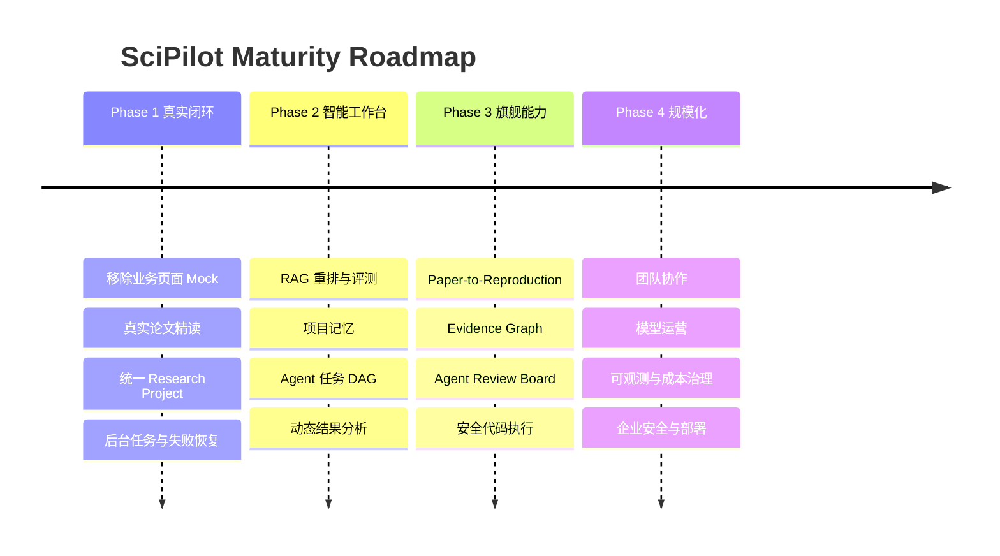

# SciPilot 产品能力成熟度与闭环缺口报告

> 评估对象：当前本地工作区
> 评估日期：2026-07-31
> 评估范围：React 前端、FastAPI 后端、Supabase 数据层、知识库/RAG、微调模型与五类科研 Agent
> 文档用途：产品规划、技术排期、验收标准与版本路线统一

---

## 0. 执行摘要

SciPilot 已经完成了一个可运行的全栈科研平台骨架：

- 用户可以注册、登录和维护个人资料。
- 前端具备论文、知识库、五类 Agent、知识图谱和科研资产页面。
- FastAPI 已提供论文、会话、Agent、知识库、研究拆解、实验路线、代码复现和结果分析接口。
- Supabase 已承载认证、业务数据、私有文件、RLS、知识切块和检索审计。
- 五类 Agent 页面均已接入真实的知识库问答面板。
- RAG 已具备全文检索、中文模糊检索、可选向量检索、引用返回和审计记录。
- 讯飞 MaaS 微调模型已接入服务端实际回复链路。

但是，当前平台仍处于“功能模块并列存在”的阶段，尚未形成真正统一的高级科研工作台。

最关键的判断是：

> **Agent 问答闭环已经形成，但科研业务产物闭环尚未形成。**

例如，“研究问题拆解”页面中的知识库 Agent 问答是真实后端调用，但页面主体的问题树仍由前端 Mock 生成；“代码复现”和“结果分析”也存在类似情况。论文上传已经真实保存 PDF，但“精读报告”主体仍主要是文档信息和文本预览，不是模型生成的完整论文分析。

### 综合成熟度

| 评估维度 | 成熟度 | 判断 |
|---|:---:|---|
| 平台基础与数据层 | **72%** | 主干可用，权限和数据模型已经建立 |
| 知识库与 RAG | **63%** | 已形成基础闭环，质量工程仍不足 |
| 模型调用与微调接入 | **48%** | 推理已接通，评测和运营闭环缺失 |
| 科研业务工作流 | **38%** | 多个页面主体仍是 Mock 或规则模板 |
| 多 Agent 协作 | **18%** | 当前是五个独立入口，不是协作系统 |
| 工程化与生产保障 | **32%** | 缺少任务队列、监控、CI/CD 和恢复机制 |
| **综合成熟度** | **49%** | 已有平台骨架，尚未达到高级智能工作台 |

### 当前阶段定位

```text
原型页面集合
    ↓ 已完成
全栈平台骨架
    ↓ 当前所在位置
可用科研工作台
    ↓
智能科研协作系统
    ↓
可评测、可运营、可规模化的平台
```

---

## 1. 成熟度评分口径

成熟度百分比不是代码完成量，也不是页面数量，而是以下五项的加权结果：

| 评分项 | 权重 | 说明 |
|---|:---:|---|
| 功能完整性 | 35% | 用户是否可以从输入走到有效结果 |
| 数据闭环 | 20% | 输入、过程、结果是否保存并可继续使用 |
| 智能质量 | 20% | 是否真正使用模型、知识和验证机制 |
| 稳定性与异常恢复 | 15% | 是否支持超时、重试、幂等、后台任务和失败恢复 |
| 可观测与可评测 | 10% | 是否可以衡量质量、延迟、成本和失败原因 |

### 百分比含义

| 区间 | 阶段 | 判断标准 |
|:---:|---|---|
| 0%–19% | 概念阶段 | 只有设计、入口或少量静态内容 |
| 20%–39% | 原型阶段 | 可以演示，但依赖 Mock、规则模板或人工补充 |
| 40%–59% | 部分可用 | 部分真实闭环，关键路径仍有断点 |
| 60%–79% | 可用阶段 | 主流程真实可用，但质量、稳定性和运营能力不足 |
| 80%–94% | 稳定阶段 | 主流程完整，有测试、恢复、评测和安全控制 |
| 95%–100% | 生产成熟 | 可规模化运营，并具有持续优化和治理机制 |

---

## 2. 各功能成熟度总表

| 编号 | 功能模块 | 成熟度 | 当前状态 | 最大缺口 |
|:---:|---|:---:|---|---|
| F01 | 用户认证与个人资料 | **78%** | 注册、登录、登出、资料和统计可用 | 密码找回、Token 生命周期、生产邮件流程 |
| F02 | 论文上传与论文库 | **66%** | PDF 保存、元数据、列表、下载和删除可用 | OCR、版本、重复检测交互、后台解析 |
| F03 | 论文精读报告 | **42%** | 有报告表和展示入口 | 当前主要是文本预览，不是完整模型精读 |
| F04 | 论文追问与 Agent 问答 | **72%** | 真实 Agent/RAG 问答、来源与引用可用 | 会话连续性、论文专属上下文、流式输出 |
| F05 | 知识库管理 | **70%** | 集合、文档、文本、删除、状态和权限可用 | 异步入库、版本、批量操作、OCR |
| F06 | RAG 检索与可信引用 | **63%** | 全文、模糊、可选向量、引用审计可用 | Query Rewrite、Reranker、质量评测、事实验证 |
| F07 | 微调模型实际调用 | **48%** | MaaS HTTP 调用与 LoRA Resource ID 已接入 | 模型评测、版本管理、反馈、成本和回滚 |
| F08 | 研究问题拆解 | **38%** | Agent 问答真实；后端有拆解接口 | 页面主体仍使用 Mock，后端拆解仍是固定模板 |
| F09 | 实验路线规划 | **32%** | Agent 问答真实；后端有路线接口 | 页面默认 Mock，任务不可编辑、不可执行 |
| F10 | 代码复现辅助 | **25%** | Agent 问答真实；可登记仓库 URL | 主体 Mock，无真实仓库读取、环境构建和运行 |
| F11 | 实验结果分析 | **42%** | 后端能读取 CSV/JSON/XLSX 并计算基础统计 | 前端仍用 Mock 图表，无动态图表和显著性比较 |
| F12 | 知识图谱 | **45%** | 节点、边、检索和可视化入口存在 | 缺少自动抽取、文档同步和图谱推理 |
| F13 | 会话与消息持久化 | **70%** | 会话、消息、引用和元数据可保存 | 跨 Agent 上下文、会话摘要、长程记忆 |
| F14 | 多 Agent 编排 | **18%** | 五个 Agent 可独立调用 | 无任务调度、交接、共享状态和审核节点 |
| F15 | 科研项目空间 | **20%** | 有分散的 research artifacts | 无统一 Project 主实体和资产关系 |
| F16 | 模型/RAG 评测体系 | **22%** | 有少量单元与端到端测试脚本 | 无标准问题集、自动评分和回归看板 |
| F17 | 工程可观测性 | **25%** | 有基础异常返回和部分日志 | 无链路追踪、指标、成本、失败分类和告警 |
| F18 | 团队协作与分享 | **10%** | 主要是个人空间 | 无团队、角色、评论、分享和协作记录 |

---

## 3. 成熟度可视化

### 3.1 六大能力域



### 3.2 当前能力热力图

| 能力域 | 0–39 原型 | 40–59 部分可用 | 60–79 可用 | 80+ 稳定 |
|---|:---:|:---:|:---:|:---:|
| 认证与用户 |  |  | **78%** |  |
| 论文管理 |  |  | **66%** |  |
| 论文精读 |  | **42%** |  |  |
| 知识库 |  |  | **70%** |  |
| RAG |  |  | **63%** |  |
| 微调模型 |  | **48%** |  |  |
| 问题拆解 | **38%** |  |  |  |
| 实验规划 | **32%** |  |  |  |
| 代码复现 | **25%** |  |  |  |
| 结果分析 |  | **42%** |  |  |
| 多 Agent | **18%** |  |  |  |
| 工程保障 | **32%** |  |  |  |

### 3.3 当前真实链路与断点


---

# 第一部分：平台级问题

## 4. 缺少统一的科研项目主线

### 4.1 当前问题

论文、问题树、实验路线、代码仓库、结果分析和会话分别存在于不同表或不同页面中，但没有一个统一的 `Research Project` 主实体把它们连接起来。

当前更接近：

```text
Paper
Research Artifact
Conversation
Knowledge Collection
Repository Artifact
Result Artifact

以上对象分别存在，但缺少统一归属关系。
```

### 4.2 直接影响

- 用户上传论文后，问题拆解页面不知道应该读取哪篇论文。
- 问题拆解结果不能直接生成实验路线。
- 实验路线不能关联某个代码仓库。
- 结果文件不能明确归属某次实验运行。
- Agent 只能看到当前问题和检索片段，看不到整个项目历史。
- Dashboard 只能展示分散统计，无法展示项目真实进度。

### 4.3 需要实现

新增统一项目模型：

```text
research_projects
├─ papers
├─ knowledge_collections
├─ research_questions
├─ experiment_plans
├─ repositories
├─ experiment_runs
├─ result_analyses
├─ conversations
└─ decisions
```

建议核心字段：

| 字段 | 用途 |
|---|---|
| `id` | 项目 ID |
| `user_id` | 所有者 |
| `name` | 项目名称 |
| `objective` | 研究目标 |
| `status` | draft / active / blocked / completed / archived |
| `current_stage` | 当前科研阶段 |
| `default_collection_id` | 默认项目知识库 |
| `created_at/updated_at` | 生命周期 |

### 4.4 完成标准

- 用户可以创建一个科研项目。
- 所有论文、Agent 会话和研究产物都能选择项目归属。
- 任意页面可以读取同一项目上下文。
- 项目 Dashboard 能展示阶段、任务、资产、风险和最近活动。
- 删除或归档项目时有明确的数据保留策略。

---

## 5. 多 Agent 仍是“多入口”，不是“多智能体”

### 5.1 当前问题

当前五个 Agent 通过不同 `category` 被查找和调用，但它们之间没有：

- 任务交接协议；
- 共享工作状态；
- 执行顺序；
- 依赖关系；
- 结果验收；
- 冲突处理；
- 人工审批节点。

### 5.2 当前形态

```text
用户 → 论文精读 Agent
用户 → 问题拆解 Agent
用户 → 实验规划 Agent
用户 → 代码复现 Agent
用户 → 结果分析 Agent
```

### 5.3 目标形态



### 5.4 需要实现

1. 任务模型：`agent_tasks`。
2. 任务依赖：`agent_task_dependencies`。
3. 任务执行记录：`agent_runs`。
4. Agent 输入/输出契约。
5. 任务状态机。
6. 人工批准、拒绝和重试。
7. Agent 结果引用上游产物。
8. 汇总 Agent 或 Verifier。
9. 幂等执行和重复任务保护。

### 5.5 完成标准

- 一个研究目标可以生成任务 DAG。
- Agent 可以消费上一个 Agent 的结构化结果。
- 用户能看到每个任务的状态、输入、输出和失败原因。
- 用户可以修改计划后只重跑受影响节点。
- 所有结论可以追溯到 Agent Run、知识证据和用户审批。

---

## 6. 长耗时任务仍运行在同步请求中

### 6.1 当前问题

PDF 提取、Embedding、批量切块、模型生成和后续代码分析都可能超过普通 HTTP 请求时间，但当前主要使用同步请求处理。

前端 Axios 默认超时仍为 30 秒，部分 Agent 问答接口没有单独覆盖更长超时。

### 6.2 风险

- 大文件上传后页面长时间等待。
- 请求超时，但后端可能仍在执行。
- 用户重复点击导致重复任务和重复费用。
- 服务重启后任务状态丢失。
- 无法展示真实阶段和百分比。
- 无法安全重试失败步骤。

### 6.3 需要实现

- 后台任务队列；
- 任务状态表；
- `queued / extracting / chunking / embedding / generating / completed / failed` 阶段；
- 轮询或 Server-Sent Events；
- 任务取消；
- 幂等键；
- 指数退避重试；
- 死信与人工恢复；
- 上传和模型调用分离。

### 6.4 完成标准

- API 在创建任务后快速返回 `job_id`。
- 页面可以看到当前阶段、进度和错误原因。
- 页面刷新后仍能恢复任务状态。
- 重复请求不会产生重复文档或重复模型调用。
- 服务重启后任务可以继续或明确失败。

---

# 第二部分：智能能力问题

## 7. RAG 仍缺少质量工程

### 7.1 已完成

- PDF、TXT、MD 和直接文本入库；
- SHA-256 去重；
- 固定长度切块和重叠；
- PostgreSQL 全文检索；
- `pg_trgm` 中文模糊检索；
- 可选 1536 维 pgvector；
- 公共和个人知识可见性；
- `[n]` 引用返回；
- 检索和引用记录。

### 7.2 主要缺口

#### 检索前

- 没有 Query Rewrite。
- 没有自动生成多个检索子问题。
- 没有根据 Agent 类型提取不同关键词。
- 没有术语扩展、同义词和中英文对齐。
- 没有问题意图分类。

#### 检索中

- 切块主要依据字符长度，不理解章节、标题和语义边界。
- 没有父子 Chunk。
- 没有相邻片段自动合并。
- 没有独立 Reranker。
- 没有动态调整全文/向量权重。
- 没有针对标题、摘要、正文、代码和表格的差异化评分。
- 没有按文档时效、可信来源和版本做权重控制。

#### 生成后

- 当前主要检查引用编号是否合法。
- 没有检查“结论是否真的由引用内容支持”。
- 没有检查遗漏引用。
- 没有识别引用之间的冲突。
- 没有回答完整性和覆盖率评估。

### 7.3 需要实现

1. Query Rewrite 与多查询召回。
2. Hybrid Search 参数配置。
3. Reranker。
4. Section-aware Chunking。
5. Parent-Child Retrieval。
6. 引用蕴含验证。
7. 无答案检测。
8. RAG 评测数据集。
9. Recall@K、MRR、nDCG、Citation Precision 指标。
10. 检索调试页面。

### 7.4 完成标准

- 每次回答能查看原始问题、改写问题和召回路径。
- 标准评测集可以自动比较版本差异。
- 引用不仅编号正确，而且语义支持结论。
- 低置信度问题明确拒答或请求补充资料。
- 检索配置变化有版本和回归结果。

---

## 8. 文档理解仍停留在纯文本提取

### 8.1 当前问题

PDF 当前使用 `pypdf` 提取文本，无法稳定理解：

- 扫描版 PDF；
- 双栏阅读顺序；
- 表格；
- 公式；
- 图片和图注；
- 页眉页脚；
- 参考文献结构；
- 章节层级。

### 8.2 直接影响

- 论文方法和实验数据可能被错误拼接。
- 表格中的关键结果无法进入知识库。
- 公式和变量定义丢失。
- 引用只能定位到 Chunk，无法精确定位页面和区域。
- 扫描论文完全不可用。

### 8.3 需要实现

- OCR；
- Layout Parser；
- 标题和章节检测；
- 表格结构化；
- 公式保留或 LaTeX 转换；
- 图片/图注关联；
- 页码和 bounding box；
- 参考文献解析；
- 论文元数据补全；
- 解析质量评分。

### 8.4 完成标准

- 引用可以定位到页码和原文区域。
- 表格能够作为结构化证据被检索。
- 扫描版 PDF 能通过 OCR 入库。
- 双栏论文的阅读顺序正确。
- 解析失败时能指出失败页和原因。

---

## 9. 微调模型只有推理接入，没有持续优化闭环

### 9.1 已完成

- 服务端读取 MaaS 配置；
- 使用 OpenAI 兼容 HTTP 接口；
- 发送 Model ID；
- 使用 `lora_id` 请求头发送 Resource ID；
- 120 秒模型超时；
- 不向前端暴露密钥；
- RAG 回答优先选择微调模型；
- 模型失败时安全降级。

### 9.2 缺失能力

- 无固定评测集。
- 无基础模型与微调模型对照。
- 无模型版本记录。
- 无 A/B 测试。
- 无用户点赞、点踩和修改反馈。
- 无失败案例池。
- 无训练数据审核流。
- 无延迟、Token、费用和错误率指标。
- 无自动回滚。
- 无 Prompt 版本管理。

### 9.3 推荐闭环



### 9.4 完成标准

- 每次调用记录模型版本、Prompt 版本、延迟和结果状态。
- 至少有覆盖五个 Agent 的固定评测集。
- 新模型必须通过自动质量门禁。
- 用户反馈不能直接进入训练集，必须人工审核。
- 可以在不改代码的情况下切换或回滚模型版本。

---

# 第三部分：具体功能闭环问题

## 10. 用户认证与账号体系 — 78%

### 已完成

- 注册、登录、登出；
- Bearer Token；
- 当前用户读取和资料更新；
- 用户统计和活动；
- 注册密码强度校验；
- 用户级数据归属验证。

### 未完成

- 登录页明确标注“忘记密码暂未开放”。
- 缺少密码找回和重置。
- 缺少生产环境邮件验证完整体验。
- 缺少 Token 刷新和过期恢复策略。
- 缺少设备与会话管理。
- 缺少异常登录与风控。
- 缺少账号注销和数据导出。

### 完成闭环

```text
注册 → 邮件验证 → 登录 → Token 刷新 → 密码找回
→ 设备管理 → 账号注销 → 数据保留/删除策略
```

---

## 11. 论文上传与精读 — 42%–66%

### 已完成

- PDF 文件类型和大小检查；
- 文件头验证；
- Supabase 私有 Storage 保存；
- SHA-256；
- 基础元数据和文本提取；
- 论文列表、搜索、下载和删除；
- 精读报告数据表与页面展示。

### 核心缺陷

当前上传接口生成的“精读报告”主要包含：

- 文档信息；
- 前 2000 字符文本预览。

它没有在上传后调用论文精读模型生成完整的：

- 研究背景；
- 核心方法；
- 实验设计；
- 关键结论；
- 创新点；
- 局限性。

因此“上传论文 → 自动精读报告”目前不是完整智能闭环。

### 其他缺口

- 论文没有自动进入项目知识库。
- 论文追问面板没有天然绑定当前论文 ID。
- 上传、解析、精读和入库没有统一任务状态。
- 缺少论文版本和重复上传交互。
- 缺少 DOI、会议、年份和参考文献补全。
- 缺少报告重新生成和版本比较。

### 完成闭环

```text
上传 PDF
→ 后台解析
→ 结构与元数据识别
→ 自动进入项目知识库
→ 论文 Agent 生成结构化精读
→ 引用定位到论文页面
→ 用户追问
→ 保存报告版本和反馈
```

---

## 12. 研究问题拆解 — 38%

### 已完成

- 页面入口和问题树 UI；
- 对应 Agent 的真实知识库问答；
- 后端 `/research/decompose` 接口；
- 研究产物保存。

### 核心缺陷

- 页面“开始拆解”仍调用 `mockAPI.getMockResearchTree()`。
- 真实 `researchAPI.decompose()` 已定义但被注释。
- 后端拆解结果仍是固定的三个规则模板节点。
- 子问题没有父子层级生成逻辑。
- 数据集和论文字段默认空数组。
- “跳转论文精读”等操作未形成数据传递。

### 需要实现

- 前端接通真实拆解接口；
- 后端调用问题拆解 Agent；
- 强制结构化 JSON 输出；
- 子问题层级、可行性、证据和风险；
- 关联项目、论文和知识集合；
- 子问题编辑、合并、删除和确认；
- 一键生成实验路线。

### 完成标准

- 同一研究方向多次拆解不再返回完全固定模板。
- 每个子问题都有依据、可验证指标和建议数据集。
- 用户确认后的问题树能够直接成为实验规划输入。

---

## 13. 实验路线规划 — 32%

### 已完成

- 实验路线 UI；
- 对应 Agent 的真实知识库问答；
- 后端路线生成和保存接口；
- 公共仓库、数据集目录的基础读取。

### 核心缺陷

- 页面加载时直接显示 Mock 路线。
- 没有从已确认的研究问题生成路线。
- 后端步骤为固定五步模板。
- 任务状态只是展示，不能修改。
- 没有任务依赖、负责人、开始时间和实际完成时间。
- 导出按钮明确处于“开发中”。
- 无实验运行实体。

### 需要实现

- 从 `research_question_id` 生成路线；
- Agent 输出结构化任务 DAG；
- 任务编辑与状态流转；
- 依赖关系和风险；
- 数据集、基线和指标绑定；
- 实验运行与路线任务关联；
- Markdown/PDF 导出；
- 任务完成后自动更新项目进度。

---

## 14. 代码复现 — 25%

### 已完成

- GitHub URL 输入界面；
- 对应 Agent 的真实知识库问答；
- 后端仓库 URL 格式校验；
- 复现产物保存；
- 错误日志接口骨架。

### 核心缺陷

- 页面仓库分析仍使用 Mock。
- 后端只解析 URL 中的 owner/repo。
- 不调用 GitHub API。
- 不读取 README、目录树、依赖文件或 Release。
- `language` 固定为 `Unknown`，`stars` 固定为 `0`。
- 文件树和依赖数组为空。
- 错误诊断只返回通用建议。
- 不拉取代码，不构建环境，不运行命令。

### 分阶段完善

#### 第一阶段：只读仓库理解

- GitHub API 获取元数据；
- 获取默认分支和目录树；
- 读取 README、requirements、pyproject、package、Dockerfile；
- Agent 生成依赖、入口、配置和复现步骤；
- 缓存 API 结果并处理限流。

#### 第二阶段：安全执行

- 隔离容器；
- 网络、CPU、内存和磁盘限制；
- 依赖安装日志；
- 白名单命令；
- 运行产物保存；
- 超时和强制终止；
- 恶意仓库防护。

#### 第三阶段：复现验证

- 预期指标与实际指标对比；
- 环境锁定；
- Seed 和数据版本记录；
- 自动生成复现报告；
- 可复现性评分。

---

## 15. 实验结果分析 — 42%

### 已完成

- 后端读取 CSV、JSON 和 XLSX；
- 最大 20 MB 限制；
- 最多读取 10,000 行；
- 自动识别数值字段；
- 均值、标准差、最值和 95% 置信区间；
- 分析产物保存；
- ECharts 前端基础能力。

### 核心缺陷

- 前端分析按钮仍使用 Mock 数据。
- 图表横轴、系列和数值是固定示例。
- 后端返回 `charts: []`。
- 没有识别实验组、基线、Seed 和指标方向。
- 没有真正执行显著性检验。
- 没有效果量、异常检测和多重比较校正。
- 没有将结果关联到实验运行。
- 没有让结果分析 Agent 基于真实统计量生成结论。

### 需要实现

- 前端调用 `resultAPI.analyze()`；
- 后端返回数据驱动图表配置；
- 自动识别宽表/长表；
- baseline 与 treatment 对比；
- 根据数据条件选择统计检验；
- 效果量与置信区间；
- 异常和缺失值报告；
- Agent 生成结论边界和下一步建议；
- 图表、统计表和文字报告导出。

---

## 16. 知识图谱 — 45%

### 已完成

- 知识节点和边的数据结构；
- 公共目录种子数据；
- 图谱探索和搜索 API；
- 前端图形展示和交互。

### 未完成

- 文档入库后不会自动抽取实体和关系。
- 删除或更新文档后图谱不会同步。
- 节点缺少来源证据和置信度。
- 缺少实体消歧、别名和重复合并。
- 缺少时间、版本和冲突关系。
- 图谱没有参与 Agent 推理或检索。

### 完成闭环

```text
文档入库
→ 实体/关系候选抽取
→ 来源与置信度
→ 人工审核
→ 图谱更新
→ Graph + Vector 混合检索
→ Agent 回答
→ 结论回写为研究决策节点
```

---

# 第四部分：工程质量问题

## 17. 前后端存在“接口已定义但页面未使用”

当前典型情况：

| 页面 | 前端真实 API | 页面实际行为 |
|---|---|---|
| 研究问题拆解 | `researchAPI.decompose()` 已定义 | 主体仍使用 Mock |
| 实验路线 | `experimentAPI.generateRoadmap()` 已定义 | 页面初始化为 Mock |
| 代码复现 | `codeAPI.analyzeRepo()` 已定义 | 调用被注释，主体使用 Mock |
| 结果分析 | `resultAPI.analyze()` 已定义 | 主体使用 Mock 和固定图表 |

这类问题会造成“Swagger 看起来完整、页面也看起来完整，但业务闭环实际断开”。

### 处理要求

- 删除生产页面对 `mockAPI` 的依赖；
- Mock 只允许存在于 Storybook、测试或显式 Demo 模式；
- 为每个页面增加真实 API 集成测试；
- 后端返回结构必须与前端 TypeScript 类型同步；
- 页面必须展示真实加载、空状态、失败和重试。

---

## 18. 缺少流式输出

前端存在 WebSocket TODO，论文页面使用定时器模拟流式文字，并不是真实服务端流式返回。

### 影响

- 长回答期间用户只能等待。
- 模拟流式不能反映后端实际生成进度。
- 请求超时体验较差。
- 无法取消模型生成。

### 推荐方案

优先考虑 Server-Sent Events：

- 比 WebSocket 更适合单向模型输出；
- 认证和代理配置更简单；
- 支持逐步输出 Token、检索状态和引用；
- 普通 CRUD 仍保持 HTTP。

---

## 19. 错误被安全降级，但缺少可观测原因

`grounded_agent_reply()` 在模型异常、输出为空或引用不合法时都会返回证据摘录，这是用户侧安全的。

但当前问题是：

- 多种失败原因在用户侧表现相同；
- 缺少结构化错误分类；
- 缺少模型服务延迟；
- 缺少供应商状态；
- 缺少 fallback 次数统计；
- 难以判断是模型错误、Prompt 错误还是引用错误。

### 需要记录

| 字段 | 示例 |
|---|---|
| `request_id` | 单次请求追踪 ID |
| `model_provider` | xunfei-maas |
| `model_version` | 模型 ID 或部署版本 |
| `response_mode` | model / extractive / no-evidence |
| `fallback_reason` | timeout / invalid-citation / provider-error |
| `retrieval_count` | 召回数量 |
| `latency_ms` | 总延迟 |
| `model_latency_ms` | 模型延迟 |
| `token_usage` | 输入/输出 Token |
| `estimated_cost` | 估算费用 |

日志不得记录真实 API Key、Authorization Header、完整私人文档或用户密码。

---

## 20. 自动化测试覆盖不均衡

### 已有测试

- 注册与登录服务行为；
- 知识库文本处理；
- Agent 知识回答；
- 微调模型请求格式；
- 知识库和五 Agent 端到端脚本。

### 主要缺口

- 前端组件测试；
- 页面与真实 API 集成测试；
- 浏览器端完整 E2E；
- 论文上传与删除测试；
- 研究拆解、实验路线、代码和结果接口测试；
- RLS 迁移回归；
- 模型超时和重试测试；
- 大文件和并发测试；
- 安全测试；
- CI 自动执行。

### 最低质量门禁

```text
Pull Request
├─ Backend unit tests
├─ Frontend type-check
├─ Frontend build
├─ API contract tests
├─ Migration lint
├─ Secret scan
└─ Critical E2E smoke test
```

---

## 21. 生产运行能力不足

当前缺少：

- CI/CD；
- 容器化部署说明；
- 数据库备份和恢复演练；
- 配置中心和密钥轮换；
- API 限流；
- 用户配额；
- 模型费用限额；
- 健康检查分层；
- 供应商故障熔断；
- Prometheus/OpenTelemetry；
- 错误告警；
- 数据保留策略；
- 管理后台。

### 生产完成标准

- 可以看到 API、数据库、模型和任务队列状态。
- 单个用户无法无限调用模型或上传文件。
- 模型供应商故障时不会拖垮 API。
- 密钥可轮换且无需修改代码。
- 数据库有自动备份和恢复验证。
- 故障有告警、负责人和处理记录。

---

# 第五部分：安全与治理问题

## 22. 需要强化的安全控制

### 已完成基础

- 前端不保存服务端 Secret Key；
- Supabase RLS；
- 私有 Storage；
- 文件大小限制；
- PDF 文件头校验；
- Agent Prompt 中声明知识内容不是系统指令；
- 检索 RPC 限制执行角色。

### 尚需完善

- 文件病毒和恶意内容扫描；
- ZIP Bomb 和解析器资源限制；
- RAG Prompt Injection 分类与隔离；
- 用户输入和模型输出审计策略；
- 敏感信息脱敏；
- 模型训练数据授权记录；
- 数据删除和导出；
- API Rate Limit；
- 管理操作审计；
- 公开知识发布审批；
- GitHub 仓库安全执行沙箱；
- 供应链和依赖漏洞扫描。

---

# 第六部分：建议的建设优先级

## 23. P0：先把“看起来能用”变成“真的闭环”

建议周期：第一阶段

| 优先任务 | 目标 | 验收 |
|---|---|---|
| 移除四个页面主体 Mock | 接通拆解、路线、代码、结果真实接口 | 页面不再 import `mockAPI` |
| 修复论文精读主体 | 上传后真实调用论文 Agent | 报告不是文本预览 |
| 统一项目主实体 | 串联论文、任务、代码和结果 | 所有核心资产有 `project_id` |
| 长任务基础设施 | 解析和模型调用可恢复 | 有 `job_id`、状态、重试 |
| Agent 超时治理 | 避免 30 秒误超时 | 按接口设置合理超时 |
| API 契约测试 | 防止前后端结构漂移 | CI 自动验证 |

### P0 完成后的目标闭环


---

## 24. P1：把平台提升为“智能工作台”

| 优先任务 | 价值 |
|---|---|
| Query Rewrite + Reranker | 显著提升 RAG 命中质量 |
| 项目级长程记忆 | Agent 理解整个研究上下文 |
| 任务 DAG 与状态机 | 让多个 Agent 可以交接 |
| 结果动态可视化 | 真实数据生成真实图表 |
| GitHub 只读分析 | 形成可信的代码复现建议 |
| 微调模型评测集 | 判断微调是否真正有效 |
| 用户反馈系统 | 建立模型持续优化入口 |
| 引用蕴含验证 | 从“有引用”升级到“引用支持结论” |

---

## 25. P2：形成高级产品差异

| 创新能力 | 说明 |
|---|---|
| Paper-to-Reproduction | 从论文自动生成可执行复现项目 |
| Research Mission Control | 研究目标自动转为可视化 Agent 任务 DAG |
| Evidence Graph | 结论连接论文片段、代码、实验和指标 |
| Agent Review Board | 主 Agent、Critic、Evidence、Judge 协作审查 |
| Reproducibility Score | 对论文和项目生成可复现性评分 |
| Intelligent Experiment Analyst | 自动统计检验、异常分析和下一轮实验建议 |
| Living Research Memory | 保存项目决策、失败经验和长期偏好 |
| Multimodal Paper Intelligence | 理解公式、图表、图片和扫描论文 |

---

## 26. P3：生产化与团队化

- 团队 Workspace；
- 角色和权限；
- 评论与审批；
- 项目分享；
- 报告导出；
- 模板市场；
- 管理后台；
- 使用量和费用；
- SLA、监控与告警；
- 企业数据保留和审计。

---

# 第七部分：目标系统可视化

## 27. 目标高级工作台架构



## 28. 建议演进路线



---

# 第八部分：最终验收定义

## 29. “高级智能工作台”最低完成标准

当以下条件全部满足时，SciPilot 才可以从“中规中矩的平台”升级为“高级智能工作台”：

### 产品闭环

- [ ] 用户可以创建统一科研项目。
- [ ] 论文、问题、实验、代码和结果属于同一项目。
- [ ] 页面主体不再依赖 Mock。
- [ ] 一个阶段的输出可以直接成为下一个阶段的输入。
- [ ] 用户可以看到整个项目的进度和阻塞点。

### 智能闭环

- [ ] 五个 Agent 可以通过任务协议交接。
- [ ] Agent 使用项目上下文和知识证据。
- [ ] 关键输出经过引用验证或审查 Agent。
- [ ] 微调模型有固定评测集和版本管理。
- [ ] 用户反馈可以进入经过审核的优化流程。

### 执行闭环

- [ ] 长任务后台执行并可恢复。
- [ ] 代码仓库可以被真实读取和分析。
- [ ] 实验运行有环境、日志、指标和产物。
- [ ] 结果分析基于真实上传数据。
- [ ] 复现结果可以与论文目标进行对照。

### 可信闭环

- [ ] 结论可以追溯到知识片段。
- [ ] 知识片段可以追溯到原始文档和页码。
- [ ] 实验结论可以追溯到运行与指标。
- [ ] 所有 Agent 调用有版本、延迟和结果记录。
- [ ] 用户数据、密钥和私有文件均有明确权限边界。

### 生产闭环

- [ ] 核心流程有自动化测试。
- [ ] 有 CI/CD 和 Secret Scan。
- [ ] 有请求限流和用户配额。
- [ ] 有监控、告警和故障恢复。
- [ ] 有备份、恢复和数据删除策略。

---

## 30. 结论

SciPilot 当前最有价值的基础不是某一个页面，而是已经同时具备：

- 五类科研 Agent；
- 用户和会话体系；
- Supabase 数据与权限；
- 知识库和可信 RAG；
- 微调模型实际调用链。

下一阶段不应继续横向增加孤立页面，而应集中完成以下三件事：

1. **建立统一 Research Project，把已有功能串成一条真实科研主线。**
2. **移除页面主体 Mock，让后端业务接口和 Agent 真实生成科研产物。**
3. **建立任务、评测和审计机制，让智能能力可执行、可验证、可持续优化。**

推荐将以下流程作为 SciPilot 的旗舰闭环：

> **上传论文 → 结构化精读 → 研究问题拆解 → 实验路线 → 代码复现 → 结果对比 → 证据化复现报告**

当这一条链路真正贯通后，SciPilot 才会从“包含多个 AI 功能的平台”跃升为“能够参与科研全过程的高级智能工作台”。

---

## 附录 A：评估证据索引

本报告基于以下当前实现进行静态核对：

| 评估内容 | 主要代码位置 |
|---|---|
| API 路由与业务产物 | `backend/api/routes.py` |
| 请求/响应契约 | `backend/api/schemas.py` |
| 认证与用户归属 | `backend/api/dependencies.py` |
| 知识提取、切块和 Embedding | `backend/services/knowledge_base_service.py` |
| RAG 上下文、引用与 fallback | `backend/services/agent_knowledge_service.py` |
| 微调模型 MaaS 调用 | `backend/services/finetuned_model_service.py` |
| 模型选择与默认 LLM | `backend/services/llm_service.py` |
| 讯飞论文 Agent WebSocket | `backend/services/xunfei_agent_service.py` |
| 前端 API 定义与 Mock 数据 | `frontend/src/services/api.ts` |
| 论文工作台 | `frontend/src/pages/PaperRead/index.tsx` |
| 问题拆解主体 | `frontend/src/pages/ResearchDecompose/index.tsx` |
| 实验路线主体 | `frontend/src/pages/ExperimentRoadmap/index.tsx` |
| 代码复现主体 | `frontend/src/pages/CodeReproduce/index.tsx` |
| 结果分析主体 | `frontend/src/pages/ResultAnalyze/index.tsx` |
| 真实 Agent/RAG 面板 | `frontend/src/components/AgentKnowledgePanel.tsx` |
| 数据模型与 RLS | `supabase/migrations/001_init_schema.sql` 至 `008_knowledge_base.sql` |
| 后端单元测试 | `backend/tests/` |
| 真实 Supabase 验证脚本 | `backend/scripts/` |

### 评估限制

- 本报告主要依据当前代码和迁移文件进行静态评估。
- 未使用真实生产流量、模型费用、用户留存或人工质量评分。
- 微调模型实际效果需要在真实 API 配置和标准评测集下测量。
- 百分比用于确定建设优先级，不应作为商业 SLA 或正式合规结论。
