<h1 align="center">✨ SciPilot</h1>

<p align="center">
  🧠 <strong>AI-Powered Vertical Platform for Software Engineering Research & Learning</strong>
  <br><em>（面向软件工程学科的智能体学习与项目辅助平台）</em>
</p>

<p align="center">
  Paper Reading · Code Understanding · Project Planning · AI Agents
</p>

<p align="center">
  
  
  
  <br>
  
  
  
  
  
  
  
  
</p>

---

## 📌 Table of Contents

- [Overview](#overview)
- [System Architecture](#system-architecture)
- [Core Features](#core-features)
- [Page Routes & Navigation](#page-routes--navigation)
- [Tech Stack](#tech-stack)
- [Project Structure](#project-structure)
- [Database Design](#database-design)
- [Component Architecture](#component-architecture)
- [API Interaction Flow](#api-interaction-flow)
- [UI Design System](#ui-design-system)
- [State Management](#state-management)
- [API Specification](#api-specification)
- [Local Development](#local-development)
- [Build & Deploy](#build--deploy)
- [Development Milestones](#development-milestones)
- [Team Responsibilities](#team-responsibilities)

---

## Overview

**SciPilot** is an AI-powered vertical platform designed for Software Engineering (SE) students and researchers. It addresses five critical pain points in the research pipeline — from literature review to experimental analysis — by providing structured, traceable, and intelligent agent services.

> **Target Users** （目标用户）
> - **Junior Researchers** (Graduate Year 1 / Senior Undergrads): Need to quickly understand research directions, read papers, and find entry points.
> - **Experiment Executors** (Graduate Year 1-2): Need to design experiments, find baselines, reproduce code, and analyze results.
> - **Course Learners** (SE Undergrads): Need concept explanations, case studies, and knowledge graph navigation.

### Value Proposition

| Pain Point | SciPilot Solution |
|-----------|---------------------|
| Fragmented paper reading | Structured deep-read reports with citation tracing |
| Vague research directions | Hierarchical research question trees with feasibility scoring |
| Unsystematic experiment design | Auto-generated roadmaps with baseline & dataset recommendations |
| Code reproduction failures | Step-by-step reproduction guides with error diagnosis |
| Unclear result interpretation | Statistical analysis + auto-generated visualizations + writing suggestions |

---

## System Architecture

### End-to-End Data Flow

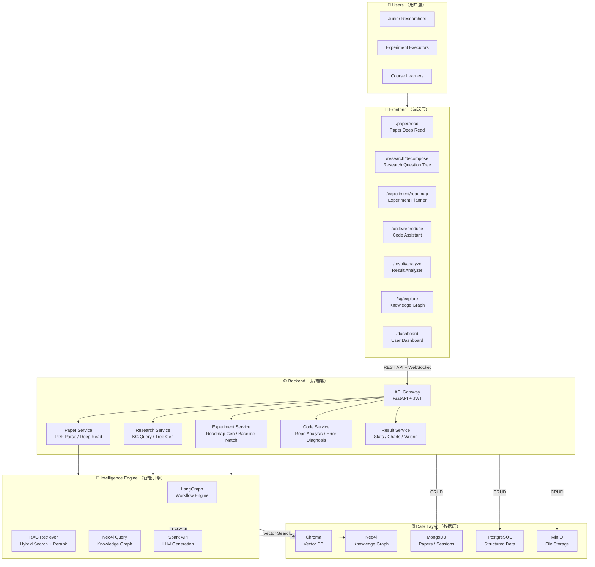

### Frontend-Backend Communication Pattern

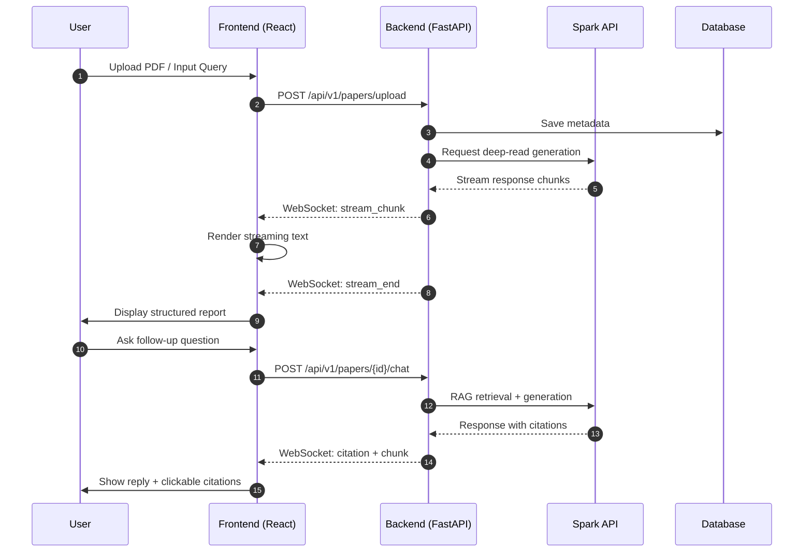

---

## Core Features

### Feature Matrix

| # | Module | Route | Input | Output |
|---|--------|-------|-------|--------|
| 1 | **Paper Deep Read** | `/paper/read` | PDF / arXiv ID | Structured 7-section report + chat |
| 2 | **Research Decomposition** | `/research/decompose` | Research direction | Interactive question tree |
| 3 | **Experiment Roadmap** | `/experiment/roadmap` | Research question | Full experiment plan + baseline |
| 4 | **Code Reproduction** | `/code/reproduce` | GitHub repo URL | Step-by-step guide + error diagnosis |
| 5 | **Result Analysis** | `/result/analyze` | CSV / JSON / Excel | Charts + stats + writing suggestions |

### 1. Paper Deep Read （论文精读）

Upload a PDF or enter an arXiv ID. The system parses and generates a structured deep-read report with 7 sections:

```
1. Research Background & Motivation
2. Core Research Questions
3. Method & Innovation Points
4. Experiment Design
5. Key Results
6. Limitations & Future Work
7. Inspiration for Beginners
```

**UI Layout:**
```
┌────────────┬──────────────────────┬──────────────┐
│  Section   │   Deep Read Report   │  Knowledge   │
│  Navigator │   (Markdown + LaTeX  │   Graph      │
│            │    + Citation Cards) │   Panel      │
├────────────┼──────────────────────┼──────────────┤
│ 1. Background│ ## Background       │ ● APR        │
│ 2. Questions │ ...[1][2]...        │   ├─ GenProg │
│ 3. Methods   │                     │   └─ SemFix  │
│ 4. Experiments│ ## Core Questions  │ ● Defects4J  │
│ 5. Results   │ ...                 │              │
│ 6. Limits    │ [Citation Popup]    │ [Click node] │
│ 7. Inspiration│                    │              │
└────────────┴──────────────────────┴──────────────┘
│  Chat Input: [Ask a question...] [Send] [Q1] [Q2] │
└───────────────────────────────────────────────────┘
```

**Workflow Diagram:**

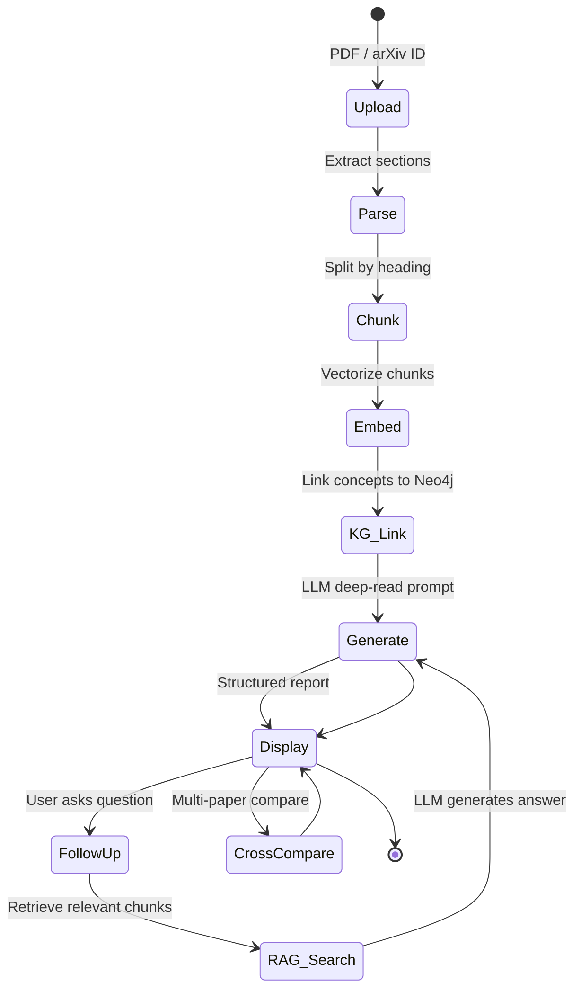

### 2. Research Question Decomposition （研究问题拆解）

Enter a broad research direction. The system outputs a hierarchical research question tree with feasibility scoring.

**Workflow Diagram:**

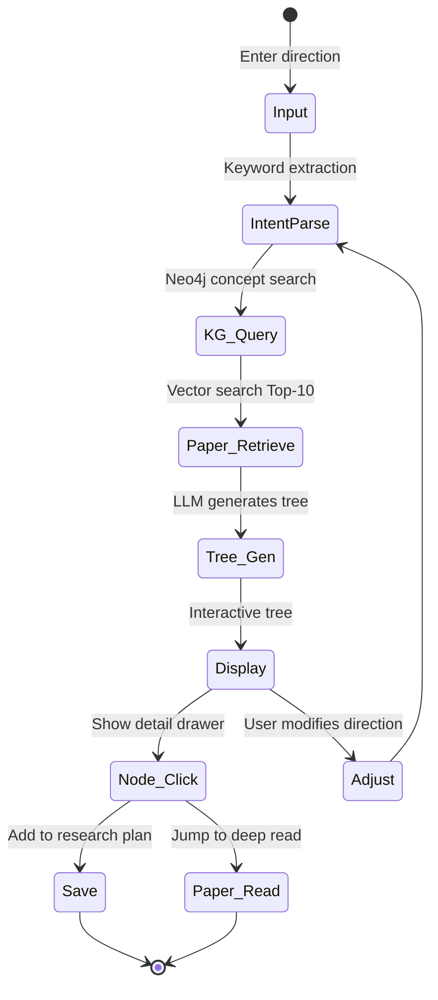

### 3. Experiment Roadmap Generation （实验路线生成）

Based on a research question and previously read papers, auto-generate a complete experiment plan.

**Workflow Diagram:**

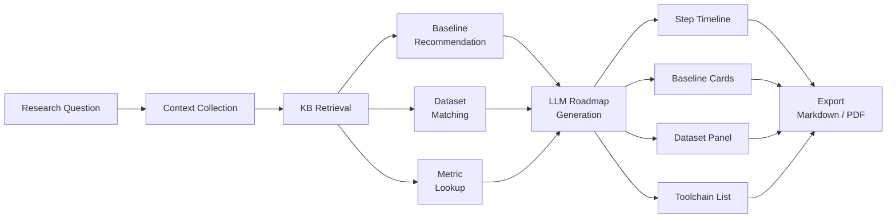

### 4. Code Reproduction Assistant （代码复现辅助）

Input a GitHub repository URL. The system analyzes structure, extracts dependencies, and generates a reproduction guide.

**Workflow Diagram:**

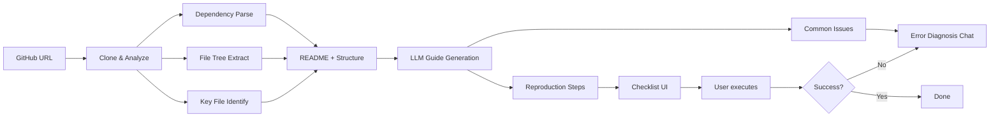

### 5. Result Interpretation （结果解释）

Upload experiment result files. Auto-generate statistical summaries, visualizations, and analysis text.

**Supported Charts:**

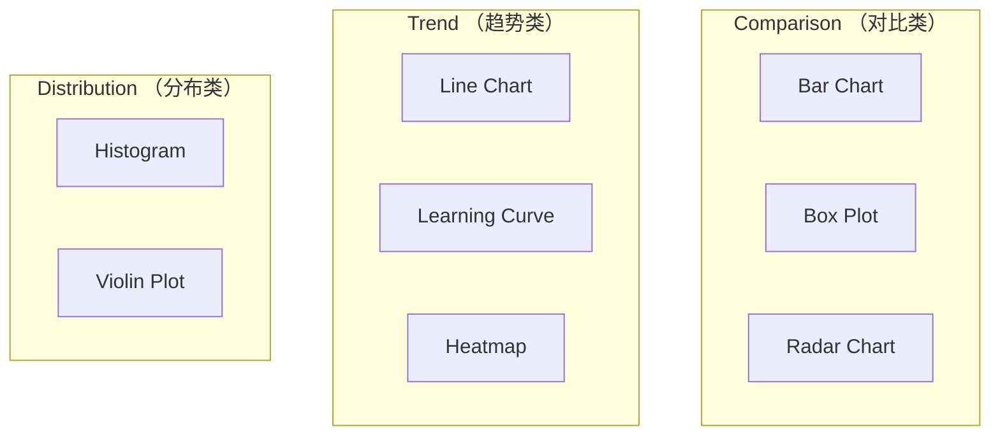

---

## Page Routes & Navigation

### Route Tree

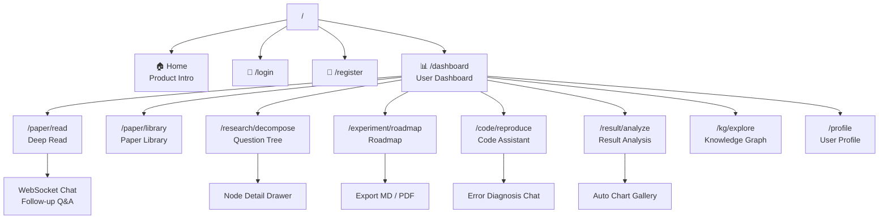

### Route Guard Rules

| Type | Routes | Behavior |
|------|--------|----------|
| Public | `/`, `/login`, `/register` | Free access |
| Protected | `/dashboard`, `/paper/*`, `/research/*`, `/experiment/*`, `/code/*`, `/result/*`, `/kg/*`, `/profile` | Redirect to `/login` if unauthenticated |

---

## Tech Stack

### Frontend Technology Stack

| Layer | Technology | Version | Purpose |
|-------|-----------|---------|---------|
| Framework | React | 18.x | Component-based UI |
| Language | TypeScript | 5.x | Type safety |
| Build Tool | Vite | 5.x | Fast dev server & optimized builds |
| Styling | TailwindCSS | 3.x | Utility-first CSS |
| Components | shadcn/ui | latest | High-quality accessible components |
| State | Zustand | 4.x | Lightweight global state |
| Routing | React Router | v6 | SPA navigation |
| HTTP | Axios | 1.x | API requests with interceptors |
| Realtime | WebSocket API | native | Streaming chat output |
| Charts | ECharts | 5.x | Statistical visualizations |
| Graph Viz | D3.js | 7.x | Knowledge graph rendering |
| Math | KaTeX | latest | LaTeX formula rendering |
| Markdown | react-markdown + remark-gfm | latest | Rich markdown content |
| Syntax Highlight | PrismJS | latest | Code block highlighting |

### Full-Stack Architecture

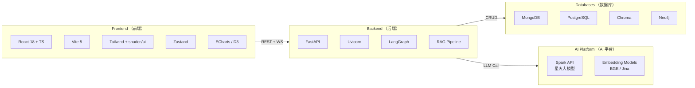

---

## Project Structure

```
frontend/                          # 前端项目根目录
├── public/                        # 静态资源
│   ├── favicon.ico
│   └── logo.svg
│
├── src/
│   ├── app/                       # App entry & global config
│   │   ├── App.tsx                # Root component
│   │   ├── routes.tsx             # Route definitions
│   │   └── providers.tsx          # Global providers (Zustand, Theme)
│   │
│   ├── pages/                     # Page-level components (route-mapped)
│   │   ├── Home/                  # Landing page
│   │   ├── Login/
│   │   ├── Register/
│   │   ├── Dashboard/             # User dashboard
│   │   ├── PaperRead/             # Paper deep read
│   │   │   ├── index.tsx
│   │   │   ├── SectionNav.tsx     # Chapter navigation tree
│   │   │   ├── DeepReadReport.tsx # Report renderer
│   │   │   ├── CitationCard.tsx   # Citation popup
│   │   │   └── PaperChat.tsx      # Follow-up chat
│   │   ├── PaperLibrary/          # Paper collection
│   │   ├── ResearchDecompose/     # Research question tree
│   │   │   ├── ResearchTree.tsx   # Interactive tree
│   │   │   ├── TreeNodeDetail.tsx # Node detail drawer
│   │   │   └── FeasibilityBadge.tsx
│   │   ├── ExperimentRoadmap/     # Experiment planner
│   │   │   ├── Timeline.tsx       # Gantt-style timeline
│   │   │   ├── BaselineCard.tsx
│   │   │   ├── DatasetPanel.tsx
│   │   │   └── ToolChainList.tsx
│   │   ├── CodeReproduce/         # Code reproduction
│   │   │   ├── RepoInfoCard.tsx
│   │   │   ├── FileTree.tsx
│   │   │   ├── DependencyList.tsx
│   │   │   ├── ReproductionChecklist.tsx
│   │   │   └── ErrorDiagnosis.tsx
│   │   ├── ResultAnalyze/         # Result analysis
│   │   │   ├── DataUploader.tsx   # Drag & drop upload
│   │   │   ├── ChartGallery.tsx   # Auto chart gallery
│   │   │   ├── StatsSummary.tsx   # Statistical summary
│   │   │   ├── AnalysisEditor.tsx # AI text editor
│   │   │   └── WritingSuggestion.tsx
│   │   ├── KnowledgeGraph/        # Knowledge graph explorer
│   │   │   └── GraphCanvas.tsx    # D3.js graph canvas
│   │   └── Profile/
│   │
│   ├── components/                # Reusable UI components
│   │   ├── ui/                    # Base UI (shadcn/ui wrappers)
│   │   ├── layout/                # Layout components
│   │   │   ├── AppLayout.tsx      # Main layout (Header + Sidebar + Content)
│   │   │   ├── Header.tsx
│   │   │   ├── Sidebar.tsx
│   │   │   └── MobileNav.tsx
│   │   ├── chat/                  # Chat components
│   │   │   ├── ChatBubble.tsx
│   │   │   ├── ChatInput.tsx
│   │   │   ├── ChatSidebar.tsx
│   │   │   ├── MessageList.tsx
│   │   │   └── StreamingText.tsx
│   │   ├── markdown/              # Markdown rendering
│   │   │   ├── MarkdownRenderer.tsx
│   │   │   ├── CodeBlock.tsx      # Code block with highlight + copy
│   │   │   └── LaTeXBlock.tsx     # LaTeX formula renderer
│   │   ├── chart/                 # Chart components
│   │   │   ├── BarChart.tsx
│   │   │   ├── LineChart.tsx
│   │   │   ├── BoxPlotChart.tsx
│   │   │   ├── HeatmapChart.tsx
│   │   │   ├── RadarChart.tsx
│   │   │   └── ChartWrapper.tsx   # ECharts universal wrapper
│   │   └── common/                # Common business components
│   │       ├── LoadingSpinner.tsx
│   │       ├── EmptyState.tsx
│   │       ├── ErrorBoundary.tsx
│   │       ├── ConfirmDialog.tsx
│   │       ├── FileDropZone.tsx
│   │       ├── SearchBar.tsx
│   │       └── Pagination.tsx
│   │
│   ├── hooks/                     # Custom React Hooks
│   │   ├── useAuth.ts
│   │   ├── useWebSocket.ts        # WebSocket connection management
│   │   ├── useChat.ts
│   │   ├── usePaperRead.ts
│   │   ├── useResearchTree.ts
│   │   ├── useExperiment.ts
│   │   ├── useCodeAnalysis.ts
│   │   ├── useResultAnalysis.ts
│   │   ├── useFileUpload.ts
│   │   └── useDebounce.ts
│   │
│   ├── services/                  # API service layer
│   │   ├── api.ts                 # Axios instance (interceptors, baseURL)
│   │   ├── auth.service.ts
│   │   ├── paper.service.ts
│   │   ├── research.service.ts
│   │   ├── experiment.service.ts
│   │   ├── code.service.ts
│   │   ├── result.service.ts
│   │   ├── kg.service.ts          # Knowledge graph queries
│   │   └── user.service.ts
│   │
│   ├── store/                     # Zustand stores
│   │   ├── authStore.ts
│   │   ├── chatStore.ts
│   │   ├── paperStore.ts
│   │   └── uiStore.ts
│   │
│   ├── types/                     # TypeScript type definitions
│   │   ├── api.ts
│   │   ├── paper.ts
│   │   ├── research.ts
│   │   ├── experiment.ts
│   │   ├── code.ts
│   │   ├── result.ts
│   │   ├── chat.ts
│   │   └── user.ts
│   │
│   ├── utils/                     # Utility functions
│   │   ├── format.ts              # Date / number formatting
│   │   ├── validators.ts          # Form validation
│   │   ├── constants.ts           # Constants
│   │   └── helpers.ts
│   │
│   ├── styles/                    # Global styles
│   │   ├── globals.css            # CSS variables + Tailwind entry
│   │   ├── themes.css             # Theme variables (light / dark)
│   │   └── animations.css         # Animation definitions
│   │
│   └── assets/                    # Static assets
│       ├── images/
│       ├── icons/
│       └── fonts/
│
├── index.html
├── package.json
├── tsconfig.json
├── tsconfig.node.json
├── vite.config.ts
├── tailwind.config.ts
├── postcss.config.js
├── .env.local                     # Env vars (DO NOT commit)
├── .env.example                   # Env vars template (commit this)
├── .eslintrc.cjs
├── .prettierrc
└── README.md
```

---

## Database Design

### Entity Relationship Diagram

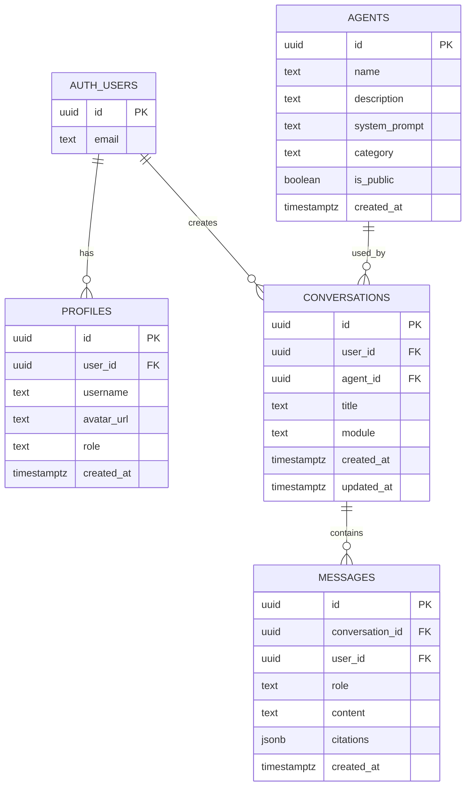

### MongoDB Document Schemas

```typescript
// Paper Document
interface Paper {
  paper_id: string;           // se-{venue}-{year}-{seq}
  title: string;
  authors: string[];
  venue: string;              // ICSE / FSE / ASE / TSE / arXiv
  year: number;
  doi?: string;
  abstract: string;
  keywords: string[];
  sections: Array<{
    heading: string;
    text: string;
    embedding_id: string;
    start_page: number;
  }>;
  contributions: string[];
  github_url?: string;
  citation_count: number;
  quality_score: number;
}

// Session Document
interface Session {
  session_id: string;
  user_id: string;
  module: 'paper_read' | 'rq_decomp' | 'experiment' | 'code' | 'result';
  title: string;
  messages: Array<{
    role: 'user' | 'assistant' | 'system';
    content: string;
    citations?: Array<{
      source_id: string;
      source_type: 'paper' | 'textbook' | 'code' | 'kg';
      snippet: string;
    }>;
    timestamp: Date;
  }>;
  context_papers: string[];
}
```

### PostgreSQL Structured Tables

```sql
-- Datasets table
CREATE TABLE datasets (
    id SERIAL PRIMARY KEY,
    name VARCHAR(100) NOT NULL,
    language VARCHAR(50),
    project_count INT,
    bug_count INT,
    source_url TEXT,
    description TEXT,
    common_tasks TEXT[],
    created_at TIMESTAMP DEFAULT NOW()
);

-- Metrics table
CREATE TABLE metrics (
    id SERIAL PRIMARY KEY,
    name VARCHAR(100) NOT NULL,
    full_name VARCHAR(200),
    formula TEXT,
    description TEXT,
    applicable_tasks TEXT[],
    common_values JSONB
);

-- Experiment templates
CREATE TABLE experiment_templates (
    id SERIAL PRIMARY KEY,
    task_type VARCHAR(100),
    template_name VARCHAR(200),
    steps JSONB,
    recommended_baselines TEXT[],
    recommended_datasets INT[],
    recommended_metrics INT[]
);
```

---

## Component Architecture

### Component Hierarchy

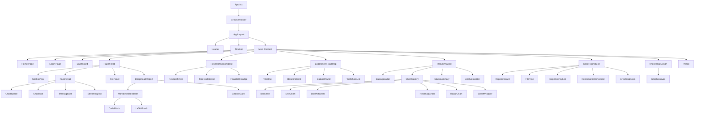

---

## API Interaction Flow

### REST API Endpoints

| Method | Endpoint | Description |
|--------|----------|-------------|
| `POST` | `/api/v1/auth/login` | User login |
| `POST` | `/api/v1/auth/register` | User registration |
| `GET` | `/api/v1/users/me` | Get current user |
| `POST` | `/api/v1/papers/upload` | Upload PDF (multipart) |
| `GET` | `/api/v1/papers/{id}/deep-read` | Get deep-read report |
| `POST` | `/api/v1/papers/{id}/chat` | Paper follow-up chat |
| `POST` | `/api/v1/research/decompose` | Research question decomposition |
| `POST` | `/api/v1/experiments/generate-roadmap` | Generate experiment roadmap |
| `POST` | `/api/v1/code/analyze-repo` | Analyze GitHub repo |
| `POST` | `/api/v1/code/diagnose-error` | Error diagnosis |
| `POST` | `/api/v1/results/analyze` | Analyze result files (multipart) |
| `GET` | `/api/v1/kg/concepts` | Get KG concept nodes |
| `GET` | `/api/v1/kg/concepts/{id}/relations` | Get concept relations |

### WebSocket Streaming Protocol

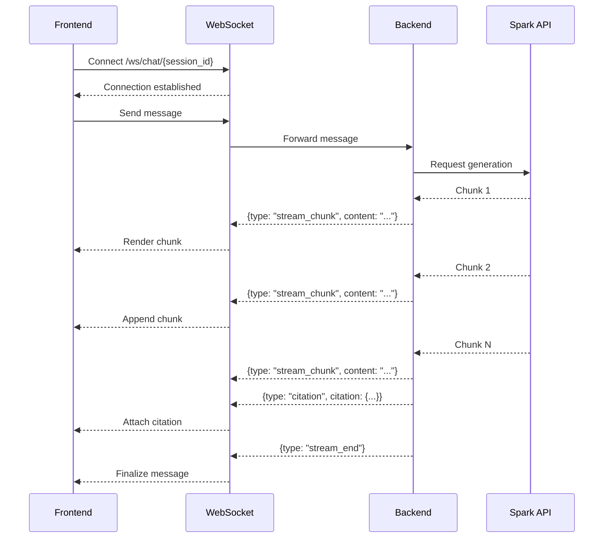

### Axios Configuration

```typescript
// services/api.ts
const api = axios.create({
  baseURL: import.meta.env.VITE_API_BASE_URL, // http://localhost:8000
  timeout: 30000,
  headers: { 'Content-Type': 'application/json' },
});

// Request interceptor — auto-attach JWT
api.interceptors.request.use((config) => {
  const token = useAuthStore.getState().token;
  if (token) config.headers.Authorization = `Bearer ${token}`;
  return config;
});

// Response interceptor — unified error handling
api.interceptors.response.use(
  (res) => res,
  (err) => {
    if (err.response?.status === 401) {
      useAuthStore.getState().logout();
      window.location.href = '/login';
    }
    return Promise.reject(err);
  }
);
```

---

## UI Design System

### Design Principles

- **Clean & Professional**: Academic-oriented interface with moderate information density
- **Structure First**: All outputs rendered structurally (tables, trees, timelines) （结构化优先）
- **Traceability**: Every generated claim carries a clickable citation （溯源可见）
- **Progressive Disclosure**: Complex info layered — collapsed by default, expanded on demand （渐进披露）

### Color Palette

```css
:root {
  /* Primary */
  --primary: #2563eb;
  --primary-hover: #1d4ed8;
  --primary-light: #dbeafe;

  /* Semantic */
  --accent: #0ea5e9;      /* Cyan — emphasis elements */
  --success: #10b981;     /* Green — high feasibility / success */
  --warning: #f59e0b;     /* Yellow — medium feasibility / warning */
  --danger: #ef4444;      /* Red — low feasibility / error */
  --purple: #8b5cf6;      /* Purple — knowledge graph / AI */

  /* Neutral */
  --bg: #ffffff;
  --bg-secondary: #f8fafc;
  --border: #e2e8f0;
  --text-primary: #0f172a;
  --text-secondary: #64748b;
  --text-muted: #94a3b8;
}
```

### Typography

| Use Case | Font Stack |
|----------|-----------|
| Chinese | `"PingFang SC", "Microsoft YaHei", "Noto Sans CJK SC", sans-serif` |
| English | `Inter, "SF Pro Display", system-ui, sans-serif` |
| Code | `"JetBrains Mono", "Consolas", "Courier New", monospace` |

### Spacing System (4px grid)

| Token | Value | Usage |
|-------|-------|-------|
| `space-1` | 4px | Inline element padding |
| `space-2` | 8px | Tight component gaps |
| `space-3` | 12px | Standard internal padding |
| `space-4` | 16px | Component internal spacing |
| `space-6` | 24px | Component gaps |
| `space-8` | 32px | Section gaps |
| `space-12` | 48px | Major section separations |
| `space-16` | 64px | Page-level spacing |

### Responsive Breakpoints

```
Mobile:  < 640px    → Single column, sidebar as drawer
Tablet:  640-1024px → Two-column layout
Desktop: > 1024px   → Full three-column layout
```

---

## State Management

### Zustand Store Architecture

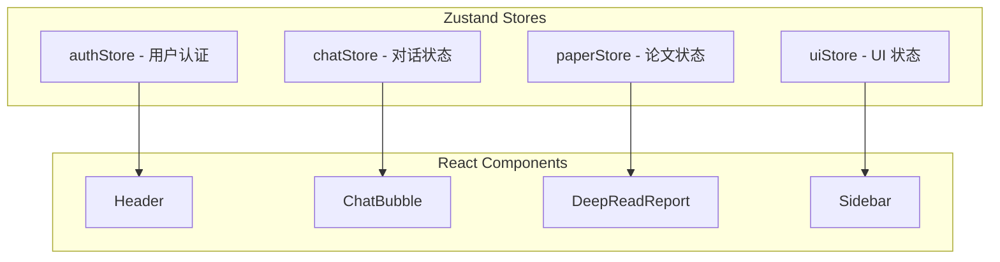

### Store Interfaces

```typescript
// authStore — 用户认证状态
interface AuthState {
  user: User | null;
  token: string | null;
  isAuthenticated: boolean;
  login: (email: string, password: string) => Promise<void>;
  register: (data: RegisterData) => Promise<void>;
  logout: () => void;
  checkAuth: () => Promise<void>;
}

// chatStore — 对话状态
interface ChatState {
  sessions: ChatSession[];
  currentSessionId: string | null;
  messages: Message[];
  isStreaming: boolean;
  createSession: (module: string) => Promise<string>;
  sendMessage: (content: string) => Promise<void>;
  loadHistory: () => Promise<void>;
  clearCurrentSession: () => void;
}

// paperStore — 论文状态
interface PaperState {
  currentPaper: Paper | null;
  deepReadReport: DeepReadReport | null;
  isLoading: boolean;
  uploadPaper: (file: File) => Promise<Paper>;
  getDeepRead: (paperId: string) => Promise<DeepReadReport>;
  clearPaper: () => void;
}

// uiStore — UI 状态
interface UIState {
  sidebarOpen: boolean;
  theme: 'light' | 'dark';
  toggleSidebar: () => void;
  toggleTheme: () => void;
}
```

---

## API Specification

### WebSocket Message Protocol

```typescript
// Message types for streaming chat
interface WSMessage {
  type: 'stream_chunk' | 'stream_end' | 'citation' | 'error';
  content?: string;
  citation?: {
    source_id: string;
    source_type: 'paper' | 'textbook' | 'code' | 'kg';
    snippet: string;
    url?: string;
  };
}
```

### Key API Response Types

```typescript
// Deep Read Report
interface DeepReadReport {
  paper_id: string;
  sections: Array<{
    heading: string;
    content: string;
    citations: Array<{ source: string; text: string }>;
  }>;
  knowledge_graph_nodes: string[];
}

// Research Question Tree
interface ResearchTree {
  core_question: string;
  sub_questions: Array<{
    id: string;
    question: string;
    feasibility: 'high' | 'medium' | 'low';
    datasets: string[];
    papers: string[];
  }>;
  related_work: Array<{ name: string; paper_id: string }>;
}

// Experiment Roadmap
interface ExperimentRoadmap {
  objective: string;
  steps: Array<{
    step: number;
    task: string;
    details: string;
    estimated_days: number;
  }>;
  baselines: Array<{
    name: string;
    paper_id: string;
    github_url: string;
  }>;
  datasets: Array<{ name: string; url: string }>;
  metrics: Array<{ name: string; formula: string }>;
  tools: Array<{ name: string; purpose: string }>;
}

// Code Analysis Result
interface CodeAnalysis {
  repo_info: { name: string; language: string; stars: number };
  file_tree: Array<{ path: string; type: 'file' | 'dir' }>;
  dependencies: Array<{ package: string; version: string }>;
  key_files: Array<{ path: string; description: string }>;
  reproduction_guide: Array<{ step: number; command: string; description: string }>;
  common_issues: Array<{ error: string; solution: string }>;
}

// Result Analysis
interface ResultAnalysis {
  summary_stats: {
    mean: number;
    std: number;
    ci_95: [number, number];
  };
  charts: Array<{
    type: 'bar' | 'line' | 'box' | 'heatmap' | 'radar';
    title: string;
    echarts_option: Record<string, any>;
  }>;
  analysis_text: string;
  writing_suggestions: string;
}
```

---

## Local Development

### Prerequisites

- Node.js >= 18.0
- npm >= 9.0 (or pnpm >= 8.0)
- Backend service running at `http://localhost:8000`

### Quick Start

```bash
# 1. Clone repository
git clone https://github.com/Khaliii-6/SciCopilot_The-Fronted-Portion.git
cd SciCopilot_The-Fronted-Portion

# 2. Install dependencies
npm install

# 3. Configure environment
cp .env.example .env.local
# Edit .env.local with your values

# 4. Start dev server
npm run dev
# → http://localhost:5173
```

### Environment Variables

```bash
# .env.local
VITE_API_BASE_URL=http://localhost:8000
VITE_WS_BASE_URL=ws://localhost:8000
```

### Available Scripts

```bash
npm run dev          # Start dev server (http://localhost:5173)
npm run build        # Production build
npm run preview      # Preview production build
npm run lint         # ESLint check
npm run format       # Prettier format
npm run type-check   # TypeScript type check
```

---

## Build & Deploy

### Vite Configuration

```typescript
// vite.config.ts
import { defineConfig } from 'vite';
import react from '@vitejs/plugin-react';
import path from 'path';

export default defineConfig({
  plugins: [react()],
  resolve: {
    alias: {
      '@': path.resolve(__dirname, './src'),
    },
  },
  server: {
    port: 5173,
    proxy: {
      '/api': {
        target: 'http://localhost:8000',
        changeOrigin: true,
      },
      '/ws': {
        target: 'ws://localhost:8000',
        ws: true,
      },
    },
  },
  build: {
    outDir: 'dist',
    sourcemap: true,
    rollupOptions: {
      output: {
        manualChunks: {
          vendor: ['react', 'react-dom', 'react-router-dom'],
          charts: ['echarts'],
          markdown: ['react-markdown', 'remark-gfm', 'katex'],
        },
      },
    },
  },
});
```

### GitHub Pages Deployment

```bash
npm run build
# Settings → Pages → Branch: main /root
```

---

## Development Milestones

| Week | Milestone | Frontend Tasks | Acceptance Criteria |
|------|-----------|---------------|---------------------|
| W1 | Project Init | Initialize React + Vite + Tailwind; configure routing; build AppLayout | Home, Login, Dashboard skeleton ready |
| W2 | Paper Library + Deep Read UI | Paper upload, library list, deep-read report rendering (Markdown + citations) | Papers uploadable; reports render correctly |
| W3 | Paper Chat + KG Panel | WebSocket streaming chat, knowledge graph side panel, citation popup | Real-time streaming; citations clickable |
| W4 | Research Decomposition | Interactive tree component (D3.js / custom), node color coding, detail drawer | Tree foldable/expandable; nodes interactive |
| W5 | Experiment Roadmap | Step timeline, baseline cards, dataset panel, export functionality | Full experiment plan page functional |
| W6 | Code Reproduction | Repo info card, file tree, dependency list, reproduction checklist, error diagnosis | Repo URL input → full display |
| W7 | Result Analysis | Drag-drop upload, ECharts gallery (>=4 types), stats summary, analysis editor | CSV upload → auto charts + analysis |
| W8 | Integration & Polish | End-to-end testing, Loading/Error/Empty states, responsive, performance optimization | No blocking bugs; page load < 2s |
| W9 | User Validation & Submit | 2+ real users trial, feedback collection, bug fixes, demo video recording | Feedback documented; demo video <= 3min |

### Development Timeline Visualization

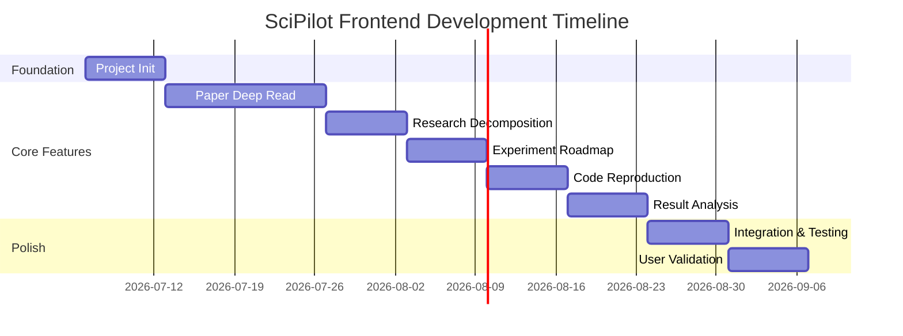

---

## Team Responsibilities

### Frontend Development Roles

| Module | Core Responsibilities |
|--------|----------------------|
| **Auth** | Login page, register page, JWT auth flow |
| **Dashboard** | Dashboard UI, recent sessions, saved papers, progress tracking |
| **Paper Deep Read** | PDF upload, report renderer (Markdown + LaTeX), citation cards, chat |
| **Paper Library** | Paper grid/list, search/filter, paper cards, bookmark |
| **Research Decomposition** | Interactive tree visualization, node detail drawer, feasibility badges |
| **Experiment Roadmap** | Step timeline, baseline comparison cards, dataset panel, export |
| **Code Reproduction** | Repo info, file tree, dependency list, checklist, error diagnosis chat |
| **Result Analysis** | Data upload, ECharts gallery, stats summary, analysis editor |
| **Knowledge Graph** | D3.js graph visualization, concept navigation, relation display |
| **UI Infrastructure** | Layout components, base UI kit, theme system, responsive adapter |

---

<p align="center">
  <strong>Built with passion for SE researchers worldwide.</strong>
  <br>
  <em>为全球软件工程研究者而构建</em>
</p>

<p align="center">
  <sub>SciPilot Frontend README · Based on the detailed implementation plan · 2026</sub>
</p>
